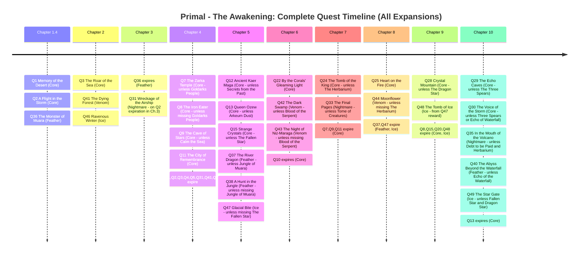

# PRIMAL - THE AWAKENING CAMPAIGN BOOK

## TABLE OF CONTENTS

* [PRIMAL - THE AWAKENING CAMPAIGN BOOK](#primal---the-awakening-campaign-book)
  * [TABLE OF CONTENTS](#table-of-contents)
  * [CAMPAIGN CHAPTERS](#campaign-chapters)
    * [CHAPTER 1 (PART 1)](#chapter-1-part-1)
      * [CH. 1.1 REWARDS](#ch-11-rewards)
    * [CHAPTER 1 (PART 2)](#chapter-1-part-2)
      * [CH. 1.2 REWARDS](#ch-12-rewards)
    * [CHAPTER 1 (PART 3)](#chapter-1-part-3)
      * [CH. 1.3 REWARDS](#ch-13-rewards)
    * [CHAPTER 1 (PART 4)](#chapter-1-part-4)
      * [CH. 1.4 REWARDS](#ch-14-rewards)
    * [CHAPTER 2](#chapter-2)
      * [CH. 2 REWARDS](#ch-2-rewards)
    * [CHAPTER 3](#chapter-3)
      * [CH. 3 REWARDS](#ch-3-rewards)
    * [CHAPTER 4](#chapter-4)
      * [CH. 4 REWARDS](#ch-4-rewards)
    * [CHAPTER 5](#chapter-5)
      * [CH. 5 REWARDS](#ch-5-rewards)
    * [CHAPTER 6](#chapter-6)
      * [CH. 6 REWARDS](#ch-6-rewards)
    * [CHAPTER 7](#chapter-7)
      * [CH. 7 REWARDS](#ch-7-rewards)
    * [CHAPTER 8](#chapter-8)
      * [CH. 8 REWARDS](#ch-8-rewards)
    * [CHAPTER 9](#chapter-9)
      * [CH. 9 REWARDS](#ch-9-rewards)
    * [CHAPTER 10](#chapter-10)
      * [CH. 10 REWARDS](#ch-10-rewards)
    * [CHAPTER 11](#chapter-11)
      * [CH. 11 LORE QUESTIONS](#ch-11-lore-questions)
      * [CH. 11 REWARDS](#ch-11-rewards-1)
    * [THE LANTERN BEARER](#the-lantern-bearer)
    * [THE AWAKENED](#the-awakened)
      * [SCENARIO](#scenario)
      * [SPECIAL RULES](#special-rules)
      * [INTRODUCTION](#introduction)
      * [CONCLUSION](#conclusion)
        * [IF YOU HAVE "_THE VOICE OF WOLTYAR_"](#if-you-have-_the-voice-of-woltyar_)
        * [OTHERWISE](#otherwise)
      * [BLOOD VISION](#blood-vision)
    * [THE REBIRTH OF POWER (ABSORBING THE DRAGON'S POWER)](#the-rebirth-of-power-absorbing-the-dragons-power)
    * [THE DAWN OF MANKIND (REJECTING THE DRAGON'S POWER)](#the-dawn-of-mankind-rejecting-the-dragons-power)
  * [QUEST SCENARIOS](#quest-scenarios)
    * [1. THE MEMORY OF THE DESERT](#1-the-memory-of-the-desert)
      * [1.1 SCENARIO](#11-scenario)
      * [1.2 SPECIAL RULES](#12-special-rules)
      * [1.3 INTRODUCTION](#13-introduction)
      * [1.4 CONCLUSION](#14-conclusion)
        * [1.4.1 VARIANT A](#141-variant-a)
        * [1.4.2 VARIANT B](#142-variant-b)
      * [1.5 BLOOD VISION](#15-blood-vision)
      * [1.6 REWARDS](#16-rewards)
      * [1.7 EXPIRATION](#17-expiration)
    * [2. A FLIGHT IN THE STORM](#2-a-flight-in-the-storm)
      * [2.1 SCENARIO](#21-scenario)
      * [2.2 SPECIAL RULES](#22-special-rules)
      * [2.3 INTRODUCTION](#23-introduction)
      * [2.4 CONCLUSION](#24-conclusion)
        * [2.4.1 VARIANT A](#241-variant-a)
        * [2.4.2 VARIANT B](#242-variant-b)
      * [2.5 BLOOD VISION](#25-blood-vision)
      * [2.6 REWARDS](#26-rewards)
      * [2.7 EXPIRATION](#27-expiration)
    * [3. THE ROAR OF THE SEA](#3-the-roar-of-the-sea)
      * [3.1 SCENARIO](#31-scenario)
      * [3.2 SPECIAL RULES](#32-special-rules)
      * [3.3 INTRODUCTION](#33-introduction)
      * [3.4 CONCLUSION](#34-conclusion)
      * [3.5 BLOOD VISION](#35-blood-vision)
      * [3.6 REWARDS](#36-rewards)
      * [3.7 EXPIRATION](#37-expiration)
    * [4. THE PACK LEADER](#4-the-pack-leader)
      * [4.1 SCENARIO](#41-scenario)
      * [4.2 SPECIAL RULES](#42-special-rules)
      * [4.3 INTRODUCTION](#43-introduction)
      * [4.4 CONCLUSION](#44-conclusion)
      * [4.5 BLOOD VISION](#45-blood-vision)
      * [4.6 REWARDS](#46-rewards)
      * [4.7 EXPIRATION](#47-expiration)
    * [5. CLAWS OF SILVER](#5-claws-of-silver)
      * [5.1 SCENARIO](#51-scenario)
      * [5.2 SPECIAL RULES](#52-special-rules)
      * [5.3 INTRODUCTION](#53-introduction)
      * [5.4 CONCLUSION](#54-conclusion)
      * [5.5 BLOOD VISION](#55-blood-vision)
      * [5.6 REWARDS](#56-rewards)
      * [5.7 EXPIRATION](#57-expiration)
    * [6. ON THE HUNT BETWEEN THE TWO DESERTS](#6-on-the-hunt-between-the-two-deserts)
      * [6.1 SCENARIO](#61-scenario)
      * [6.2 SPECIAL RULES](#62-special-rules)
      * [6.3 INTRODUCTION](#63-introduction)
      * [6.4 CONCLUSION](#64-conclusion)
      * [6.5 BLOOD VISION](#65-blood-vision)
      * [6.6 REWARDS](#66-rewards)
    * [7. THE ZARKA TEMPLE](#7-the-zarka-temple)
      * [7.1 SCENARIO](#71-scenario)
      * [7.3 INTRODUCTION](#73-introduction)
      * [7.4 CONCLUSION](#74-conclusion)
      * [7.5 BLOOD VISION](#75-blood-vision)
      * [7.6 REWARDS](#76-rewards)
      * [7.7 EXPIRATION](#77-expiration)
    * [8. THE IRON EATER](#8-the-iron-eater)
      * [8.1 SCENARIO](#81-scenario)
      * [8.3 INTRODUCTION](#83-introduction)
      * [8.4 CONCLUSION](#84-conclusion)
      * [8.5 BLOOD VISION](#85-blood-vision)
      * [8.6 REWARDS](#86-rewards)
      * [8.7 EXPIRATION](#87-expiration)
    * [9. THE CAVE OF STARS](#9-the-cave-of-stars)
      * [9.1 SCENARIO](#91-scenario)
      * [9.2 SPECIAL RULES](#92-special-rules)
      * [9.3 INTRODUCTION](#93-introduction)
      * [9.4 CONCLUSION](#94-conclusion)
      * [9.5 BLOOD VISION](#95-blood-vision)
      * [9.6 REWARDS](#96-rewards)
      * [9.7 EXPIRATION](#97-expiration)
    * [10. THE SUBMERGED LANDS](#10-the-submerged-lands)
      * [10.1 SCENARIO](#101-scenario)
      * [10.2 SPECIAL RULES](#102-special-rules)
      * [10.3 INTRODUCTION](#103-introduction)
      * [10.4 CONCLUSION](#104-conclusion)
      * [10.5 BLOOD VISION](#105-blood-vision)
      * [10.6 REWARDS](#106-rewards)
      * [10.7 EXPIRATION](#107-expiration)
    * [11. THE CITY OF REMEMBRANCE](#11-the-city-of-remembrance)
      * [11.1 SCENARIO](#111-scenario)
      * [11.2 SPECIAL RULES](#112-special-rules)
      * [11.3 INTRODUCTION](#113-introduction)
      * [11.4 CONCLUSION](#114-conclusion)
      * [11.5 BLOOD VISION](#115-blood-vision)
      * [11.6 REWARDS](#116-rewards)
      * [11.7 EXPIRATION](#117-expiration)
    * [12. ANCIENT KAER MAGA](#12-ancient-kaer-maga)
      * [12.1 SCENARIO](#121-scenario)
      * [12.2 SPECIAL RULES](#122-special-rules)
      * [12.3 INTRODUCTION](#123-introduction)
      * [12.4 CONCLUSION](#124-conclusion)
      * [12.5 BLOOD VISION](#125-blood-vision)
      * [12.6 REWARDS](#126-rewards)
    * [13. QUEEN OZEW](#13-queen-ozew)
      * [13.1 SCENARIO](#131-scenario)
      * [13.2 SPECIAL RULES](#132-special-rules)
      * [13.3 INTRODUCTION](#133-introduction)
      * [13.4 CONCLUSION](#134-conclusion)
      * [13.5 BLOOD VISION](#135-blood-vision)
      * [13.6 REWARDS](#136-rewards)
      * [13.7 EXPIRATION](#137-expiration)
    * [14. THE DRAGON WITH A THOUSAND FACES](#14-the-dragon-with-a-thousand-faces)
      * [14.1 SCENARIO](#141-scenario)
      * [14.2 SPECIAL RULES](#142-special-rules)
      * [14.3 INTRODUCTION](#143-introduction)
      * [14.4 CONCLUSION](#144-conclusion)
      * [14.5 BLOOD VISION](#145-blood-vision)
      * [14.6 REWARDS](#146-rewards)
    * [15. STRANGE CRYSTALS](#15-strange-crystals)
      * [15.1 SCENARIO](#151-scenario)
      * [15.2 SPECIAL RULES](#152-special-rules)
      * [15.3 INTRODUCTION](#153-introduction)
      * [15.4 CONCLUSION](#154-conclusion)
      * [15.5 BLOOD VISION](#155-blood-vision)
      * [15.6 REWARDS](#156-rewards)
      * [15.7 EXPIRATION](#157-expiration)
    * [16. THE SANCTUARY OF THE STORM](#16-the-sanctuary-of-the-storm)
      * [16.1 SCENARIO](#161-scenario)
      * [16.2 SPECIAL RULES](#162-special-rules)
      * [16.3 INTRODUCTION](#163-introduction)
      * [16.4 CONCLUSION](#164-conclusion)
      * [16.5 BLOOD VISION](#165-blood-vision)
      * [16.6 REWARDS](#166-rewards)
    * [17. THE FLOWER IN THE MIST](#17-the-flower-in-the-mist)
      * [17.1 SCENARIO](#171-scenario)
      * [17.3 INTRODUCTION](#173-introduction)
      * [17.4 CONCLUSION](#174-conclusion)
      * [17.5 BLOOD VISION](#175-blood-vision)
      * [17.6 REWARDS](#176-rewards)
    * [18. THE HALLS OF REMEMBRANCE](#18-the-halls-of-remembrance)
      * [18.1 SCENARIO](#181-scenario)
      * [18.2 SPECIAL RULES](#182-special-rules)
      * [18.3 INTRODUCTION](#183-introduction)
      * [18.4 CONCLUSION](#184-conclusion)
      * [18.5 VISIONS](#185-visions)
        * [18.5.1 HEARTPIERCER VISION](#1851-heartpiercer-vision)
        * [18.5.2 BLOOD VISION](#1852-blood-vision)
      * [18.6 REWARDS](#186-rewards)
    * [19. THE THRONE UNDER THE MOUNTAIN](#19-the-throne-under-the-mountain)
      * [19.1 SCENARIO](#191-scenario)
      * [19.2 SPECIAL RULES](#192-special-rules)
      * [19.3 INTRODUCTION](#193-introduction)
      * [19.4 CONCLUSION](#194-conclusion)
      * [19.5 BLOOD VISION](#195-blood-vision)
      * [19.6 REWARDS](#196-rewards)
    * [20. CRYSTALLIZATION](#20-crystallization)
      * [20.1 SCENARIO](#201-scenario)
      * [20.3 INTRODUCTION](#203-introduction)
      * [20.4 CONCLUSION](#204-conclusion)
      * [20.5 VISIONS](#205-visions)
        * [20.5.1 FALLEN STAR VISION](#2051-fallen-star-vision)
        * [20.5.2 BLOOD VISION](#2052-blood-vision)
      * [20.6 REWARDS](#206-rewards)
      * [20.7 EXPIRATION](#207-expiration)
    * [21. THE THRONE OF THE DRAGON](#21-the-throne-of-the-dragon)
      * [21.1 SCENARIO](#211-scenario)
      * [21.2 SPECIAL RULES](#212-special-rules)
      * [21.3 INTRODUCTION](#213-introduction)
      * [21.4 CONCLUSION](#214-conclusion)
      * [21.5 BLOOD VISION](#215-blood-vision)
      * [21.6 REWARDS](#216-rewards)
    * [22. BY THE CORALS GLEAMING LIGHT](#22-by-the-corals-gleaming-light)
      * [22.1 SCENARIO](#221-scenario)
      * [22.3 INTRODUCTION](#223-introduction)
      * [22.4 CONCLUSION](#224-conclusion)
      * [22.5 BLOOD VISION](#225-blood-vision)
      * [22.6 REWARDS](#226-rewards)
    * [23. THE RED CORAL CAVE](#23-the-red-coral-cave)
      * [23.1 SCENARIO](#231-scenario)
      * [23.2 SPECIAL RULES](#232-special-rules)
      * [23.3 INTRODUCTION](#233-introduction)
      * [23.4 CONCLUSION](#234-conclusion)
      * [23.5 BLOOD VISION](#235-blood-vision)
      * [23.6 REWARDS](#236-rewards)
    * [24. THE TOMB OF THE KING](#24-the-tomb-of-the-king)
      * [24.1 SCENARIO](#241-scenario)
      * [24.2 SPECIAL RULES](#242-special-rules)
      * [24.3 INTRODUCTION](#243-introduction)
      * [24.4 CONCLUSION](#244-conclusion)
      * [24.5 BLOOD VISION](#245-blood-vision)
      * [24.6 REWARDS](#246-rewards)
    * [25. HEART ON THE FIRE](#25-heart-on-the-fire)
      * [25.1 SCENARIO](#251-scenario)
      * [25.2 SPECIAL RULES](#252-special-rules)
      * [25.3 INTRODUCTION](#253-introduction)
      * [25.4 CONCLUSION](#254-conclusion)
      * [25.5 BLOOD VISION](#255-blood-vision)
      * [25.6 REWARDS](#256-rewards)
    * [26. THE VOICE OF THE MOUNTAIN](#26-the-voice-of-the-mountain)
      * [26.1 SCENARIO](#261-scenario)
      * [26.2 SPECIAL RULES](#262-special-rules)
      * [26.3 INTRODUCTION](#263-introduction)
      * [26.4 CONCLUSION](#264-conclusion)
      * [26.5 BLOOD VISION](#265-blood-vision)
      * [26.6 REWARDS](#266-rewards)
    * [27. THE ETERNAL FLAME](#27-the-eternal-flame)
      * [27.1 SCENARIO](#271-scenario)
      * [27.3 INTRODUCTION](#273-introduction)
      * [27.4 CONCLUSION](#274-conclusion)
      * [27.5 BLOOD VISION](#275-blood-vision)
      * [27.6 REWARDS](#276-rewards)
    * [28. CRYSTAL MOUNTAIN](#28-crystal-mountain)
      * [28.1 SCENARIO](#281-scenario)
      * [28.2 SPECIAL RULES](#282-special-rules)
      * [28.3 INTRODUCTION](#283-introduction)
      * [28.4 CONCLUSION](#284-conclusion)
      * [28.5 BLOOD VISION](#285-blood-vision)
      * [28.6 REWARDS](#286-rewards)
    * [29. THE ECHO CAVES](#29-the-echo-caves)
      * [29.1 SCENARIO](#291-scenario)
      * [29.2 SPECIAL RULES](#292-special-rules)
      * [29.3 INTRODUCTION](#293-introduction)
      * [29.4 CONCLUSION](#294-conclusion)
      * [29.5 BLOOD VISION](#295-blood-vision)
      * [29.6 REWARDS](#296-rewards)
    * [30. THE VOICE OF THE STORM](#30-the-voice-of-the-storm)
      * [30.1 SCENARIO](#301-scenario)
      * [30.2 SPECIAL RULES](#302-special-rules)
      * [30.3 INTRODUCTION](#303-introduction)
      * [30.4 CONCLUSION](#304-conclusion)
      * [30.5 BLOOD VISION](#305-blood-vision)
      * [30.6 REWARDS](#306-rewards)
    * [31. THE WRECKAGE OF THE AIRSHIP](#31-the-wreckage-of-the-airship)
      * [31.1 SCENARIO](#311-scenario)
      * [31.2 SPECIAL RULES](#312-special-rules)
      * [31.3 INTRODUCTION](#313-introduction)
      * [31.4 CONCLUSION](#314-conclusion)
      * [31.5 BLOOD VISION](#315-blood-vision)
      * [31.6 REWARDS](#316-rewards)
      * [31.7 EXPIRATION](#317-expiration)
    * [32. AN UNDERGROUND FLOWER](#32-an-underground-flower)
      * [32.1 SCENARIO](#321-scenario)
      * [32.2 SPECIAL RULES](#322-special-rules)
      * [32.3 INTRODUCTION](#323-introduction)
      * [32.4 CONCLUSION](#324-conclusion)
      * [32.5 BLOOD VISION](#325-blood-vision)
      * [32.6 REWARDS](#326-rewards)
    * [33. THE FINAL PAGES](#33-the-final-pages)
      * [33.1 SCENARIO](#331-scenario)
      * [33.2 SPECIAL RULES](#332-special-rules)
      * [33.3 INTRODUCTION](#333-introduction)
      * [33.4 CONCLUSION](#334-conclusion)
      * [33.5 VISIONS](#335-visions)
        * [33.5.1 BLOOD VISION](#3351-blood-vision)
        * [33.5.2 MYSTERIOUS EGG VISION](#3352-mysterious-egg-vision)
      * [33.6 REWARDS](#336-rewards)
    * [34. THE BREATH OF THE DRAGON](#34-the-breath-of-the-dragon)
      * [34.1 SCENARIO](#341-scenario)
      * [34.2 SPECIAL RULES](#342-special-rules)
      * [34.3 INTRODUCTION](#343-introduction)
      * [34.4 CONCLUSION](#344-conclusion)
      * [34.5 BLOOD VISION](#345-blood-vision)
      * [34.6 REWARDS](#346-rewards)
    * [35. IN THE MOUTH OF THE VOLCANO](#35-in-the-mouth-of-the-volcano)
      * [35.1 SCENARIO](#351-scenario)
      * [35.2 SPECIAL RULES](#352-special-rules)
      * [35.3 INTRODUCTION](#353-introduction)
      * [35.4 CONCLUSION](#354-conclusion)
      * [35.5 BLOOD VISION](#355-blood-vision)
      * [35.6 REWARDS](#356-rewards)
    * [36. THE MONSTER OF MUARA](#36-the-monster-of-muara)
      * [36.1 SCENARIO](#361-scenario)
      * [36.2 SPECIAL RULES](#362-special-rules)
      * [36.3 INTRODUCTION](#363-introduction)
      * [36.4 CONCLUSION](#364-conclusion)
      * [36.5 BLOOD VISION](#365-blood-vision)
      * [36.6 REWARDS](#366-rewards)
      * [36.7 EXPIRATION](#367-expiration)
    * [37. THE RIVER DRAGON](#37-the-river-dragon)
      * [37.1 SCENARIO](#371-scenario)
      * [37.3 INTRODUCTION](#373-introduction)
      * [37.4 CONCLUSION](#374-conclusion)
      * [37.5 BLOOD VISION](#375-blood-vision)
      * [37.6 REWARDS](#376-rewards)
      * [37.7 EXPIRATION](#377-expiration)
    * [38. A HUNT IN THE JUNGLE](#38-a-hunt-in-the-jungle)
      * [38.1 SCENARIO](#381-scenario)
      * [38.2 SPECIAL RULES](#382-special-rules)
      * [38.3 INTRODUCTION](#383-introduction)
      * [38.4 CONCLUSION](#384-conclusion)
      * [38.5 BLOOD VISION](#385-blood-vision)
      * [38.6 REWARDS](#386-rewards)
    * [39. THE STONES OF THE PRIMORDIALS](#39-the-stones-of-the-primordials)
      * [39.1 SCENARIO](#391-scenario)
      * [39.2 SPECIAL RULES](#392-special-rules)
      * [39.3 INTRODUCTION](#393-introduction)
      * [39.4 CONCLUSION](#394-conclusion)
      * [39.5 BLOOD VISION](#395-blood-vision)
      * [39.6 REWARDS](#396-rewards)
    * [40. THE ABYSS BEYOND THE WATERFALL](#40-the-abyss-beyond-the-waterfall)
      * [40.1 SCENARIO](#401-scenario)
      * [40.2 SPECIAL RULES](#402-special-rules)
      * [40.3 INTRODUCTION](#403-introduction)
      * [40.4 CONCLUSION](#404-conclusion)
      * [40.5 BLOOD VISION](#405-blood-vision)
      * [40.6 REWARDS](#406-rewards)
    * [41. THE DYING FOREST](#41-the-dying-forest)
      * [41.1 SCENARIO](#411-scenario)
      * [41.2 SPECIAL RULES](#412-special-rules)
      * [41.3 INTRODUCTION](#413-introduction)
      * [41.4 CONCLUSION](#414-conclusion)
      * [41.5 BLOOD VISION](#415-blood-vision)
      * [41.6 REWARDS](#416-rewards)
      * [41.7 EXPIRATION](#417-expiration)
    * [42. THE DARK SWAMP](#42-the-dark-swamp)
      * [42.1 SCENARIO](#421-scenario)
      * [42.2 SPECIAL RULES](#422-special-rules)
      * [42.3 INTRODUCTION](#423-introduction)
      * [42.4 CONCLUSION](#424-conclusion)
      * [42.5 BLOOD VISION](#425-blood-vision)
      * [42.6 REWARDS](#426-rewards)
    * [43. THE NIGHT OF NIZ-MARAGA](#43-the-night-of-niz-maraga)
      * [43.1 SCENARIO](#431-scenario)
      * [43.2 SPECIAL RULES](#432-special-rules)
      * [43.3 INTRODUCTION](#433-introduction)
      * [43.4 CONCLUSION](#434-conclusion)
      * [43.5 BLOOD VISION](#435-blood-vision)
      * [43.6 REWARDS](#436-rewards)
    * [44. MOONFLOWER](#44-moonflower)
      * [44.1 SCENARIO](#441-scenario)
      * [44.2 SPECIAL RULES](#442-special-rules)
      * [44.3 INTRODUCTION](#443-introduction)
      * [44.4 CONCLUSION](#444-conclusion)
      * [44.5 BLOOD VISION](#445-blood-vision)
      * [44.6 REWARDS](#446-rewards)
    * [45. THE HALLS OF REMEMBRANCE](#45-the-halls-of-remembrance)
      * [45.1 SCENARIO](#451-scenario)
      * [45.2 SPECIAL RULES](#452-special-rules)
      * [45.3 INTRODUCTION](#453-introduction)
      * [45.4 CONCLUSION](#454-conclusion)
      * [45.5 VISIONS](#455-visions)
        * [45.5.1 HEARTPIERCER VISION](#4551-heartpiercer-vision)
        * [45.5.2 BLOOD VISION](#4552-blood-vision)
      * [45.6 REWARDS](#456-rewards)
    * [46. REVENOUS WINTER](#46-revenous-winter)
      * [46.1 SCENARIO](#461-scenario)
      * [46.2 SPECIAL RULES](#462-special-rules)
      * [46.3 INTRODUCTION](#463-introduction)
      * [46.4 CONCLUSION](#464-conclusion)
      * [46.5 BLOOD VISION](#465-blood-vision)
      * [46.6 REWARDS](#466-rewards)
      * [46.7 EXPIRATION](#467-expiration)
    * [47. GLACIAL BITE](#47-glacial-bite)
      * [47.1 SCENARIO](#471-scenario)
      * [47.2 SPECIAL RULES](#472-special-rules)
      * [47.3 INTRODUCTION](#473-introduction)
      * [47.4 CONCLUSION](#474-conclusion)
      * [47.5 BLOOD VISION](#475-blood-vision)
      * [47.6 REWARDS](#476-rewards)
      * [47.7 EXPIRATION](#477-expiration)
    * [48. THE TOMB OF ICE](#48-the-tomb-of-ice)
      * [48.1 SCENARIO](#481-scenario)
      * [48.2 SPECIAL RULES](#482-special-rules)
      * [48.3 INTRODUCTION](#483-introduction)
      * [48.4 CONCLUSION](#484-conclusion)
      * [48.5 BLOOD VISION](#485-blood-vision)
      * [48.6 REWARDS](#486-rewards)
      * [48.7 EXPIRATION](#487-expiration)
    * [49. THE STAR GATE](#49-the-star-gate)
      * [49.1 SCENARIO](#491-scenario)
      * [49.2 SPECIAL RULES](#492-special-rules)
      * [49.3 INTRODUCTION](#493-introduction)
      * [49.4 CONCLUSION](#494-conclusion)
      * [49.5 BLOOD VISION](#495-blood-vision)
      * [49.6 REWARDS](#496-rewards)
  * [QUESTS UNLOCK GUIDE](#quests-unlock-guide)
    * [Quest Reward Chains](#quest-reward-chains)
    * [Complete Expiration Legend](#complete-expiration-legend)

## CAMPAIGN CHAPTERS

### CHAPTER 1 (PART 1)

> **Summary**: You return to Alborea with a Vyraxen carcass, attracting attention. Commander Reja learns of other recent monster attacks and calls for a Council meeting. She invites the hunters to attend but asks them to go with her first.

The airship plows the sky as it takes you back to Alborea, humanity's stronghold on Thyrea. Below you, the natural world is still reeling from the thunderous rumbling of Woltyar. Animals flee to take refuge in their burrows and dens, and the trees are bent double with the ferocious breath of the wind. Far away, on the horizon, you see the ocean. Following the drought on the Outer Islands, your ancestors sailed those waters for years before landing on the great central continent of Thyrea. This is the only green and verdant land that still welcomes life. You have always wondered what its secret was.

The airship lands at the port just outside the city walls. Still covered in ash, you disembark from the deck with the precious cargo on your shoulders. Hunched under its weight, you make your way across the garrison courtyard overlooked by the Hunters' quarters. When you drop the Vyraxen carcass with a thud, some seekers, laden with parchment scrolls, widen their eyes in astonishment, and a group of hunters, training not far away, stop what they are doing to look in your direction.

"Do any of you know what kind of monster that is?" the new recruits ask each other in a whisper.

The city blacksmith emerges from his smoking tower and looks curiously at the scene from the door of the forge. A few seekers run toward you, followed closely by the tall figure of the Commander, Reja. Austere in her black robes, with a single glance, the Commander disperses the crowd that has gathered around your trophy.

"No trace of the expedition, Commander," Thoreg hastens to explain," ...the monster caught our scent and attacked us immediately after the eruption."

Reja nods, then bends down and rests her hand on the Vyraxen's face, staring at it with a gloomy expression. You realize that your squad was not the only expedition that has been attacked recently.

"Summon the Keeper. His presence is requested at the Council meeting tonight," she orders a cadet. Then she turns toward you. "The Council will meet later today, at sunset. You have earned the right to attend."

You see her gather herself, pensively, and then she looks up at the plumes of smoke billowing out of the top of the forge.

"But first, come with me. There's something I want to show you."

#### CH. 1.1 REWARDS

- Add Vyraxen to your trophies by marking it on your campaign sheet.

### CHAPTER 1 (PART 2)

> **Summary**: The Commander takes the hunters to the city forge to meet Rarog. She requests reinforced armor and weapons made using monster hides, similar to the methods of the first hunters. Rarog agrees to craft the equipment once Central Command finalizes their plans. This highlights the adaptation and innovation needed to face the increasing monster threat.

The first Alboreans who ventured on missions were seekers tasked with mapping and exploring the new lands on the island. They were familiar with the natural world; they understood the cycle of the seasons as well as the behavior of animals, but none of them were prepared for what awaited them. The monsters on the island massacred those first expeditions. Very few survived But humankind does not give up so easily.

Thus, the order of the Hunters was established. These were men and women who trained to face those fearsome creatures and to help the teams of seekers extend the boundaries of research into the wildest areas.

Since then, the fire of the forge in Alborea has never stopped burning. The Commander makes her way through the garrison courtyard to the entrance to the large forge. All you can see from the outside is the high chimney and its turrets, spewing out steam and sputtering glowing sparks.

Upon entering, you are immediately funnelled underground to reach the furnace carved into the living rock at the time of the foundation of Alborea. The acrid smell of hot iron welcomes you into the large workshop. The yawning mouth of fire, which is perpetually alight, illuminates the blacksmith and his apprentices, who are all bent over the benches in the process of welding, bending, and sharpening weapons.

The Commander looks over a workbench covered in leather strips and iron ingots.

"A beautiful trophy, Commander," says Rarog, the blacksmith, as he hammers on a large anvil placed in the center of the room, as if it were an altar used to conduct sacred rituals.

"That's precisely why I'm here. We need armor and claws, exactly like a monster's..." the Commander replies.

Rarog stops shaping the shield he is working on and gives her a pensive look.

"Reinforce our own weapons with the skin of those creatures. Just like the first hunters had thought about doing?" he says in a low voice.

"The beasts' armor will make our weapons very heavy... Will the hunters be able to handle them?" he exclaims, then wipes his hands on a dirty green rag.

"They will find the strength," she replies without hesitation. The blacksmith forces his mouth into a sneering grin and begins polishing a blade,

"When you lot at Central Command have finished discussing things, bring it here to me. You'll be able to fight the next one you encounter on equal terms."

#### CH. 1.2 REWARDS

- Set the Forge level to 1 on your campaign sheet.
- Unlock the Fire Forge card
- Each player gains the following crafting resources:
  - Elements: 2x 
  - Materials: 1x , 1x , 2x 

### CHAPTER 1 (PART 3)

> **Summary**: The hunters visit Thessa at the Green Palace, the herbalists' home. They give her herbs from the Crimson Forest. Thessa reveals she's helping the hunters by creating potions and shows the hunters her laboratory. She also provides a list of additional herbs she needs. This introduces the importance of herbalism and potion-making in the fight against the monsters.

You exit the forge to the hissing whistle of hot weapons being tempered as they are plunged into cold water and return to the main square. Reja bids you a hasty farewell and sets off at a determined pace toward the garrison.

While waiting for the sun to set, you pick up the saddlebag full of herbs to feel its weight. There is still enough time to visit Thessa

You cross the square and continue along the main streets of Alborea until you reach the hanging gardens in the eastern district of the city. You are surprised to be hit by a cloud of perfume coming from the aromatic herbs just before it comes into view: the Green Palace, home of the herbalists.

The building has been constructed over several floors where all kinds of medicinal plants are grown, irrigated by the waterfall that flows alongside the building.

You find Thessa busy analyzing plants and colored powders.

"It's nice to see you again!" she exclaims as soon as she sees you. "You remembered our little botanical hunting expedition, then?"

You promptly take the booty recovered for her in the Crimson Forest out of the bag,

"A mature rhizome!" exclaims Thessa with satisfaction, turning the root over in her hands.

Then you see her taking some seeds and planting them in little earthenware pots filled with fertile soil.

"The Commander has asked me to help the Hunters' Corps, So, we set up a laboratory to distill potions and mixtures for hunting," she tells you as she leads you through the great hall wrapped in vines and covered with shelves full of books and glass vials.

On Thyrea, people continue to discover new plants and flowers with surprising properties. The botanical knowledge handed down by your ancestors is still useful today to help you understand the secrets of nature and to allow you to access its power, even if only a small part.

"I hope the Alemores have been helpful," she continues. "Recently, we have been studying new mixtures. Here is a list of herbs that could be useful to me!"

#### CH. 1.3 REWARDS

- Set the Herbalist level to 1 on your campaign sheet.
- Unlock the Herbalist card.
- Each player gains the following crafting resources:
  - Plants: 1x , 1x , 2x , 2x 

### CHAPTER 1 (PART 4)

> **Summary**: The Council meeting takes place. Commander Reja expresses concern about the rising monster attacks and introduces the Keeper, Noatar. Noatar explains his ability to connect with Thyrea and its creatures through their blood, allowing him to access past memories. He joins the Council, and daily monster hunts are mandated. This introduces a mystical element to the conflict and emphasizes the urgency of the situation.

It is now sunset. After learning to recognise new plants and flowers that can be used to make potions, you thank Thessa and rush to arrive in time for the Council meeting.

The large tent that has been erected in the courtyard is lined with tapestries featuring embroidered depictions of the heroic deeds of the bravest hunters. Waiting for you, you find the captains of the veteran squads sitting in a circle, with their eyes fixed on Reja, who has been chosen as their leader. You take your seats, a few moments before the Commander takes the floor.

"Recent events call for closer cooperation between us all," Reja begins. "Tragic news is getting increasingly frequent from every outpost on the island," she continues. "Settlements under attack, groups of people missing, monsters pushing beyond the limits of their territories... and lastly, today, the awakening of Woltyar, and a Vyraxen attack."

The Commander gives you the floor, and you explain in detail what happened during the mission. Concern rises among those present and their questions get more pressing. What happened to the Prime Seeker's expedition to the slopes of Woltyar? How is the volcano connected to the monsters' attacks? Reja knits her brows and decisively restores order and confidence.

"Nael is the best seeker we have, perhaps the best Alborea has ever had. We have done everything we could... I know him. I'm sure he's alive and he'll return to us soon."

The hunters look at each other; after a moment's pause, the Commander resumes:

"Our mettle is being tested. We need a guide in this time of chaos," she exclaims.

At that very moment, the tapestry behind her seat is pulled aside, and a tall man emerges, with severe features and a long, golden-green robe. He is known as the Keeper. There are rumours of him drinking monster blood and that he can see things the human eye cannot.

"Noatar has guided us to all the recent discoveries. His git can no longer be ignored," she concludes as the man steps forward under the gaze of the veteran captains.

"Nature on Thyrea is different from that of the Outer Islands, the Keeper opens his speech by saying in a calm and stoic voice. "Thyrea is alive... and she seems to have a powerful connection with her creatures. In the blood of the monsters, there is a trace of a power that, ike the threads in the tapestry behind me, weaves its way through the lives, events, and most ancient places on the island. Through their blood, I can access this tapestry of life and retrace the threads that lead me to relive the memories of the living beings, places, and events of the past."

Reja takes the floor again.

"From dawn tomorrow, the Keeper will become a member of this Council, The blood of these monsters is now a precious resource for us. I want all combat-ready squads to go out on missions: there will be new quests posted every day on the large quest board in the yard.

"The behaviour of these monsters is getting increasingly unpredictable. Forget what you know about them because, out there, nothing is like we remember it anymore."

#### CH. 1.4 REWARDS

- Unlock Quest 1 and Quest 2.
- Each player upgrades their card pool.
- **Feather Expansion**: Unlock Quest 36.

### CHAPTER 2

> **Summary**: Commander Reja addresses the hunters before dawn, explaining the monsters' new, more aggressive behavior and the need for adaptation. She emphasizes the importance of teamwork and recounts the story of how she lost her arm. The hunters then begin training, and are encouraged to take on new quests.

Commander Reja strides across the courtyard overlooked by the Hunters' quarters. She can't sleep. There are too many images and too many voices crowding her dreams, In the darkness and silence of the hour before dawn, she can focus her undivided attention on training. She tightens the straps on her artificial forearm at the elbow. It is a device made of golden Arkeum, forged by the blacksmith to allow her to continue using her spear. She picks up the weapon and starts repeating the positions: lunge, dodge, thrust, parry... You and some of the other hunters join her, waiting for her dawn speech. Someone offers to train with her, and they start fighting. Reja does not go easy on him.

When her opponent surrenders, Reja notices the sky on the horizon is showing the first pale glimmers of sunlight. The time has come. You all sit down, ready to listen to her.

"Something has changed out there. All the teams that have returned have reported some weird behaviour from the monsters. They are hunting far outside their usual territory and they have been seen attacking and killing each other, not out of hunger, but to assert dominance," says the Commander, walking among you. "Exploring the wilderness has become much more dangerous. They sniff us out as if they were searching for something.."

In a moment of silence, you wonder who are the hunters and who is the prey.

"Years ago, our teachers, Alborea's first hunters, studied these creatures. They watched how they fought in order to emulate their movements. They realized that their thick skin was an impenetrable shield and their claws were merciless weapons."

Reja pauses to look at the new weapons and armor on the rack and then continues.

"Today, l'm asking you all to don that leather and take up those claws. Your appearance, your actions - out there you'll be beasts, and just as brutal as they are. You will be crushed by the weight of your armor, but you will do it to protect what makes you human."

Reja pauses and walks past you.

"Remember that a monster has the strength to survive alone. on Thyrea We do not, we need each other. And that is how we shall survive."

The end of her speech is met with a loud cry of agreement and the Commander salutes you and sets of toward the living quarters.

As everyone disperses to start training, amidst the comments from your companions, you can hear the exuberant young recruits speaking aloud.

"But that. hand? What happened to her?" one of them asks.

"They say it happened years ago. She was the young leader of her own hunting squad. One member of her group ended up with the gaping jaws of a monster bearing down on him, but she threw herself in harms way to protect him. She forced her spear between that creatures teeth with such strength that it went straight through its skull. But the monster's teeth sank deep into her arm and the wound wouldn't heal, so they had to amputate," another replies, checking the balance of an axe in her hand.

"When she recovered, she started going on missions again. She changed squads a lot, inspiring the hunters there to become leaders. There is something about her that inspires you to be better... After a while, she became the Commander of the Council" she says as she secures a scale-covered shield to her arm.

You leave behind your companions, who are busy with training, and go to the quest board where the new quests have already been posted. Inspired by th` Commander, you want to test your mettle as soon as possible.

#### CH. 2 REWARDS

- Unlock Quest 3.
- **Venom Expansion**: Unlock Quest 41.
- **Ice Expansion**: Unlock Quest 46.

### CHAPTER 3

> **Summary**: Thessa urgently brings the hunters to the Keeper, who is trapped in a vision. Thessa uses a potion to revive him, and he relays a cryptic prophecy about the awakening of a "Beast" and humankind's destructive path. He also mentions a snake but struggles to remember more details. The hunters then check the crowded quest board.

"Did you bring the plants? Hurry, this way!" Thessa urges you as she runs along the corridors toward the Keeper's quarters.

Worriedly, she enters his rooms. The Keeper is stretched out on the warm wooden floor, still as a statue, his eyes wide open and rolled back in his head,

"Something's wrong. He's stuck in the vision; he can't come back.." Thessa stammers as she grabs the Tarmaret root you brought her and mixes it into her brew.

She holds the Keeper's torso up and places the cup to his lips. Rivulets of the yellow concoction dribble onto the man's clothes, who unconsciously manages to swallow a few sips.

"Hopefully this will help," Thessa explains to you, in an effort to convince both you and herself that this will work.

You hold your breath until the Keeper jolts back to consciousness and starts talking excitedly.

"There was a woman whose body was made of crystal... / have to write it down before the memory slips away," he says, panting for breath.

He grabs a large sheet of cotton paper and starts drawing and writing. He draws a woman holding a sceptre topped with a gem, then all around her body, like a frame, he anxiously writes:

"The Awakening of the Beast will once again devastate life on Thyrea, Power will flow from the broken lands, and mankind will follow that same path, and they, too, will be drawn into the jaws of the monster.

On a second sheet of paper, he sketches out the luminous lines on the woman's cheeks and all around her eyes.

"Then, she told me of an ancient prophecy and a snake, but it was at that moment that everything became hazy and I could no longer. remember, he looks at you and forces a reassuring smile before trying to explain.

"It's like when we te. to remember someone and cant pot together a clear picture. We remember some details, others ale lost, but we know that that person existed, even if our memory is confused... says the Keeper, looking at his sketches.

You make sure he is okay and then take your leave to let him rest.

Lost in thought, you make your way across the courtyard, which is by now crowded with other squads, and elbow your way through to check the quest board. Each slip of paper nailed there seems like a piece in a still unfinished mosaic.

#### CH. 3 REWARDS

- Each player upgrades their card pool.
- **Nightmare Expansion**: Quest 2 expires.
- **Feather Expansion**: Quest 36 expires.

### CHAPTER 4

> **Summary**: Prime Seeker Nael returns and presents his findings about ancient civilizations on Thyrea. He describes three distinct cultures: the Zarka, the Tecli, and the Krismari, each with unique characteristics and artistic representations of three powerful Dragons: the Ancient, Celestial, and Indomitable. The cause of these civilizations' disappearance remains a mystery.

In the tent, the air is permeated with fragrant fumes spiraling out of the braziers. A soft murmur runs through the other hunting squads sitting on the mats. They are waiting like you, summoned to hear Nael, the Prime Seeker's report, who is head of the research teams. As the Commander had predicted, he survived and returned to Alborea after his expedition had been given up for lost in the valleys of Woltyar.

"Apparently, they've found the ruins of ancient civilizations," you hear some of the hunters discussing among themselves.

"So, it's true then: Thyrea was inhabited in the past!" they whisper:

In the front rows, Reja and the garrison captains wait in silence. Their faces look tense. Finally, Nael makes his entrance from behind a tapestry. His sky-blue robe covers his seeker's uniform. He ties back his long black hair, adjusts the glasses on his nose, and begins reading his report on the findings of his.

"I would like to thank the captains and the Commander for convening this meeting and for granting me a few minutes of your time," Nael starts off to general silence.

"Thanks to the latest missions, we were able to shed light on certain surprising aspects of this island's past," he says as he affixes a large map of the continent onto the wooden panel.

"We believe that ancient civilizations had existed and lived here on Thyrea for over a thousand years. They died out many centuries before our arrival and the foundation of Alborea. We have identified three main peoples, which originated from the subdivision of a single older clan," he explains.

Then he points with his open hand to the entire northern area between the Dragon's Ridge Mountains and the Arkeum-veined Goldark Mountain Range.

"In this region, we have mainly found traces of a community known as the Zarka. These people controlled the Arkeum deposits, from which they made statues, jewellery, and even musical instruments. The inscriptions we have translated suggest that these objects made of Arkeum were available to everyone, and their contemplation was part of a course of study in pursuit of knowledge and power. Continuing on to the western part of the continent, we identified several ruins that can be traced back to another major group, the Tecli, says Nael, his hand now hovering between the drawing of the Sunset Plains and the Crystal Plateau.

"And finally, in the southern lands, we have discovered the remains of the Krismari civilization, he concludes, gesturing with a wave of his hand to the area south of the volcano, the Riverlands, and the imposing Niz-Maraga jungle.

"While we still know little about the Tecli people, we believe the Krismari worshipped the stars, the sky, as well as the sea," he says, then adds: "What we find surprising, however, is that from what we can understand thus far, their knowledge on the subject far exceeded our own."

"Were all these clans united under a single leader? Or do you think they were at war with each other? me hunterasks.

"We found no traces of wars or battles between the cans.h fact, we are inclined to think that the cu lures intermixedand were related in many ways," Nael replies.

He then unrolls a piece of cloth on the table with severa artifacts discovered by the Seekers fastened to it and continues.

"It seems that they used art to express their knowledge of and closeness with nature, Indeed, nature is a recurring theme throughout all their artworks, sometimes shown as terribe and powerful, at other times as being in perfect harmony wit humanity".

"But there's more.. he continues, accompanied by the clinking of his medallion, "all these groups painted and sculpted three creatures that we found intriguing: three great Dragons:

Nael pauses, observing the restless and fascinated gazes of the hunters.

Reja nods at him to encourage him to continue, the Prime Seeker takes a deep breath before plowing on.

"The first is the Ancient, often portrayed by the Tel, who painted it with gold and green scales, entwined with ancient trees, and its body is decorated with countless faces with human or beastly features. The second, the Celestial, is represented by the Krismari people as a large, feathered dragon, depicted in the waves of the sea, but often also in the sky, surrounded by points of light and constellations. The third Dragon, the Indomitable, is the mightiest of the three, depicted as black in color and accompanied by lightning and ferocious tempests, as depicted by the Zarka civilization."

In the general astonishment, Nael feels the need to provide some explanation.

"We do not know whether these Dragons were gods to them or if, on the other hand, they represented creatures that actually. existed. Perhaps it was simply a way for each of the populations to visually represent the nature of Thyrea itself, a force that mankind worshipped, feared, or perhaps hoped to control by giving it form.'

You see the captains in the front rows getting excited about the Prime Seeker's tale as the buzz of hushed chatter increases in the room.

"Nael, what have you found regarding the end of these civilisations? Do we know what happened to them? the Commander asks pressingly, in chorus with others.

"Unfortunately, not - we simply don't know. The end of these cultures is a mystery... For now, we can do nothing more than speculate," Nael replies.

A heavy silence has fallen in the tent, broken only by the howling of the wind blowing incessantly beyond the city walls.

#### CH. 4 REWARDS

- Upgrade the Forge and Herbalist to level 2.
- Unlock Quest 11.
- If you have "_The Goldarks People_”, unlock Quest 7. Otherwise, unlock Quest 8.
- If you have "_Calm the Sea_", unlock Quest 9.
- Quest 1, 2, 3, 4 and 5 expire.
- **Nightmare Expansion**: Quest 31 expires.
- **Feather Expansion**: If you have "_The Poison of the Pazis_", unlock Reward card 25 (unlock both copies of this card).
- **Venom Expansion**: Quest 41 expires.
- **Ice Expansion**: Quest 46 expires.

### CHAPTER 5

> **Summary**: The Ceremony of Light takes place in Alborea. The hunters join Thessa and Nael, who are researching the ceremony's origins and its possible connection to the Keeper's recent vision of a masked figure revealing a human who lights a lantern. They discover that Alborea's lanterns mirror the stars their ancestors followed to Thyrea and that lanterns were used on their airships, but find no direct link to the masked figure.

Just like every year since the foundation of the city, the Ceremony of Light is taking place in Alborea, but this one seems different. The lights that have been lit in the city are not enough to ward off the concerns preoccupying the entire community.

A large bonfire has been lit in the square, burning small, wicked-looking effigies that symbolise future dangers that need to be banished. Anyone who so wishes may take some embers from the bonfire to light the fire in the fireplace of their rooms or workshops. Rarog, the blacksmith, calls out a greeting as he walks past you with a bucket full of embers to be thrown into the fire at his forge as a gesture of good fortune.

Following tradition, on every street corner, countless lanterns have been lit from the flames of the bonfire, dotting the streets of the city with points of light. These lanterns were carved from stone and embedded in the walls of the houses when the city was built by the founders of Alborea.

As you make your way across the city to join Thessa at the Green Palace, you notice that each door is illuminated by a glass lantern or candles that have been placed on the doorsteps. On the sides of the buildings, intertwined with the shoots of climbing plants, there are a number of small copper statuettes, which reflect the lights and tinkle in the evening wind.

You climb the tall, damp stairs of the palace and enter Thessa the herbalist's laboratory to deliver the plants you have collected on your mission.

"Wait, let's go over this again from the beginning. Our ancestors landed here about a century ago, after having traveled for at least another hundred years, right? Oh, there you are!" Thessa welcomes you, She and Nael are busy studying some ancient scrolls containing the history of the people of Alborea.

"Thessa and l were just rereading the ancient chronicles in search of some more details about our Ceremony of Lights, Nael says.

"This very night, the Keeper had a vision. From the shadows, a figure appeared with a humped back covered in feathers, its face had a long, pointed beak and it had sharp, black claws. The creature, however, then shakes itself, removes its feathered cloak and beaked bone mask, and reveals itself to be human. She picks up a lantern from the dark ground and holds it up high in front of her: at her touch, the lantern is filled with dazzling light and the vision ends," Nael explains. "So, we are wondering where the symbol of our traditions comes from."

"We already know everything it says here. There were plagues and famines throughout the land of our ancestors, and they were forced to look for a new home. They left behind the Outer Islands, which had become barren wastelands, and sailed to the Central Islands. Thyrea was the only island that was lush and full of life, so they built a new city here. They found no trace of other humans, and had to combat the monsters that lived there," Thessa reads.

"Here, look. This is the diary of a builder. He says that they drew the map of the city they were going to build and that they marked out specific points where they planned to build the stone lanterns. Apparently, they correspond to the positions of the stars they had followed to fly to Thyrea... When it's all lit up, the city itself becomes a giant map of the starry sky!", says Nael in amazement.

"But does it say anything about why they chose the lantern as their symbol?", asks Thessa, while leafing through some scrolls. "It was also printed and embroidered on tapestries and robes," she adds.

"It continues, here... It says that the fleet of airships that had flown from the Outer Islands to Thyrea had hung lanterns on the sides of the ships, which were always kept alight to avoid getting lost and make sure the fleet stayed together during long crossings," Nael reads.

He and Thessa continue leafing through and reading the ancient manuscripts for some time but find nothing that could connect the woman with the bone mask who appeared in the Keeper's visions to their past.

#### CH. 5 REWARDS

- Each player upgrades their card pool.
- If you have "_Secrets from the Past_", unlock Quest 12.
- If you have "_Arkeum Dust_", unlock Quest 13.
- **Feather Expansion**: If you have "_The Jungle of Muara_", unlock Quest 37. Otherwise, unlock Quest 38
- **Ice Expansion**: If you have "_The Fallen Star_", unlock Quest 15 (if not already unlocked). Otherwise, unlock Quest 47.

### CHAPTER 6

> **Summary**: Under an unusually large moon, the Keeper has a vision of the Celestial Dragon battling a storm beast. The beast defeats the Celestial, ripping out its heart and causing it to fall into the sea. The Indomitable Dragon's roar intensifies the storm, turning the aurora red, dimming the stars, and ushering in a prolonged period of darkness.

Tonight, the Keeper walks alone through the streets of Alborea. The city is shrouded in a surreal silence: the sentries patrolling the walls tread lightly, the tavern has already closed, and the still waters of the sea fill the inlets of the harbour.

In the night sky, an unnaturally large, silvery moon has risen. It looms over the earth while down here everything seems to be holding its breath. The Keeper reaches the town square. His sandals step on the cold stone of the pavement and then on the dew-soaked soil. In the center of the square grows a thousand-year-old tree, with a thick, tall trunk and roots spreading out around its base like a spider's web. Its light-colored wood shines like a pearl under the moonlight. The Keeper sits among its thick roots and looks up at the moon in the sky. He watches the halo of light around the moon begin to pulsate and expand over the inky blue of the night sky. His eyes fill with that light... and he begins to travel.

In his vision, the Keeper finds a memory of the Celestial Dragon as it flyes through the sapphire skies of the north. The wind blows through its blue feathers as night falls and the stars glow brightly. In those same stars, the Dragon had read the arrival of this very night.

The Dragon looks at the riot of lightning advancing towards from the peaks of the Three Spears.

A raging beast can be seen at the center of the cyclone, dragging the storm with it. The stars in the northern sky seem to fall into the swirl of grey clouds and, all around it, the rumble of thunder booms rhythmically, like a beating heart. The beast in the storm attacks the Celestial. During the battle, they fly all over Thyrea. Their blood falls on the white snow, their scales fall into the mouth of Woltyar, and the feathers of the Celestial fall on the jungle until, finally, their wings cast dark shadows over the waters of the sea.

In every burst of light, in every fiery breath, the Celestial hears the voice of the beast, and, in it, its desire for power.

As they fly over the Teal Sea, the beast of thunder has the upper hand: it plunges its snout into the Celestial's chest and sinks its teeth into the other Dragon's heart. It rips it from its nest of veins and arteries, and crushes it between its fangs to squeeze out its power-soaked blood. The Celestial plummets toward the sea, which opens wide to receive the body of its Dragon in the waves. The sea floor splits apart, creating a fault line. The waters begin to churn and swirl ceaselessly.

The Indomitable Dragon roars triumphantly, its storm thickens, and through the dense clouds, the roar of its voice echoes throughout Thyrea. At its call, the lights in the aurora borealis turn red and flutter like tongues of fire. In the depths of space, the oldest stars dim and recede, leaving only a cold, empty void in their place.

That night lasted so long that the sun did not rise for days, eclipsed by the large, motionless moon. There was nothing but the red light of the aurora borealis and the stars falling from the sky.

#### CH. 6 REWARDS

- Unlock Quest 22.
- Quest 10 expires.
- **Venom Expansion**: if you have "_The Blood of the Serpent_", unlock Quest 42. Otherwise, unlock Quest 43.

### CHAPTER 7

> **Summary**: The hunters discuss their shared nightmares and feelings of increased strength and aggression, theorizing that the Awakening is affecting them. Commander Reja confirms reports of enhanced abilities from those near Woltyar and announces a new training camp there. The hunters then debate the cost of survival and their own growing ferocity.

A lively fire crackles in the brazier in the center of the common room where the returning hunters and those about to leave on a mission cross paths to compare notes and swap stories.

I've just been with them: they had a rough night, but they seem to be fine now," says Thoreg, letting himself collapse onto a bench.

"Is it true what they say about their eyes?" asks Ljonar.

"Yes, when they woke up this morning they had red pupils, like the fire of a Vyraxen, and they were crying tears of blood from their eyes," says Thoreg.

"They didn't tell you everything, Thor," says Mirah, who is busy carving wood for her arrows.

"They said they all had the same nightmare" she explains. "It was dark and they were climbing a mountain. During the ascent, they were attacked by a number of increasingly angry monsters. They killed them, one after the next, and took their strength to keep climbing... but none of them can remember what they found once they reached the top," says Mirah.

"Hmm, that's strange... For some time now, l've also been having nightmares where I see a mountain... but it's far away, and I can't remember what I was doing in the dream, Lionar says in a hushed voice.

"I dream about the beasts, and I keep doing what I do when I'm awake, Dareon says, staring at the hilt of his great sword, "every night."

"It's the Awakening; the beasts are no longer attacking out of mere hunger... Im starting to think that all this is not just affecting the monsters," says Thoreg.

"It's affecting us, too" Ljonar finishes his comrade's sentence, "it compels us to fight, to be more aggressive, more ferocious."

"It's not just aggression: I've never felt so strong... with each passing day, my hammer seems lighter. I feel faster, more alert, and sometimes l even feel like I'm learning from the movements of those monsters," Thoreg explains, trying to find the right words.

"..I can feel their fury, and I'm able to imitate it, adds Dareon.

"We're also pretending to look like them," Mirah thinks wryly, turning over her helmet in the shape of a feral beastly face in her hands.

"This is what has allowed us to survive. How could we face these monsters if we didn't have our weapons, and if we hadn't found this strength, which increases every day?" Ljonar asks everyone.

In answer to his question, the last tongue of fire in the brazier goes out, leaving the room barely illuminated by the glowing embers. At that moment, the door is thrown wide open and the Commander bursts into the room. The hunters inside the room rush to meet her, forming a circle around her.

"During their return from the Woltyar region, some squads have reported that every day spent in the shadow of the volcano has made them stronger and more resilient, Reja begins, "as if they were able to absorb the power and strength that is awakening along with the volcano. And at this very moment, humanity desperately needs this strength.

The eyes of the hunters in the room meet - everyone seems to have shared the same experience and no one appears to doubt the Commander's theory.

"For all who wish to join, tomorrow, a group will depart with the task of setting up a new training camp near the foothills of the volcano," Reja concludes, before saying goodbye and retiring to her lodgings.

"How much more blood will be shed in order for us to survive?" Ljonar asks under his breath.

"Everything here challenges us to endure..." says Dareon, ready to grin and bear whatever fate has in store for the hunters of Thyrea, "I feel alive when I fight to survive."

#### CH. 7 REWARDS

- Make a decision as a group:
  - Do you want to train at the Woltyar training camp? If yes, gain the achievement "_The Voice of Woltyar_".
- Each player upgrades their card pool.
- If you have "_The Herbarium_", unlock Quest 24.
- Quest 7, 9 and 11 expire.
- **Nightmare Expansion**: If you have "_The Tome of Creatures_", unlock Quest 33.

### CHAPTER 8

> **Summary**: Nael translates an ancient codex containing the "Myth of the Gith." The myth describes the Primordials, beings deeply connected to nature who bestowed gifts upon humanity. A man sought them and experienced a vision of a self-devouring dragon in the sky after hearing their beautiful melody. The vision faded, but the man's quest for answers continued. Nael speculates that the Primordials represent Thyrea's energy and expresses hope that humanity can one day understand their melody.

Leaning over the large table, Nael fills roll after roll of transcriptions taken from an ancient codex he found sealed in a tomb. The codex is a collection of stories that the Krismari, Tecli, and Zarka peoples had handed down over the centuries. The pages are divided into columns where the same story has been transcribed using two different writing systems.

"These symbols follow different rules than the common language of the ancients. I think it's a more complex form of language, dating back to even earlier times," he explains.

Then, he points to a text of Tecli origin.

"In these pages, it is said to have been a musical language... it seems to describe a melody, rather than a thought formulated in words."

Nael continues reading while slowly moving his hands over the pages.

"Few wise men were able to read or write it. The translation that is given here in the ancient common language is but a fraction of the true meaning of these symbols."

"It will still take me some time to understand and transcribe. these texts, but have already translated some fascinating myths" he tells you,".here, listen to this: The Myth of the Gith, he says, and begins reading.

"Originally, there were the Primordials. Their Voice was as dense as the earth, as colorful as the sky, and as deep as the sea. The first men feared them and gazed upon them in ave, Wherever there were Primordials, the natural world flourished, trees were laden with fruit, and living beings were filled with emotion. Men lived in harmony thanks to the gifts bestowed by those mysterious creatures: they received water when the rivers were dry, and they received light when the nights were too long and cold.

One day, however, a man set off on a journey: he felt as if something was missing. On his way, he encountered Primordials that were as tall as mountains, with their backs covered in forests. One, in particular, fascinated him: it had two large round eyes shining like lights plucked from the firmament, ivory horns, and a long moustache cascading from the sides of its fanged mouth. The man asked it for help to fill the void he felt. Intrigued, the creature stared at him with its starry eyes and stretched out a claw to meet his hand.

At that moment, the man heard the melody running through all of nature. The song of the Primordials was of unparalleled beauty: every note and every silence had a profound meaning. The man then looked up at the sky, and in the blue night, he saw a large luminous circle. He gazed deeper between the stars until he realised the circle was actually the body of a creature he had never seen before: an enormous dragon with a serpentine body that had looped back on itself to bite its own tail.

The man stood staring at the sky for a long time after the image had melted away, wondering about the meaning of what he had seen. In his quest for answers, which he would never give up on, the man who had set out on that journey filled the emptiness he had felt."

"The Primordials are always described differently, I wonder if they are not a figment of the writers' imaginations. They talk about them as if there were no boundaries between them and nature. Like creatures that are perfectly blended with the energy of Thyrea, Nael reflects aloud after he finishes reading the text.

"Who knows if one day we, too, will be able to hear the notes of that great melody running through Thyrea," he says, as he puts out the lantern resting on the table.

#### CH. 8 REWARDS

- Upgrade the Forge and Herbalist to level 3.
- If you have "_The Voice of Woltyar_", each player upgrades their card pool.
- Unlock Quest 25.
- **Feather Expansion**: Quest 37 expires.
- **Venom Expansion**: If you have "_The Herbarium_", unlock Quest 44.
- **Ice Expansion**: Quest 47 expires.

### CHAPTER 9

> **Summary**: A voice within the Echo describes a growing lust for power, mirrored by the storm above a mountaintop. This desire for unified power is embraced, and darkness falls. The Commander, attending to the Keeper during a vision, calls for aid. The Keeper awakens and reveals that humanity's lust for power is the root cause of the current events, based on his experience within the memories of the Indomitable Dragon.

I still remember when humankind was fascinated and inspired by our singing, and soon their Voices merged into the Echo. In each Voice, we can hear a trace of their desires, a distinct motif that contributes to the immense symphony. One chorus of Voices, in particular, which initially appeared as a slight dissonance in the Echo, is getting more incessant every day, It vibrates powerfully within me, grows in intensity, and enriches the melody by adding depth and contrast. It brings with it a lust for power that overwhelms me, from which I can no longer separate myself.

From up here, on the mountaintop, I feel like I can see all of Thyrea, / am alone, at the summit. What if that chorus is telling the truth? What if this was the challenge that gives meaning to who we are? The storm rages in and above me. The sky releases the same desire that gushes forth from my soul. In the black clouds that enshroud the mountain, the conflict that stirs in my heart takes shape.

I feel a sensation that has lain dormant for centuries awaken. What use is the force of the storm if not to increase my power? What do I need the breath of fire or the power of thunder for? What if I were the snake? The lightning pierces the night, and it seems to me that the clouds take the shape of lots of dragons with ravenous mouths. Why hide it? This is what I want,

"The power that was divided will be united once again, think, and my roar mingles with the thunder of the tempest.

Everything goes dark. I can no longer feel anything.

"Quickly, bring the herbs and a cold compress!" exclaims the Commander, who has been holding the man's hand the entire time.

"Noatar's power is increasing every day," she explains, "these long, intense visions are getting more and more frequent... Sometimes I'm almost afraid he won't be able to return from them."

Finally, the Keeper awakens, moving with a jerk. He remains silent, bewildered by what he has just experienced. He gestures with a wave of his hand to be given the infusion prepared by Thessa to drink, then finally, he finds the strength to speak, and addresses those present with an almost unrecognisable voice, as if it took some time for him to return to his true self.

"I was in the memories of the Indomitable Dragon, on top of the Three Spears... he takes a breath, then continues, "it was mankind's lust for power that started everything."

#### CH. 9 REWARDS

- Each player upgrades their card pool.
- Quest 8, 15 and 20 expire.
- Unlock Quest 28 unless you have "_The Dragon Star_".
- **Ice Expansion**: Quest 48 expires. Then, unless you have both "_The Fallen Star_" and "_The Dragon Star_", unlock Quest 49.

### CHAPTER 10

> **Summary**: The Keeper has another vision, witnessing the Indomitable Dragon fatally attacking the Ancient Dragon, tearing out its heart. The Indomitable Dragon then undergoes a transformation, gaining silver scales, new horns, and white eyes, before being reborn with sun-colored wings. Its triumphant roar echoes across Thyrea as the sun sets, seemingly on humanity's last day.

The Keeper reaches the ancient tree in the center of the square and flops to the ground.

"How much more blood must flow," he murmurs.

The gnarled roots press against his flesh, but he is already far away: his white eyes are already filled with a new vision.

High in the sky, the Ancient Dragon grits its fangs to defend itself from the attacks of the enormous black Dragon, which bears down on it like a furious storm. Each strike of its claws hits like lightning and shatters the green scales of the Ancient. Every roar rumbles like thunder. The desire for power, which motivates the Dragon of the storm, explodes and spreads through the Echo reverberating in the sky over all of Thyrea.

The sunset is invaded by the darkness of the night when the attacker takes hold of the Ancient in a fatal grip, sinks its fangs into its chest, and tears out its heart, thick with Thyrea's memories. The body, now drained of the Ancient's blood and power, falls to the ground. The earth trembles at the sight of her dragon and opens wide at the moment of impact, the trees dry up and sink underground with it.

Up there in the sky, the Indomitable Dragon flaps its wings and hovers on the spot. Its luminous heart beats, lightning flashes around it, and on its scales, stained red with blood, the stars it stole from the sky still shine. Suddenly, its ember-like eyes whiten and go blind. The Dragon bends its head backwards and its muscles stiffen. A moment later, its body swells up, its scales turn silver, and new, sharply pointed horns grow to form a large crown all around its enraged face.

In an explosion of light, the Indomitable is transformed, dies, and is reborn into a new Dragon. Its first roar rumbles triumphantly and echoes in the heart of every creature on Thyrea. Its wings have taken on the color of the sun, which is setting on the last day of human civilisation.

#### CH. 10 REWARDS

- If you have "_The Voice of Woltyar_", each player upgrades their card pool.
- Unlock Quest 30 unless you have "_The Three Spears_" or "_The Echo of the Waterfall_".
- If you have "_The Three Spears_", unlock Quest 29.
- Quest 13 expires.
- **Feather Expansion**: If you have "_The Echo of the Waterfall_", unlock Quest 40.
- **Nightmare Expansion**: If you have "_A Debt to Be Paid_" and "_The Herbarium_", unlock Quest 35.

### CHAPTER 11

> **Summary**: The Commander announces the return of the ancient Dragon, sighted flying from the Three Spears. The storm, growing more threatening each day, moves with the Dragon. The hunters will use ballistas against the Dragon, while the Commander will confront the storm. The hunters retire to their rooms, contemplating humanity's fate.

Night has just fallen when the watchmen start sounding the large drums and horns on the walls. The courtyard fills with hurried footsteps.

"The storm is approaching!" shout the hunters returning from the northern lands. "All of Thyrea is responding," they say frantically. "There are earthquakes in every region, and floods, and everywhere the sky is black with ash from Woltyar!' As you follow the flow of people into the great hall of Central Command, you turn to look back at the horizon before the city gates close again. The towering black clouds of the storm thicken over the entire continent. The edges of the clouds ripple and seem to grab onto the sky like claws, dragging forward the heavy, hazy body of the storm. Disturbed by the sight, you look away. You hear the rumble of the doors of Alborea closing behind you and enter the great hall.

The Council has gathered all the hunters together. The captains are already in their places, standing around a long war table. With both her arms outstretched, the Commander is leaning over the table. After a few moments, she looks up and begins to speak.

"We knew this time would come. Well, here we are, the final hunt."

Her words cut through the silence and general tension in the room. Then, Reja continues: "Many of you already know that the storm is not a natural phenomenon. A gigantic Dragon was sighted a few days ago taking flight from the top of the Three Spears. The storm is moving with the creature, and it is getting bigger and more threatening with each passing day. It brings no wind or rain with it, only darkness and death."

The Commander nods to Noatar, the Keeper, who continues:

"The description we have of this Dragon coincides with my visions: it is the monster that devoured the Celestial and the Ancient in the past... It is the one responsible for bringing about the demise of the ancient civilisations."

His voice drops as he remembers one of his first visions.

"As the crystal-bodied woman prophesied, this monster is the answer to so many of our questions, the cause of the blind, savage fury that has overtaken Thyrea and all her creatures." The Commander, focused on the practicality of taking immediate action, unrolls a map of a rocky location on the table. It shows a desolate place in the western lands above the sandy expanse of the desert.

"From what we know, this is the location of the epicentre of the storm, and this is where we will strike!" she exclaims decisively.

"But how are we going to tackle a monster like that?" she is bombarded with questions from those present, with increasing desperation in their voices.

"What hope is there against a Dragon that size?" they ask.

The Commander calls everyone to order and starts to explain: "The hunters will not fight alone. We will employ the ballistas, war machines that have been specially built for this battle." Reja places some wooden models on the table to represent heavy artillery.

"They will be positioned here, in the rear, she says, pointing to four different points on the map. "We will draw the Dragon into the center and the ballistas will surround it, so we always have a clear line of fire... They will aim for the heart."

Then she looks up at you.

"The best teams will face the Dragon and they will have the task of drawing it out toward the bolts of the ballistas."

"And what about the storm?" the buzz of worried voices grows. "How can we face a force that defies nature?"

"Leave the storm to me... I'll take care of it, replies the Commander with a certainty that leaves you dumb founded."

You see a new spark in her eyes, and as she continues to give more details about the battle, you hear some hunters whispering.

"Look at her eyes," they say in a hushed voice, "so, what they say is true... She has changed: like Noatar, she too has discovered the power."

"That's all for now. Go, hunters," says the Commander, "rest well... because we leave at dawn. This will be a long night, before the battle."

Outside, the deafening crash of thunder echoes in the air as the storm warns the world below of its supernatural presence, You listen to the distant roaring of thunderclaps and your thoughts return to those lost, ancient civilisations. Did mankind really face this monster in the past? Has the fate of humanity already been written?

With heavy footsteps, you retire to your rooms, in silence and with your head full of questions to be answered.

Skip the Questboard phase of this Chapter. During the Hunt phase play the final scenario of the campaign: "The Awakened".

#### CH. 11 LORE QUESTIONS

Read the questions and try to answer them as a group, based on the information you have gathered during your campaign.

- What happened to the ancient civilizations?
- What is the Voice? Who can hear it?
- What was the origin of the Three Dragons?
- What are the powers of the Awakened Dragon?
- What is the meaning of the Ouroboros, the symbol of the serpent biting its own tail?

#### CH. 11 REWARDS

- Each player upgrades their card pool.
- If you have "_The Bones of the Ancient_", unlock all cards with Reward ID "S1" (some of these cards come in multiple copies so that every player can have one).
- If you have "_The Dragon Star_", unlock all cards with Reward ID "S2" (some of these cards come in multiple copies so that every player can have one).
- **Feather Expansion**: If you have "_The Lantern Bearer_" read the Keeper's vision on page 22 of the Campaign book - The Path of the Lantern. You cannot read it if you have "_The Voice of Woltyar_".
- **Ice Expansion**: If you have "_The Lake of the Celestial_", unlock Reward card 38 (this card comes in multiple copies so that every player can have one).

### THE LANTERN BEARER

> **Summary**: Tempted to claim a fallen creature's power, you are stopped by the mysterious lantern woman, whose silent gaze reflects their own greed back at them. Her light reminds them that true strength lies in giving, not taking.

The bleeding carcass on the ground in front of me is still convulsing in death throes. The heady feeling of battle tempts me and pushes me closer to claim my trophy. My gaze lingers on the creature's chest, where its still-beating heart is slowly dying. Is it my right to possess its power and add its strength to mine?.

I kneel down and, with some confusion, approach its exposed flesh, butI find a hand with long, black, tapered claws positioned between me and my prey. I turn around and I am astonished to find the face of the woman with the lantern, very close to mine. Her eyes look askance at me from behind her pointed bone helmet. They are pools of darkness in which I seethe reflection of my face, horribly deformed by my lust for power.

"I don't want to lose myself" 

I think. Without using her voice, the woman manages to common cate with me. I understand what her gaze and her silence mean; she seems so strange and so familiar at the same time. Then she hands me her lantern,and the light seems to caress my frightened soul with sweetness and serenity. At that moment, I clearly feel that the purest form of humanity resides within me. It is a power that wants to be given rather than taken away, an ever-growing light - the more it is shared, the further it can illuminate.

### THE AWAKENED

#### SCENARIO

Miniature: **Awakened**

Terrain Tokens:

- **NORTH**: 1x Rock
- **EAST**: 1x Rock
- **WEST**: 1x Rock
- **EDGES**: 4x Ballista

#### SPECIAL RULES

The Awakened features special components and rules that are explained in detail on page 99 of the Rulebook. Keep the Rulebook close at hand while setting up this scenario.

- Use the alternative combat board (back of the board).
- Place four ballista tokens face up in the corners of the combat board (black side up), as shown in the figure.
- Take the Awakened's extended monster board.
- Place the special Awakening cards in the last two behavior slots on the extended monster board.
- Set the storm level to 1 by placing the storm marker in the corresponding space on the storm track
- Remove two base attrition cards with an attrition value of 1 and one base attrition card with an attrition value of 2 from the attrition deck.Then add in the Awakened's special attrition cards instead.
- Build the Awakened's behavior deck by shuffling its signature behavior cards together with any instinct behavior cards corresponding to the monster trophies you collected over the course of the campaign.
- Use The Commander's Voice and Artillery Assault objective cards.
- If you have "_The Spear that Killed the Dragon_", use The Heartpiercer objective card as well.
- If you have "_Ouroboros_", take the envelope S3. When the Awakened reaches Stance IV, open the envelope and put the card it contains into play. That card follows the standard rules of objective cards.

#### INTRODUCTION

> **Summary**: A stormy twilight sets the stage for the final battle. The hunters, led by a transformed Reja, advance towards the Dragon. Reja feels the storm's "Voice" and orders the hunters to hold their ground. From a high vantage point, they see the Dragon's luminous, beating heart shaking the sky. Reja gives a rousing speech, urging the hunters to embrace fear as strength and declaring their intention to defeat the Dragon and bring a new dawn.

A surreal twilight shrouds the lands of Thyrea. The sun hides behind the dark mantle of the storm and turns its back on the world, which remains cloaked in a ghostly blanket, suspended between light and shadow. With your gaze fixed upon the wall of black clouds in front of you, you advance at a determined pace, along with the other teams of hunters chosen to face the Dragon. Flanking the marching expedition, you count four large war machines advancing on the rocky terrain. Reja is walking at the head of the group, as if she intends to face the Dragon alone. You are following immediately behind her, with your hands firmly gripping your weapons. There is something both enchanting and terrifying about the Commander - you find her gaze unsettling; it transmits a newfound ferocity.

"I feel the storm spreading in the sky... Its Voice is everywhere, in the cutting air, in the trembling earth," the Commander tells you without turning around. It wants to devour everything" she adds.

In the tormented skies of Thyrea, the outline of drawings and figures belonging to an ancestral age seem to take shape, The lightning bolts stretch like serpents of fire, and their light reveals the depth of the clouds above you. As you walk beneath the thick blanket of the storm, you notice faint electric shocks running up and down the Commander's arm.

"I will hold back the storm and command the ballista attack," she reminds you. "You know what to do... Do not give any ground," she orders.

You watch her climb on top of a large rock sticking out of a chasm in the earth that looks like an open wound. You climb up after her and from this new vantage point, you see it: majestic and terrifying, the Dragon appears as a patch of shadow even darker than the night.

"What is that light?" you ask aloud in amazement.

"It’s heart," Reja replies.

Like a drum growing in intensity, you see the beast's heart beating and causing the entire sky to shake. A roar, and then another, a tremor that makes you shiver and from which it is impossible to escape - its luminous heart glows with a perennial fire that feeds the storm. The time has come. The Commander turns her back on the monster and challenges you with her eyes to keep your nerve.

"Look into the eyes of your comrades, observe the fate that unites us in this struggle. Our destiny is not written in the stars, but in the flame that burns in our hearts and souls.".

Reja points the tip of her spear at the Dragon.

"You look at it and you see an indomitable, invincible force.

Then, she stares at each of you, one by one. "But I see that same strength in your eyes! It has powerful claws, and you have your swords; it has its armor, and you have your comrade's shield!"

Her words vibrate in the air.

"The Dragon tests us as hunters and as human beings. You are right to be afraid today. Embrace that feeling, turn it into a weapon that fuels your strength!"

All the weapons of Alborea are raised in unison.

"We will sweep away this monstrous night!" she cries, pointing her spear at the dark sky, "Tomorrow, the sun will rise again, marking a new dawn for mankind!"

You raise your chins and look for the monster's fiery gaze. The wind blows through the straps of your armor and crashes onto your skin. A voice from within you gives you encouragement and gets louder with every breath: you are ready to fight.

#### CONCLUSION

> **Summary**: Discarding your broken armor and weapons, you approached the Dragon's carcass, drawn to its still-beating, three-part heart. The Commander, Nael, and the Keeper joined you. Recalling the Indomitable's heart-devouring, you asked if they could take its power. Nael warned of the danger, suggesting division for balance. The Keeper questioned the consequences. You contemplated the immense power.

You lie down on the ground, drop your weapons, unfasten the straps of your armor, now soaked in blood, and turn your eyes to the sky, which begins to clear.

You have been taught that hunters are nothing without their battle gear. But today it was not your weapons that gave you the courage you needed, it was not the bones in your armor or the iron of the blades that made you rise to the occasion of battle. It was desire that filled your lungs, the pains and defeats that you had learned to endure. Today, your weapons have been broken, your armor shattered, but your souls have become invincible. Where hunters fell, heroes arose.

Cries of liberation and joyful laughter can be heard echoing around the battlefield. You hug your comrades, kneel on the ground, and raise your arms skyward in triumph. A few steps away from humanity's jubilation, the smoking carcass of the Dragon is still lying there, prone on the battlefield. Its gaze is fixed for eternity in an empty expression, unable to convey any motion.

With slow, limping steps you approach the monstrous corpse, attracted by the light that still emanates from its breast.

At chest height, the monster's scaly armor has been torn open, and you can clearly see its still-beating heart, divided into three anatomically distinct parts. They beat in unison, but the rhythm is getting slower and more worn out.

"Are you thinking what I'm thinking?" the Commander asks from behind you.

She was also compelled to visit the corpse, seduced by the power of the Dragon. At that moment, Nael and the Keeper also arrive.

"The Indomitable in my visions took power from the other Dragons by devouring their hearts," the latter says, thoughtfully.

"Could we take its power for ourselves?" you ask, as your pulses suddenly quicken.

"Such power in the hands of a human being would be dangerous," Nael reflects, "but we could divide it... Recreate the balance that was there in the past."

"If we were to take it, ultimately, where could it lead us?" asks the Keeper.

You stand there, for a long time, giddy at the thought of such power.

##### IF YOU HAVE "_THE VOICE OF WOLTYAR_"

> **Summary**: Gathered around a slain Dragon's heart, the Commander, the Keeper, and their allies are consumed by the temptation to claim its power and reshape Thyrea to humanity's will. As the leaders prepare to consume the heart, a new era: the age of the Dragon Slayers: is born.

The Commander looks at you and sees in you the same desire that is blazing within her. She approaches the heart of the Dragon, extends her Arkeum hand, then retracts her fingers and squeezes them into her fist.

"Imagine what we could do if we possessed such power. For too long we have fled, we have been victims... I can see it written in the tired and hungry face of my hunters!" the Commander says passionately.

You notice many others are gathering around to listen to the Commander's words.

"Now we can finally begin a new era: our era!"

Even the Keeper, despite his concern, seems to see a unique opportunity for Alborea

"Thyrea would have no more secrets hidden from our gaze.." he murmurs to himself, "and mankind would become the guardian of the Power.

"The Voice of the Dragon can tame the nature on Thyrea... Can you imagine what that would mean? We would dominate the island's monsters, we could shape the mountains to become our homes, we could move the tides and calm the winds to sail the seas," continues the Commander.

"We would have the opportunity to start again," Nael tells you, "and we would have the strength to create a just, harmonious world, according to our rules," he concludes, full of hope.

As those words are said, in the eyes of your comrades, you see the desire to lay claim to their strength. You feel that a new civilization of humankind - the Dragon Slayers - is preparing to be born and take flight. Along with the other hunters, you gather around your leaders: Noatar, Reja, and Nael prepare to devour the monster's heart and welcome its power into themselves.

An imposing red sun rises in the sky, its rays filtering through the dawn sky to illuminate the primordial ceremony of power transfer. In an atmosphere of blood and glory, you watch excitedly as the first spark of humankind's fire ignites - it is the foundation of a new era.

- Read "_The Rebirth of Power_".

##### OTHERWISE

> **Summary**: Standing over the Dragon's beating heart, the group resists the temptation of its power. The Commander steps forward and convinces the hunters that claiming it would only breed aggression and division. Together, they choose to destroy it, and with it, the cycle of violence: embracing a future of unity and peace instead.

You get closer and closer to the heart of the Dragon. As you stare at its rhythmic beating, you taste blood in your mouth, and you recollect your companions' cries, the sound of their bones breaking in the monster's claws.

"What is the purpose of such terrifying power?" you ask.

That violent compulsion, that ferociousness you felt growing within you when you were in the heat of battle, you understand that it cannot define who you truly are.

"We are still human beings" you think, "it is not the Voice of the Dragon that we must follow and give heed to, but that of our brothers and sisters, our comrades."

Reja looks at you and notices your faces marked with wounds and the look of exhaustion in your eyes, tired of supporting the weight of the power and the violence it entails. You exchange a nod of understanding, without the need for words. At that moment, other hunters approach the body of the Dragon with a mesmerized look in their eyes. The Commander takes the initiative and stretches out her hand, putting it between them and the beast's still-beating heart.

"Do we want to go from prey to predator?" she asks the men and women around her. "That is not who we are... This is power that does not belong to us. That Voice we have all hea will make us aggressive... It will end up dividing us, pitting against one another," the Commander warns.

Behind you, the bright sun rises in a clear sky, driving t clouds away.

"On the contrary, what we want is a world in which we c be united, where we no longer need to take up weapons, wh there are no fierce, bloodthirsty mouths to feed, and wh we can be truly human," exclaims Reja throwing her sp to the ground. "To attain all this, the power of the Dragon m be extinguished along with the monster it has spawned," concludes.

At that moment, the blood-soaked images that were imprinted in your mind disappear, and your eyes see the w imagined by Reja, where humankind is free and welcomed by warm embrace of nature. You seek your comrades' gazes: it over. A new day has begun.

- Read "_The Dawn of Mankind_”.

#### BLOOD VISION

> **Summary**: A surge of desire transformed me. As the Nocturne watched, I plunged my fingers into its heart, driven by the scent of power. A part of me faded, my humanity fleeing into darkness. I, Noatar, felt danger and fought to escape the vision, retreating through Thyrea's power, seeing the Dragon devouring its first prey below.

I immediately want more. Under my ecstatic gaze, my round features become sharper and the shape of my hand begins to change into something that had never been seen before.

At the same time, a part of my being starts to tear away and gets thinner and thinner within me. The Nocturne stares at me wide-eyed and incredulous, but I do not stop. I smell the intoxicating scent of the power contained in its heart, right there, in front of me. With a sneer, I sink my sharp, scale-covered fingers into its chest. Not to give my power, but to take the creature's.

Slowly, as the hunger increases within me, I feel something leaving my being, like a memory that vanishes and suddenly becomes elusive.

The spark of humanity, overwhelmed by this new desire for power, flees from my body and plunges into the inky obscurity that unites everything and devours everything.

At that moment, I, Noatar, suddenly feel in danger. The feeling that grips me is so vivid...

I manage to resist it. I try with all my might to get out of the vision. As I leave, making my way through the interwoven threads of Thyrea's power, I can still see below me, getting smaller and smaller, the image of the Dragon devouring its first prey.

### THE REBIRTH OF POWER (ABSORBING THE DRAGON'S POWER)

> **Summary**: Noatar, Nael, and Reja are reborn as the Three Dragons of Alborea, ushering in an era of human dominance over Thyrea. The island is transformed, and Alborea thrives. Humans train in the Dragons' power, but none can match their strength. The Dragons, marked by their bestial forms and the Beast's heart, struggle with their own desires and conceal dark truths about the past and the Dragon's power.

The Three Dragons of Alborea, as they were called by their people, were reborn after sharing the power of the Awakened Beast. Noatar, Nael, and Reja welcomed within themselves the deepest emotions of the Dragon bloodline, which had been lost for eons, as well as the powers and ancient forms of the Ancient, the Celestial, and the Indomitable. The rebirth of the Dragons marked the beginning of humankind's new domination over the lands of Thyrea.

From the beginning, their Voices were full of hope and the will to grow and develop. Their power shaped every aspect of nature on the island, which soon became an ideal place for

Alborea and human civilization to thrive and prosper.

In a few years, the entire continent was colonized by the Alborean people, who built cities and magnificent places of worship in honor of the Dragons and the hunters who had conquered the power through their courage. After the demise of the Awakened Beast, the monsters that once lived on Thyrea were influenced and tamed by the Voices of the new Dragons.

Some creatures are said to have gone extinct, to have fled the island, or been hunted and killed by humans.

Over time, the Alboreans began to train in the power, inspired by the song of the Three Dragons, just as the ancients had done in the past. Some of them will eventually learn to control fire, others to read the mysteries of the sky or to observe the distant memories of their bloodline in the threads that make up the complex tapestry of the power. But with training alone, no one will ever come close to possessing the power the Dragons hold Ever since devouring the heart of the Beast, the Three have had to constantly deal with their desire for power. Even in human form, the Dragon is said to have left a profound mark on them, on their spirits and souls. For them, their bestial form is an indelible scar that binds them to a dark past.

Many have wondered what the Dragons have discovered through their power. It is thought that the Three have always hidden from humankind the darkest truths and secrets about past, the origins of humanity, and the power of the Dragon.

From "_The Chronicles of Alborea: The Awakening_" – Unknown author

Congratulations!

**You have successfully completed the campaign!**

### THE DAWN OF MANKIND (REJECTING THE DRAGON'S POWER)

> **Summary**: The Beast's death brings harmony to Thyrea. Monsters lose their frenzy, and humans thrive in balance with nature. Thyrea returns to its primordial state, with power becoming a natural mystery. Hunters become guardians, and humans focus on cultivating their own inner strength through sharing and cooperation.

With the killing of the Awakened Beast, a new era began on Thyrea. The island's monsters abandoned their frenzied instincts, which had been inspired by the Voice of the Dragon.

With this lust for violence removed, it was as if they had forgotten their purpose. Some said these once wild monsters wandered alone for a long time through the lands of Thyrea, like simple animals guided by their basic survival instincts. Many creatures were thought to have retreated to the island's unexplored areas.

According to others, they probably left Thyrea forever, or maybe they slowly died out completely.

For humankind, on the other hand, the Age of Harmony had begun. Thyrea finally became a hospitable and welcoming place, just as the Alboreans had always hoped it would be, long ago, when they first arrived on the island. Over time, several cities were founded, nestled in the continent's lush vegetation, sisters of Alborea. The civilization of humankind grew and developed with respect for nature, its gifts, and its need to maintain balance.

In the past, Thyrea was dominated by the pervasive, violent emotion of the Dragon, but with the beginning of the Age of Harmony, it finally returned to being free, its true self, as it was in the beginning, at the time of the Primordials. Just as it was back then, today the power is an unknowable mystery that belongs to nature alone, and which inspires contemplation and research in man. The hunters abandoned their weapons and armor, now preserved as relics of Alborea's history. Many of them became the guardians of places that had experienced the violence of hunting in the past,

While the ancients once trained in the Voice of the Dragons, Alboreans today are dedicated to training the human voice.

The Dragon's power was something that could be taken away, and it grew through possession and violence. By contrast, the human voice - that inner strength found in the soul of each of us - grows and multiplies with every experience of giving and sharing.

May the hunger for power be laid to rest, and long may the melody of Alborea resonate throughout the lands of Thyrea.

From "_The Chronicles of Alborea: The Awakening_" – Unknown author

Congratulations!

**You have successfully completed the campaign!**

## QUEST SCENARIOS

### 1. THE MEMORY OF THE DESERT

#### 1.1 SCENARIO

Miniature: **Toramat**

Terrain Tokens:

- **NORTH**: 1x Plateau
- **EAST**: 1x Beathanis, 1x Sand
- **SOUTH**: 1x Rock
- **WEST**: 1x Rock

#### 1.2 SPECIAL RULES

**Behavior deck setup**: Leave Toramat's Crashing Charge and Out of Control behavior cards out of the behavior deck. These cards are considered to be out of play until a card ability instructs you to interact with them.

**Dust tokens**: This scenario uses dust tokens. Keep these tokens near the board and use them when instructed by card abilities during the game. Dust tokens are explained in detail on page 95 of the Rulebook.

**Hardening track**: Set the hardening level to 0 by placing the corresponding marker in the space on the Hardening track. The Hardening track is explained in detail on page 95 of the Rulebook.

**Special attrition cards**: Remove two base attrition cards with an attrition value of 1 from the attrition deck, and add in Toramat's special attrition cards instead. Special attrition cards are explained in detail on page 98 of the Rulebook.

#### 1.3 INTRODUCTION

> **Summary**: The hunters, positioned on the Red Peaks at sunset, spot a frieze beyond a rockfall, giving them hope that Emera is alive. They hear a faint reply from her, but the noise attracts a charging Toramat.

Low on the horizon, the blood-red sun casts long trembling shadows behind you. The scalding wind stirs up fine sand that scratches your eyes. From the top of the Red Peaks, you gaze across the vertiginous gorges of the canyon that cut through the arid land. According to legend, this region was once lush and green, the sun wanted to burn it and left its colors behind on everything it could not devour.

It is almost sunset, as you descend toward a valley carved by a river that has long since dried up. The narrow path between the sandstone walls is blocked by a pile of debris from a rockfall further downstream. However, beyond the fragments of stone, you can make out sections of a decorative frieze on a tall arch carved into the rock. The hope that Emera is still alive, trapped behind the landslide, causes you to rush toward the rubble and call out to her.

"Hunters, I'm here!", a weak voice replies.

It is so faint that it is immediately overwhelmed by another much louder sound, a deep roar coming from over your shoulders. Your shouting, the sound of rubble being loosed, your heavy footsteps, all that noise has attracted the attention of a monster, enraged by the invasion of its territory. A Toramat, its armored head poised for impact, is already charging toward you.

#### 1.4 CONCLUSION

> **Summary**: Emera and other wounded seekers emerge from behind the rubble. They retrieve their research materials. Emera reflects on the desert's dangers and traces of an ancient civilization.

Emera is breathing deeply, as she leans against the corrugated walls of the rust-colored gorge. Her face is gaunt from thirst and the desert heat, but the light in her eyes shows strength and conviction.

"Thanks for saving our lives," she says in a feeble voice.

She looks through the gap that you have opened by moving the collapsed rubble, from which several wounded and weary seekers are emerging. Close to exhaustion, they retrieve the notes on their scrolls and wrap protective fabric around some objects that were found in the room beyond the arch.

You all set off again toward the seekers' camp, plunged back into the cool, biting night air.

"Every step we take in this desert is a struggle and exposes us to risk, but wherever we look, we find traces of an ancient human civilization, Emera tells you, leaning on the shoulder of one of her seekers, "every grain of red rock in this place echoes with a past that we still know nothing about.'

**If the current chapter is either Chapter 1 or 2, read Variant A. Otherwise, read Variant B.**

##### 1.4.1 VARIANT A

> **Summary**: At the seekers' camp, Emera explains that studying Thyrea's past is crucial for understanding Alborea's present.

When you reach the camp, you see bulletin boards cluttered with notes, maps, and translations; the archaeological finds have been arranged in order on tables and carpets. You ask her if knowing about the past will make Alborea stronger.

Emera glances at her seekers and replies:
"In the past that we study, we hope to find answers about our present. If Thyrea is our land, then its history is our history.

We must understand what happened, hunters, just as you must learn the secrets of the monsters you are fighting."

##### 1.4.2 VARIANT B

> **Summary**: he seekers' campsite is found destroyed, with signs of an attack by a pack of carnivores led by a Felaxir.

Having reached the area of the campsite, you still cannot see the outline of the tents. As you get closer, you can see an intricate network of deep footprints on the ground, converging on the same point from all directions. You find the tents piled on the ground and carpets soaked in the blood of the seekers that stayed behind at the outpost awaiting the return of their missing comrades. Emera looks at her companions, but she is speechless. Crouched on the ground, you observe the tracks left by the pack of carnivores that attacked the camp. The clawed feet of the enormous pack leader have left deep furrows in the ground. It is no longer possible to continue research here: this area has become the hunting ground of a Felaxir.

#### 1.5 BLOOD VISION

> **Summary**: This describes a vision of destruction, with monsters moving through a storm, the sky splitting, and a quake destroying mountains. The wind stirs up hot sand, and everything dries up. This vision is likely related to the Toramat or the general state of Thyrea.

A black shadow spreads like ink over the red earth. The monsters take their first steps and move ravenously through the storm. The sky splits apart like a broken wing, and it howls furiously. The thunder becomes a single roar that makes the earth shakes. A quake reduces the mountains and the history they contain to rubble. The wind races between the sky and the earth stirring up waves of hot sand. Everything dries up and becomes a bleached skeleton of what it once was.

#### 1.6 REWARDS

- Unlock the Horn Forge card.
- Each player gains the following crafting and plant resources:
  - Elements: 2x 
  - Materials: 2x , 2x 
  - Plants: 2x , 1x , 1x , 1x 
- If the current chapter is either Chapter 1 or 2, unlock Quest 4. Otherwise, unlock Quest 6.

#### 1.7 EXPIRATION

The squad of hunters sent to rescue Emera and her search party have not returned. Tensions are high and spreading between the captains in the garrison: Alborea continues to receive reports of attacks on every camp in the Sunset Plains and Salt Desert.

- Unlock Quest 6.

### 2. A FLIGHT IN THE STORM

#### 2.1 SCENARIO

Miniature: **Ozew**

Terrain Tokens:

- **NORTH**: 1x Rock, 1x Beathanis
- **EAST**: 1x Rock, 1x Beathanis
- **SOUTH**: -
- **WEST**: 1x Rock

#### 2.2 SPECIAL RULES

**Behavior deck setup**: Leave Ozew's Lightning behavior card out of the behavior deck.
This card is considered to be out of play until a card ability instructs you to interact with it.

**Rumble deck setup**: Shuffle Ozew's rumble cards to form the rumble deck and place it near the monster board. Rumble cards are special cards unique to Ozew. They are explained in detail on page 96 of the Rulebook.

#### 2.3 INTRODUCTION

> **Summary**: The hunters' airship struggles through the Everlasting Storm near Dragon's Ridge. They are searching for a missing expedition. A swarm of monsters attacks, forcing the airship to crash-land in a foggy valley. An Ozew appears immediately after landing.

The airship is struggling against gusts of wind and rain as you stare out over the horizon at the black clouds that encircle the Dragon's Ridge Mountains. It is said that the furious storm in the northern mountains has raged ceaselessly, ever since the people of Alborea arrived at Thyrea. The Everlasting Storm, they call it. No one knows where it originates from, no one has ever managed to cross it.

The airship sails rapidly through the sky offering you a view of the region below. As the storm gradually stretches its nebulous body over the land, deep shadows are cast over the woods and valleys.

The ship heads further and further north but there is no trace of the missing expedition. At that height, the wind gets stronger and a wall of rain crashes against the flying hull of the ship. You see the captain gripping the rudder tightly as nature demonstrates all its fury and violence.

Suddenly, a swarm of monsters appears in the squally sky: a thick net of electrical discharges surrounds the airship, and it quickly begins to lose altitude. You are forced to make an emergency landing in a valley submerged in an impenetrable fog The thick undergrowth cushions the impact. The airship suffers only slight damage. You check the state of the equipment and weapons while the hum of the electrical current generated by the Swarm can still be heard above you

You barely have time to get off the ship before a large Ozew swoops down to the ground, accompanied by the loud buzzing of its wings. The horn on its forehead gives off an electric charge that illuminates the fog with a grubby, sinister light.

You realize you must fight it before it summons the rest of the Swarm!

**If the current chapter is either Chapter 1 or 2, read Conclusion A. Otherwise, read Conclusion B.**

#### 2.4 CONCLUSION

##### 2.4.1 VARIANT A

> **Summary**: Jasiver, a scientist, explains how the Ozew's flight patterns create magnetic fields that cause airship crashes. He shows them dust he believes to be fragments of Ozew wings.

While you are returning to your airship to repair the damage to your hull, you notice an imposing silhouette in the scrub. You approach with caution, clutching your weapons nervously, and to your surprise, you discover the wreckage of the missing ship, overturned and badly damaged on a large stretch of craggy terrain. You enter the hold through a large gash in the hull.

"Have you seen what an Ozew colony can do?, says a shrill voice. From behind a large wooden crate springs a short, stocky little man wearing a pair of glasses with jam-jar thick lenses.

The relief of finding someone alive on the wreck calms your tense nerves.

"Within the Swarm, Ozew moves in a helical formation, like propeller, which generates intense magnetic fields that send our airships off course, causing them to crash, he reveals speaking rapidly. You try to ask him if he is hurt, but he plow on regardless.

"Nice to meet you. I'm Jasiver, a scientist, researcher, an inventor. Thank you very much for coming here to bring us home, but it pains me to tell you that my escort did not survive the Swarm's attack.

With sadness in his eyes, he looks fixedly at you for a moment, then he shrugs his shoulders as if to shake away the gloomy thoughts and pulls a bag out of his coat.

"This dust was everywhere on the battlefield. It even fell from the sky. It's golden and almost intangible. I believe it is tiny fragments of Ozew wings, which get worn away by their frenzied flying. I imagine with a little study, it will reveal several interesting things to me."

In that devastated hold, the way his face lights up with curiosity surprises you and his theories stay with you for the entire return journey.

##### 2.4.2 VARIANT B

> **Summary**: Jasiver is traumatized and disoriented, speaking incoherently about lightning and buzzing. His mental state suggests his scientific knowledge is lost.

While you are returning to your airship to repair the damage to your hull, you notice an imposing silhouette in the scrub. You approach with caution, clutching your weapons nervously, and to your surprise, you discover the wreckage of the missing ship, overturned and badly damaged on a large stretch of craggy terrain. You enter the hold through a large gash in the hull.

"Who... who's there?" someone stutters in the dark.

Relieved to find someone alive, you rush to their aid. It is little man wearing a pair of glasses, whose thick lenses have been shattered. He looks at you in wide-eyed amazement bi does not seem to really see you. His hands are trembling as he was still in the grips of a waking nightmare.

"Where are the other seekers? Tell them to come below; it too dangerous up on deck!" he says, suddenly raising his voice as if thunder and lightning were still crashing all around you.
You exchange a worried look with each other.

"There's lightning outside... That insistent buzzing has seep into my head." he says in a pained voice, pressing his wrists his temples and finally crumpling to the ground.

The mind of Jasiver, the inventor, seems to have been badly scarred by the violence of the monsters that have overrun these lands. The brilliant ideas he kept hidden there are now forever.

#### 2.5 BLOOD VISION

> **Summary**: Two men in black robes discuss a Tecli prophecy about a storm that will darken the sky and a voice that will awaken dormant monsters. One man mentions the Indomitable controlling the clouds. This vision connects the storm to ancient prophecies and the Indomitable Dragon.

Two men, dressed in long black robes, peer at the dark clouds gathering in the sky. The sound of their voices is fragile and muffled by the din of thunder and the incoming thunderstorm.

"According to the Tecli prophecies, one day a storm will rise that will darken the sky and the stars, until it covers all of Thyrea," says one of the men. "One voice will dominate the others, and the dormant monsters will answer its call," he concludes gloomily.

"There is no need to fear, brother, not while the Indomitable controls these clouds," his companion replies, looking toward the sky.

#### 2.6 REWARDS

- Unlock the Thunder Forge card.
- Each player gains the following crafting and plant resources:
  - Elements: 2x 
  - Materials: 2x , 1x , 1x 
  - Plants: 2x , 1x , 1x , 1x 
- **If the current chapter is either Chapter 1 or 2**, unlock Quest 5.

#### 2.7 EXPIRATION

- **If the current chapter is Chapter 3**:
  News has arrived from the north: the missing seekers' airship has crashed in the woods in the Dragon's Ridge Mountains. Central Command is mapping the area to pinpoint the exact location and send a rescue team.
- **Nightmare Expansion**: Unlock Quest 31.

---
 
- **If the current chapter is Chapter 4**:
  There is no more hope for the expedition that went missing in the north: above the Dragon's Ridge Mountains, the Everlasting Storm, which has raged over the region since time immemorial, is becoming more and more intense and is preventing all airships sent to help from getting near the mountains.

### 3. THE ROAR OF THE SEA

#### 3.1 SCENARIO

Miniature: **Korowon**

Terrain Tokens:

- **NORTH**: 1x Plateau
- **EAST**: 1x Beathanis, 1x Water
- **SOUTH**: 1x Rock, 1x Synaerea
- **WEST**: 1x Brush, 1x Water

#### 3.2 SPECIAL RULES

#### 3.3 INTRODUCTION

> **Summary**: The hunters follow the Blue Delta to the coast, finding widespread destruction from a recent tidal wave. They find evidence of monstrous invaders. The sea roars, and a large Korowon emerges.

You advance silently, following the branches of the great Blue Delta, on the trail of the monster that is said to dominate the coastline. The outpost in the Riverlands was not only built to increase yields, but to study the vegetation in the area, and provide a base for expeditions to the east. In front of you, there is nothing but debris, crumbling rocks, and trees that were uprooted by the force of the tidal wave. The closer you get to the seashore, the more the area looks like it has been torn apart by the tidal wave, making it almost unrecognizable. You can make out the imprint left by the pointy feet of the creatures that have invaded the region on the carpet of sand and salt-soaked seaweed.

The monsters that inhabit the sea have always remained dormant, lying in wait to protect its unexplored depths. Now, however, it is as if the booming voice of Woltyar has shaken the land, awakening even the wrath of the watery abyss and its creatures. The thunderous roar of the sea echoes powerfully.

You make your way forward, skirting close to the cliffs that enclose the Blue Delta, and then, suddenly you see it: an enormous, multicolored shell looming from behind a rock. A colossal amber-colored, seaweed-encrusted Korowon snaps its claws, which are covered in bits of coral and fresh blood. The crashing of the waves on the shoreline thunders like war drums.

You take up arms, ready for the fight.

#### 3.4 CONCLUSION

> **Summary**: After defeating the Korowon, the hunters reach a cliff overlooking the Teal Sea. They observe the receding tide, returning sea creatures, and the turbulent whirlpool known as the Eye. They ponder whether the sea's wrath summoned the beasts or vice versa.

The acrid smell of salt fills your nostrils, while the sea pounds angrily against the rocks. Wounded and streaked with blue-tinged blood, you stare in fascination at the Korowon's huge broken shell. Your gazes are now hostage to its vivid colors, glittering under the sun's rays.

After a short rest, you move under a cloud-streaked sky toward the tall cliff overlooking the sea. As you climb higher, a sweeping view of the immense expanse of the Teal Sea opens before you. The tide seems to be receding slowly, like a wild beast in its lair, and the creatures that followed it also seem to have returned to the briny depths. That view over the desolate coastline, marred by the violence of the sea, will be forever fixed in your mind, in a feeling that hangs somewhere between the calm and the storm. At the crest of the cliff, you listen to the incessant roar of the Eye, a whirlpool of turbulent currents that opens off the coast and seems to stare maliciously into the sky.

This watery vortex has whipped the sea into a frenzy, causing tidal waves and coastal storms that thicken into a fog so dense that it completely shrouds the horizon.

One thought occupies your minds. Has the wrath of the sea summoned the beasts, or has the sea simply responded to their fury?

#### 3.5 BLOOD VISION

> **Summary**: A vision of a lagoon with coral trees, a tall pearl tower, and white houses. The sea recedes, and a wall of black water advances, destroying the tower and dragging everything into the abyss.

In the lagoon, coral trees grow to form a labyrinth of red paths through the turquoise water. A tall tower made of pearl guards the light that shines on the promontory. There are some houses as white as seashells nestled serenely behind the tower. The light from the tower illuminates the sea at its feet, which slowly retreats.

The lagoon dries up, the corals turn gray, and the distant rumbling of a boiling sea gets stronger and stronger.

A wall of black water advances quickly and begins to assault the promontory. It bites at it, breaking off chunks of the headland, until the tower collapses. Powerful fins, claws, and sharp tusks can be seen moving in the water that flows voraciously into the houses. Thick, hungry tentacles emerge from the water and drag everything they find down into the abyss.

#### 3.6 REWARDS

- Unlock the Coral Forge card.
- Each player gains the following crafting and plant resources:
  - Elements: 2x 
  - Materials: 1x , 2x , 1x 
  - Plants: 1x , 2x , 2x 
- Gain the achievement "Calm the Sea".

#### 3.7 EXPIRATION

The Riverlands are unrecognizable. No survivors have returned to Alborea, the region's outposts are lost, and the entire area is now submerged by the sea.

- Unlock Quest 10.

### 4. THE PACK LEADER

#### 4.1 SCENARIO

Miniature: **Felaxir**

Terrain Tokens:

- **NORTH**: 1x Cyricae
- **EAST**: 1x Cyricae
- **SOUTH**: -
- **WEST**: 1x Beathanis, 1x Rock

#### 4.2 SPECIAL RULES

**Special attrition cards**: Remove two base attrition cards with an attrition value of 1 from the attrition deck, and add in Felaxir's special attrition cards instead. Special attrition cards are explained in detail on page 98 of the Rulebook.

#### 4.3 INTRODUCTION

> **Summary**: At the edge of two deserts, Emera directs the seekers to explore a canyon for clues about a lost civilization. A Felaxir, far from its usual territory and covered in blood, attacks the group. They find the carcass of a young wolf near a doorway carved into the rock.

The horizon trembles as if crushed by the oppressive heat, and flutters as if an invisible flame has been lit on the surface of the world. On the border between the two deserts, the rock walls of the canyon gorges are encrusted with salt and tiny crystals that have been eroded by the wind blowing from the plateau to the west.

You follow Emera and listen to her update the seekers while the colors of dusk give way to the inky darkness of night.

The artifacts recovered on the Sunset Plains match those found by explorers in the great Salt Desert to the west. At this point, there is no doubt that a great, ancient civilization once inhabited these lands, which are so inhospitable today. she pauses for a moment, then continues. "We will set up base camp down there, split up into three squads, and go deep into every crack and crevice of this canyon until we have found something that tells us about their history.

The seeker's grim gaze reveals her every worry: if they can discover what caused the ruin of the ancient peoples of Thyrea, perhaps they can prevent the same fate from befalling Alborea. The seekers at the head of the group suddenly stop and flatten themselves against the rock. Silently, you overtake them, making your way through the canyon gorge.

A huge monster advances toward you, snarling and baring its teeth. The nine tails and large crown of sharp crystals on its back leave no doubt in your minds: it is a Felaxir. What is a pack leader doing so far away from its territory? You notice there is blood dripping from its mouth and, only now, do you see the carcass of another young wolf strewn on the ground against an enormous doorway carved into the red rock.

You spread out in a wide circle, keeping the monster at a distance, and slowly bring your hands to your torches, setting them ablaze just in time: the Felaxir, drunk on a bloodthirsty rage, leaps toward you.

#### 4.4 CONCLUSION

> **Summary**: After defeating the Felaxir, you entered a cavernous sanctuary with a double-faced statue (man/woman, representing roots/crystals). Mirrors lined the walls, and a snake biting its tail encircled the statue's base. An inscription read: "Where you think you will find the end, you will also find the beginning."

When the heat of battle slips from your heart, you and the entire group make your way through the large entrance portal carved into the red cliff face of the canyon. You light your scented wooden torches, and the resinous fumes calm your breathing.

The tunnel leads you into what appears to be a cavernous underground sanctuary.

Moisture oozes out of the loamy rock which, over the centuries, has kept the plants that carpet the vast hall alive. The room is circular, barely lit by the light filtering through the crevices high up in the ceiling. In the center, there is a double-faced statue: an old man on one side, and a woman on the opposite side.

The man's arms are depicted transforming into leafy branches stretching toward the ground like roots to cover the floor on his side of the room. On the opposite side, the fingers of the female figure seem to give rise to iridescent, luminous crystal prisms and shards like those found on a Felaxir's crown. Along the walls, the ancients placed thin sheets of glass that reflect every angle of the two-faced statue like mirrors.

Admiring one of those mirrors, Emera notices something you had missed. At the base of the statue, there is an intricate decoration that winds around the entire sculpture and shows the head of a scale-covered snake biting the tip of its own tail, as if forming a seal.

Emera and her seekers work together to translate the inscriptions that cover the curved walls of the hall: "Where you think you will find the end, you will also find the beginning."

#### 4.5 BLOOD VISION

> **Summary**: The vision shows a starry sky visible only to those who perceive the world like the Celestial Dragon. The stars move slowly, revealing constellations that teach about the passage of time.

Hidden in the darkness of my cave, I close my eyes and see a starry sky. In the absolute blackness, the first points of light appear: the stars that show themselves only to those who can feel the world in the same way as the Celestial feels it.

These stars are brightly colored and move in a slow, orderly fashion. Between the overlapping skies from different eras and seasons, I strive to focus on shapes and patterns, to make out the great constellations that teach us how the wheel of time moves.

#### 4.6 REWARDS

- Unlock the Crystal Forge card.
- Each player gains the following crafting and plant resources:
  - Elements: 2x 
  - Materials: 1x , 1x , 2x 
  - Plants: 2x , 1x , 2x 
- Gain the achievement "Secrets from the Past".

#### 4.7 EXPIRATION

Emera and her team have not yet returned. There are reports that a Felaxir has destroyed the archaeologist's research base and has rounded up an angry pack.

- Unlock Quest 6.

### 5. CLAWS OF SILVER

#### 5.1 SCENARIO

Miniature: **Hurom**

Terrain Tokens:

- **NORTH**: 1x Rock
- **EAST**: 1x Rock
- **SOUTH**: -
- **WEST**: 1x Cyricae

#### 5.2 SPECIAL RULES

**Arkeum tokens**: This scenario uses Arkeum tokens. Keep these tokens near the board and use them when instructed by card abilities during the game. Arkeum tokens are explained in detail on page 97 of the Rulebook.

**Special attrition cards**: Take Hurom's special attrition cards and place them near the monster board. These cards are out of play until a card ability instructs you to interact with them. Special attrition cards are explained in detail on page 98 of the Rulebook.

#### 5.3 INTRODUCTION

> **Summary**: Jasiver explains his discovery that the dust from Ozew's wings is Arkeum. The hunters follow a tunnel into the Goldarks, where they find evidence of Hurom's activity. Jasiver speculates that the Hurom are attracted to Arkeum's energy. A Hurom attacks the group in a cavern.

Having lit his lantern, Jasiver tirelessly resumes his enthusiastic speech:

I began testing the dust that falls from the wings of Ozew. I couldn't believe it when I found out it's actually Arkeum in powder form. Evidently, Arkeum itself flows through the veins in their wings. When combined with aircraft fuel, this powder gives the flame a powerful, almost inextinguishable energy.

So, our airships might be able to stay their course through the Everlasting Storm."

The tunnel you have taken descends endlessly into the depths of the Goldarks. The darkness seems to assault the light of your lanterns, while your ears strain to pick up every tiny noise. Jasiver has discovered that Hurom, the dragon covered in hard, silvery metal scales, is also attracted to the veins of Arkeum, so much so that it digs these tunnels with its own claws to extract even the smallest sliver of the precious metal.

"We don't understand why these beasts seek it with such intensity: Perhaps they somehow sense the energy it contains," whispers Jasiver, his voice no louder than a light gust of wind As if confirming his words, the screeching sound of claws scraping over rock reverberates around the cave that the tunnel has led you to. The air is suddenly thick with energy and your skin shudders as it galvanizes with tension. The crushed stones seem to move nervously under your feet, and the boulders piled up against the walls of the cave begin to shudder and rise into the air. All around you, the terrain is reacting to the monster's presence and the energy emanating from its body.

You adopt a united formation, shoulder to shoulder, to defend yourselves against the Arkeum-veined rocks that are now relentlessly encircling you. The Hurom glitters as it emerges from the darkness, clinging on to a steep wall with its steel claws, and then leaps at you from there.

#### 5.4 CONCLUSION

> **Summary**: After defeating the Hurom, the hunters find a cavern with statues of ancient warriors and shamans. Jasiver extracts Arkeum from a nearby vein. The statues depict people facing hostile forces of nature, similar to those the hunters have encountered.

The lifeless body of the Hurom is lying at the foot of a thick vein of luminous Arkeum that runs along the walls. Jasiver is busy using his tools to extract large nuggets of golden-colored Arkeum from the rock. You glance curiously into his backpack and notice several useful and unusual-looking objects, which are typical of his creations.

The light from your lanterns, now lying on the ground, bounces off the Arkeum and illuminates the entire cave where the Hurom had dug its lair with a golden glow. It is a large circular room that has been carved into the heart of the mountains by the hands of a builder. What people lived in this place?

Niches have been carved at regular intervals into the walls that house statues of human figures: some are wearing masks with feral expressions and long fangs, others are carved with long clawed gloves. On their garments, you can see the textures of animal skins, furs, and scales engraved in gold. You look at each figure in amazement: some appear to be powerful warriors portrayed with their most menacing armor, others seem more like wise shamans engaged in a ritual to invoke the favor of the forces of nature. You notice that the decoration along the borders of the niches shows stylized images of stormy skies and lightning.

"Perhaps those who inhabited this land centuries ago had to face the same hostile forces of nature that we've had to deal with recently, Jasiver says from behind you in a surprisingly serious tone, while he carefully scrutinizes the statue of a man wrapped in a long cloak that is draped over his shoulders like the wings of a dragon.

#### 5.5 BLOOD VISION

> **Summary**: A cloaked man instructs his meditating apprentices to find the "Voice of the Dragons" within nature and themselves, describing it as lightning, lava, and earth tremors. He urges them to connect with its indomitable strength as a storm gathers.

On the top of a mountain, a man wrapped in a long cloak walks among his apprentices, who are seated in meditation. He guides them with his words: "The Voice of the Dragons echoes throughout nature. Find it; give it form: it crackles like lightning, boils like lava, and trembles like the earth. It is a profound emotion that stirs the depths of your souls."

The men and women listen in concentration to the man reciting a chant, while the sky above them begins to turn purple and fill with clouds.

The man continues: "Feel the coming storm, its movement, its unstoppable force. There is a feeling, an indomitable strength that you must find out there, as well as inside yourselves. With every peal of thunder, with every roar of the sky, get closer to that force so you will be able to understand it."

#### 5.6 REWARDS

- Unlock the Metal Forge card.
- Each player gains the following crafting and plant resources:
  - Elements: 2x 
  - Materials: 2x , 1x , 1x 
  - Plants: 2x , 1x , 1x , 1x 
- Gain the achievements "Arkeum Dust" and "The Goldarks People".
- Unlock Reward card 1.

#### 5.7 EXPIRATION

Hurom have overrun the tunnels beneath the Goldarks. There seems to be no hope for Jasiver's group, which set out on a mission a few weeks ago. What has driven these monsters to invade the mountains?

### 6. ON THE HUNT BETWEEN THE TWO DESERTS

#### 6.1 SCENARIO

Miniature: **Felaxir**

Terrain Tokens:

- **NORTH**: 1x Rock
- **EAST**: 1x Cyricae
- **SOUTH**: -
- **WEST**: 1x Beathanis

#### 6.2 SPECIAL RULES

**Special attrition cards**: Remove two base attrition cards with an attrition value of 1 from the attrition deck, and add in Felaxir's special attrition cards instead. Special attrition cards are explained in detail on page 98 of the Rulebook.

#### 6.3 INTRODUCTION

> **Summary**: In the Salt Desert, the hunters find the remains of an outpost and a map leading to a valley. A Felaxir attacks them as they approach a cavern entrance defended by torches.

At the first light of dawn, the opalescent grains of the Salt Desert shine with an iridescent sheen and reflect the newborn light of day. On the border with the Sunset Plains, the saline sand mixes with the red earth of the canyon and the blinding glare of the light gives way to quivering mirages created by the heat. The strong winds that blow between the two deserts have already partially covered what remains of the outpost. In an abandoned backpack, you find a map of the nearby hills, with a path drawn on it that leads to a valley. As you make your way down the hillside, you inhale the intense scent of burnt plant resin, the aromatic substance that oozes from bushes and shrubs in the desert.

As soon as your gaze sweeps down to the valley below, you see a barrier of tall torches that have been set ablaze and driven into the ground to defend the entrance to a tall cavern at the base of a hill. Beyond the flames, you can make out a monument that has been built inside the cavern itself. You let yourselves slide on the orange, salty sand, making your descent quicker and quieter, but as soon as you reach the torches, a howl echoes throughout the valley.

You attempt to approach the palisade to light your own torches, but before you can reach the flames, a Felaxir leaps into your path. Its reactions to your movements are lightning fast, as if it can predict the outcome from the first imperceptible milliseconds of your motion. The light reflected off the crystal crown on top of the monster's head flashes in your eyes as it relentlessly attacks.

#### 6.4 CONCLUSION

> **Summary**: The seekers had taken refuge in an ancient temple with a two-faced statue, surrounded by a ring that must have once been filled with water. The inscription read: "Everything is becoming. Becoming is eternal while nature is finite. Everything is born, dies, and is reborn in the wheel of becoming and time. Everything returns, more vivid every time, stronger every time".

The torches have burned through all the resinous wood and have now gone out. Beyond the piles of ash, you find the missing seekers. They had found refuge in the ancient temple built inside the cavern, which protects it like a rough-hewm treasure chest. The temple is circular and in the center of the inner chamber, there is a statue with human features, but with a double face, which forces you to walk around it to observe it.

One face is depicted with eyes closed, and there are tendrils of vegetation that seem to stretch from the eyelids onto the cheeks, while the eyes on the other face are wide open, and the artist has sculpted stars instead of pupils. The two faces are turned toward two large paintings that cover the circular walls of the temple.

The face with closed eyes is looking at a painting of a forest trees with exposed roots that are thickly intertwined with each other. Between the trunks of the trees, the painter has outlined the gigantic face of a green dragon with a complicated set of horns. The face with open eyes, on the other hand, is looking at a painting of a night sky where fragments of stars and prisms of iridescent crystals rain down. In the midnight-blue sky, there. is an indigo-colored feathered dragon in flight, clutching a white moon in its claws and carrying it around on its orbit. The imposing two-faced statue is surrounded by an empty ring that must have once been filled with water.

The seekers passionately tell you their theories about the place and then translate the inscription in the ancient alphabet that runs along the ledge of the surrounding basin: "Everything is becoming. Becoming is eternal while nature is finite. Everything is born, dies, and is reborn in the wheel of becoming and time. Everything returns, more vivid every time, stronger every time".

#### 6.5 BLOOD VISION

> **Summary**: A woman with star-like eyes describes how the "eye of the Celestial" allows glimpses into the mysteries of power. She speaks of power flowing through everything on Thyrea, like constellations. She asks the stars to reveal the destiny of the power but sees ancient constellations returning, blurring the distinction between beginning and end.

"The eye of the Celestial allows us to glimpse the mysteries of the power," says the woman with star-like eyes and a body that seemed to be made of glass. power flows through everything that is alive on Thyrea.

Its threads are interwoven with the depth of the sky, like shining constellations, for those who can see them. If we push our gaze through the deepest and most remote layers of the sky, to the limit of our power, we can see the stars that will pass through our future," she continues while closing her eyes.

"I ask those stars to reveal the destiny of the power to me, but the more I observe those distant skies, the more I recognize ancient constellations that are ready to return to the sky above us.

The stars are moving in circles, and so are we. I can no longer distinguish the end from the beginning," she concludes.

"Is the destiny we see inevitable?" one of us asks.

"The stars show us the truth, but our vision may be incomplete. It is for this very reason that we must never stop training our power," she replies with a smile, but a shadow of concern crosses her face before she turns around.

#### 6.6 REWARDS

- Unlock the Crystal Forge card.
- Each player gains the following crafting and plant resources:
  - Elements: 2x 
  - Materials: 1x , 2x , 1x 
  - Plants: 1x , 1x , 2x , 1x 
- Unlock Quest 14.
- Unlock Reward card 2 (unlock both copies of this card).

### 7. THE ZARKA TEMPLE

#### 7.1 SCENARIO

Miniature: **Tarragua**

Terrain Tokens:

- **NORTH**: 1x Beathanis, 1x Plateau
- **EAST**: 1x Rock
- **SOUTH**: -
- **WEST**: 1x Rock

#### 7.3 INTRODUCTION

> **Summary**: Following Jasiver's map, the hunters find a Zarka temple on a lake in the Goldarks. They learn about Arkeum wind harps and the myth of a Primordial creature that shaped the mountains. A Tarragua attacks as they approach the temple.

You climb the black rock paths following the map of the Goldarks drawn by Jasiver. It must be an ancient monument, made by the Zarka people who had once inhabited these mountains. Between the peaks, you see tall, isolated golden sculptures glittering in the sunlight. The Seekers have mapped several similar structures all over the mountain range. They are wind harps made of Arkeum, which produce a sound when the wind blows through their hollow pipes

However, all your senses are strained to pick up other signals. You are conscious of the fact that you are in the hunting territory of a Tarragua, a mighty beast with razor-sharp horns and tangs.

"Remember, its skin is as tough as iron armor. We think it's because of their diet. They break up and chew on shards of iron-rich rock to strengthen their bodies with pure metal," the seekers told you before your departure.

You remember that Nael, the Prime Seeker, is translating the myths of the Zarka people and he told you one about the mountains of this region just before your departure, According to the myth, at the dawn of time, even before the Dragons, the continent was inhabited by gigantic creatures known as the Primordials, who ruled over the island unchallenged. One of them was said to live in these mountains. It moved on eight long legs and its head was covered with countless pointed, glittering horns. It fed on the earth that shattered under its feet and, according to the story, it was its digging and devouring that shaped the passes and deep valleys that we know today.

"Just like that creature, some other Primordials are remembered for having shaped the natural world on Thyrea,;

Nael told you, his eyes burning with curiosity.

You finally reach the spot indicated on the map and you see it: in the middle of a perfectly circular lake, a small temple surmounted by a dome. Through its windows, you see the flickering with the warm light of a burning fire.

As soon as you move toward the lake, you feel the rock tremble beneath your feet, and the strident roar of a charging Tarragua resounds in the air. You prepare for battle, pitting both your weapons and your courage against its steely fangs.

#### 7.4 CONCLUSION

> **Summary**: After defeating the Tarragua, you entered the temple to find a statue of a black dragon veined with golden Arkeum. The temple was filled with paintings of the Zarka people and a codex left by Nemon, Naels brother. The codex contained research on the island's monsters, and you realized that Nemon never returned to Alborea.

As soon as the Tarragua collapses to the ground, wracked by the throes of death, you sprint toward the temple, impatient to know who or what is keeping the fire burning inside. You follow the walkway made of slabs of the black and gold rock of the Goldarks, and eventually reach the large door and enter the building.

Standing in the center of the hall is a statue of a mighty black dragon veined with golden-colored Arkeum. Its large chest has been hollowed out to house a brazier in which a single ember burns, enveloped in a lively flame that gives off sufficient light to illuminate every corner of the temple and emanates an embracing warmth.

"Can it really be on fire, but unconsumed by the flames?, you ask each other, staring at the bottom of the brazier, which is perfectly clean and free from ash.

All around the statue of the dragon that safeguards the flaming miracle, the floor has been decorated with words from ancient prayers. On the walls, there are paintings of the rituals the ancient Zarka performed here. On one side of the hall, the Goldark Mountains have been depicted, dotted with flames that are joined together by paths trodden by many people, and painted high in the sky is the black and gold silhouette of the Indomitable. On another wall, there is a scene from temple life, with human figures dressed in black and gold training around the brazier, their hands enveloped in red flames.

"Lightning and fire... The Zarka mastered the natural force of the most destructive elements," you muse aloud

While exploring the temple to interpret more of the paintings,

you find a niche with a makeshift bed in it, some bags with some tools, and a large codex. You recognize the objects - they are from Alborea! Everything seems to have been abandoned some time ago, and there have not been any recent expeditions to the Goldarks as far as you know. You look among the objects for some clues to find out who the explorer is; you open the codex and on the first page, you read: 'Tome of Creatures. What I discovered about the monsters of Thyrea, signed Nemon, Prime Seeker, followed by pages and pages of research on the behavior and abilities of the island's beasts. A shiver runs down your spines, despite the heat of the burning ember: Nemon is Naels brother.

He left on a mission and disappeared eight years ago. This was his last refuge, and now you are holding his research in your hands - the reason he never returned to Alborea.

#### 7.5 BLOOD VISION

> **Summary**: The vision shows the same black dragon statue and brazier within the temple. People meditate in the dim light. A woman encourages them to listen to the Indomitable's fiery breath and find their "Voice," joining the "Echo" that rises to the Dragons. Felling both joy and terror at the power of the flame.

Standing in the center of the hall is a statue of a mighty black dragon veined with gold. Its large chest has been hollowed out to house a brazier in which a single ember burns, enveloped in a lively flame that gives off enough light to illuminate every corner of the temple and emanates an embracing warmth. In the dim light of the room, men and women sit in focused meditation.

"The Indomitable's fiery breath burns before you.

Listen to its Voice: what does it say to you?" whispers a woman walking among them.

Seated in contemplation, I perceive the flame's uncontrollable nature and destructive force. My chest swells and my heart becomes as inflamed as the ember in front of me. I feel joy in the face of the discovery of the power, and, at the same time, terror in the face of its immensity.

"Find your Voice," the woman implores, "and join the Echo of your brothers and sisters, which rises up to the Dragons!"

#### 7.6 REWARDS

- Each player gains the following crafting and plant resources:
  - Elements: 2x 
  - Materials: 1x , 2x , 1x 
  - Plants: 1x , 1x , 1x , 2x 
- Gain the achievements "_The Burning Ember_" and "_The Tome of Creatures_".
- Unlock Reward card 3.

#### 7.7 EXPIRATION

A large Tarragua has destroyed the temple spotted in the Goldark Mountains and it now roams the region dangerously.

- Unlock Quest 26.

### 8. THE IRON EATER

#### 8.1 SCENARIO

Miniature: **Tarragua**

Terrain Tokens:

- **NORTH**: 1x Plateau, 1x Rock
- **EAST**: 1x Beathanis
- **SOUTH**: -
- **WEST**: 1x Rock

#### 8.3 INTRODUCTION

> **Summary**: The hunters find the remains of a seeker squad attacked by a Tarragua. They learn about the Tarragua's iron-rich diet and its powerful attacks. Following the seekers' directions, they find the Tarragua in a clearing with Zarka ruins.

Standing around a pool of blood and strips of flesh, you seem like you are about to perform a macabre ritual. With your eyes fixed on the horrific mixture of soil and body parts, you listen in stunned silence to the seekers who have led you here.

"They were headed for the Three Spears. My squad and I found them like this," Hedi says.

"We had spotted it in a few areas neighboring the outpost, but they knew what to do to stay out of its way..." Hedi's voice trails off and Marh intervenes to fill the silence.

"It strikes with its hammer-like tail" she says to prepare you, pointing to an enormous boulder that has been fractured and stained red, "then it charges its prey to pin it to the ground and tear the flesh apart with its tusks."

The seekers accompany you to the path that leads into the woods at the foot of the Goldarks and continue their description.

"Its skin is as tough as iron armor. We think it's because of its diet: it breaks up and chews on shards of iron-rich rock to strengthen its body with pure metal, Marh explains, in the shade of some twisted black pines.

The cavernous roar of thunder in the distance from the storm that rages incessantly above the Three Spears marks the rhythm of your steps until you hear the thud of a felled tree, then a second and a third, getting closer. You start sprinting through the trees, sliding through streams, and jumping over mossy boulders scattered on the ground, with the weapons on your backs being jostled back and forth as you move.

The forest opens to a clearing, hemmed with menhirs made of rough rock, veined with shimmering metals. At the center of the circle, there is a gigantic Arkeum-veined hand, carved by some ancient people, which offers you welcome shelter between its chipped and weathered fingers.

The Tarragua stops its crazed charge and lets out a piercing roar that rumbles through the valley. It listens to the vibrations of your footsteps and advances menacingly in search of the sound of your breathing to flush you out from the safe haven of the stone menhirs.

#### 8.4 CONCLUSION

> **Summary**: After defeating a monster in the Goldarks, you found Zarka ruins. A giant stone face with Arkeum eyes and a menhir circle marked the area. Marh mentions larger Zarka ruins at higher altitudes, including a mystical sanctuary. Hedi reflects on how the Zarka lived in such a harsh environment, comparing its energy to their Dragon and the distant storm.

The monster's body lies on the ground. The rusty patches on its hide are intermingled with the scarlet lacerations of the wounds you have inflicted, Its iron-rich blood has already been collected in vials, which have been carefully sealed to be delivered to Thessa.

"These must be Zarka ruins. They lived here, in the Goldarks.

They worshipped the Dragon that was black and gold like their mountains... If only we could find out more about that creature, explains Hedi, while focused on charting the ruins scattered around the clearing on her map.

In addition to the half-buried hand in the center of the clearing, not far from the menhir circle, a colossal face carved from black stone, now half-sunken into the ground, seems to be staring straight through you with its golden-colored Arkeum eyes gazing into eternity.

"It is rare to find traces of their civilization so far down in the valley, but at higher altitudes, there are monumental arches, tunnels, and the remains of buildings on the rocky ridge of the mountains," says Marh, looking at the Arkeum-streaked peaks of the Goldarks. "The inscriptions speak of a large sanctuary where it seems the Zarkas trained in the mystical arts."

"I would like to go back in time and ask the people of the past how they managed to live here. Nothing here is on a human scale. It seems that all of Thyrea today is permeated by an uncontrollable energy... indomitable, like their Dragon," Hedi says, looking at the storm in the distance, both frightened and fascinated by the lightning bolts.

You take one last look at the lifeless body of the monster, which until recently had been swollen with rage like the Everlasting Storm. You feel the same tension that fills the sky on the horizon crackling on your skin.

#### 8.5 BLOOD VISION

> **Summary**: During a storm, a man instructs his apprentices to connect with the "Voice of the Dragons" (a powerful, natural force) by embracing its "unstoppable, wild, and terrible feeling," which he identifies as the "power of the Indomitable." Sparks are seen on his hands.

I look up. The storm is gathering in the sky. A man raises his arms and speaks to his apprentices in a loud, decisive tone that almost follows the rhythm of the thunder and harmonizes with the deep roar of the stormy night.

"This is the overwhelming force, the mystery of the Voice of the Dragons that echoes throughout the natural world."

He continues, while a flash of lightning illuminates the massive black clouds in a spectacle that terrifies me, illuminates me, and gives me pleasure, all at the same time.

"Sing your song, shout, and try to join that unstoppable, wild, and terrible feeling."

He opens his arms and I see sparks crackling on his hands, while the thunder above us makes us gasp.

"It is there, in that emotion, in that feeling of overwhelming power, that you will feel the full force of the power of the Indomitable."

#### 8.6 REWARDS

- Unlock the Metal Forge card.
- Each player gains the following crafting and plant resources:
  - Elements: 2x 
  - Materials: 1x , 1x , 2x 
  - Plants: 2x , 1x , 2x 
- Unlock Quest 16.

#### 8.7 EXPIRATION

The research base established in the north was destroyed in an attack by a large, metal-skinned Tarragua that now roams the region dangerously,

- Unlock Quest 26.

### 9. THE CAVE OF STARS

#### 9.1 SCENARIO

Miniature: **Orouxen**

Terrain Tokens:

- **NORTH**: 1x Plateau
- **EAST**: 1x Beathanis, 1x Water
- **SOUTH**: -
- **WEST**: 1x Rock, 1x Water

#### 9.2 SPECIAL RULES

**Debility cards**: Each player has a reserve of four Debility cards associated with their hunter (see the matching class icon on the card back). Keep these cards close at hand and use them when instructed by card abilities over the course of the game. Debility cards are explained in detail on page 96 of the Rulebook.

#### 9.3 INTRODUCTION

> **Summary**: Nael explains the Krismari's connection to the sea and their seabed maps made of coral dust. The hunters rappel into a cave that was once submerged. They find bas-reliefs, including one of a woman made of waves. A large cavern with a black lake reveals an Orouxen.

"The Krismari had a deep connection with the sea"" Nael explains, as you secure ropes to the rocks and observe the gaping chasm in the ground with suspicion. "It's hard to believe it, but we found entire maps of the seabed sketched out with coral dust. There were luminous places marked on the maps, which were probably temples, below sea level... just like this," he continues, as you test the last knot. "Let's go down and investigate."

You rappel through the gash in the earth, your torches shedding light on ancient stalactites that dot the ceiling and which, after having been submerged by the sea for centuries, are now covered with seaweed and coral. The cave looks like a vast dried-up aquarium.

Once you have reached the opposite wall, you take a large tunnel that plunges further into the depths of the earth, accompanied by the dripping of water on rocks. Along the way, one by one, your lanterns reveal a series of ancient bas-reliefs on the wall, which have been smoothed by time and water. In one of these, the light and dark blue tiles of a mosaic depict the figure of a woman with a body made of waves from the sea, studded with iridescent stones.

The path leads you into a large cavern with a deep black lake in the center, which is as still as a sheet of obsidian. The air is moist and cold and there is a pungent smell of rotten seaweed rising from the ground.

"I remember seeing these footprints somewhere, but... it can't be!" Nael, all fired up, immediately shifts his gaze to the body of water and barely manages to call you back in time.

The moment you reach the lake shore, a sinister gurgling rises from the depths of the lake and a nauseating mist begins to condense on the surface of the water. You quickly move backward when the enormous silhouette of some beast appears threateningly in the mist. The monster slowly emerges from the cloud of steam waving its huge scaly fins like large coral-covered wings. Until now, you had believed that such a beast only existed in the pages of ancient books.

"An Orouxen!" Nael shouts.

#### 9.4 CONCLUSION

> **Summary**: After defeating the Orouxen, the hunters find a passageway leading to a large chamber with a celestial vault painted on the rock. Nael recognizes the constellations and explains that the Tecli people represented the stars similarly. A pearl (likely from the Orouxen) illuminates the room, creating a starry sky on the seabed.

"The dragon of the abyss.

You collapse on the ground next to the muzzle of the beast.

"The first generation of hunters, many years ago, had found traces of the ancient presence of these creatures. We thought they were extinct... says Nael looking at the carcass in fascination.

You linger a while to examine the purple scales of the Orouxen until the Prime Seeker calls you over to him.

“I found a passageway,” he says, waving his hand.

You follow it, continuing your exploration through a narrow corridor that terminates in a large chamber illuminated by a colony of bioluminescent coral. The scene that opens up before your eyes is nothing short of extraordinary: above you, on the rock, is a painting of the celestial vault into which numerous colored crystals have been set to represent stars and constellations. With your eyes filled with wonder, your gaze traces the lines that connect the points of light. The shape of the constellation in the center of the vault resembles a dragon spreading its large wings.

"The Celestial, Nael says, looking around enthralled by the sight. "It is not the first time that I have seen those gemstones and those shapes," the Prime Seeker adds, as he recognises the various constellations,

"the Tecli people represented the stars in the same way... Constellations that we are unable to identify today... Which seems to have disappeared into the darkness of time," he concludes in a whispered voice.

The cold, pale light that radiates from the coral glitters off the stars in the celestial vault, giving the room an ethereal appearance. A starry sky on the seabed.

#### 9.5 BLOOD VISION

> **Summary**: A Krismari master speaks of the wondrous sky, full of stars revealing cosmic order and bringing the Dragon's Voice close. Those of Celestial blood observe the stars, seeking the future in their patterns.

The master's footsteps fall silently on the sand. As he walks past, the only sound that can be heard comes from the large coral necklace clinking on his chest and his almost whispered words,

"Be amazed, because this sky could be empty, but instead it shines with stars that allow their light to fall down on us. The sky could be chaotic, but instead it reveals order and patiently unveils the laws of the cosmos to us. It could be far away, but it is actually close enough for us to be able to hear the Voice of the Dragon," the Krismari master says.

Above me, the celestial vault shows itself, as if it were waiting. I look at the stars, which only the bloodline of the Celestial can observe, Gradually, they light up in the empty blue space, like a dream getting clearer. In the voids that separate one point of light from another, I look for the future waiting to come to pass.

#### 9.6 REWARDS

- Each player gains the following crafting and plant resources:
  - Elements: 2x 
  - Materials: 1x , 1x , 2x 
  - Plants: 1x , 1x , 2x , 1x 
- If not already unlocked, unlock Quest 15.

#### 9.7 EXPIRATION

Another squad of hunters has ventured into the Riverlands and discovered a Krismari temple where sky-worshipping rituals were performed. They have reported a still-intact mosaic depicting a woman with a body made of waves, her clothes blending into the sea.

### 10. THE SUBMERGED LANDS

#### 10.1 SCENARIO

Miniature: **Orouxen**

Terrain Tokens:

- **NORTH**: 1x Plateau, 1x Sand
- **EAST**: 1x Synaerea, 1x Water
- **SOUTH**: Beathanis, 1x Sand
- **WEST**: 1x Brush, 1x Water

#### 10.2 SPECIAL RULES

**Debility cards**: Each player has a reserve of four Debility cards associated with their hunter (see the matching class icon on the card back). Keep these cards close at hand and use them when instructed by card abilities over the course of the game. Debility cards are explained in detail on page 96 of the Rulebook.

#### 10.3 INTRODUCTION

> **Summary**: The hunters travel by boat through the flooded Riverlands. Nael explains that the flooding was likely caused by the same forces that create the Teal Sea whirlpools. They find fragments of artifacts and statues uncovered by the flood. Approaching the border with Woltyar's territory, they encounter an Orouxen near a colossal stone face emerging from a marsh.

You paddle in silence over the waters that have flooded the Riverlands downstream of Woltyar after the tidal wave. Nael believes it was caused by the same impetuous forces that produce the whirlpools off the coast in the Teal Sea. You remember the region as a mosaic of islets and atolls, covered in lush and abundant plant life. Green tree canopies shaded the banks of rivers and lagoons. With waterfalls and rapids, the constant sound of flowing water reverberated throughout the land. Now, all you can see in front of you is a flooded plain.

In lightweight boats, you pass by tree fronds floating in the saltwater as if pretending to be seaweed.

"What are those?" Nael, who is on the mission with you, asks while leaning over the edge of his boat.

He points to something beneath the surface of the emerald water. Fragments of precious objects have been washed up by the tidal wave and you can now see them sparkling in the rays of the midday sun. The flood also shook the earth itself and uncovered ruins that had sunken into the damp soil of the region over the centuries, and you glide past broken columns and fragments of ancient statues lying underneath your boats.

To the west, where the region borders the land around Woltyar, the water level drops, and you continue on foot. Ever since the volcano has reawakened, lazy rivers of lava have been flowing down from the hills in front of you, cooling on contact with the soaked earth, and emitting stifling vapors.

"There is no memory of such frequent and destructive natural events in the chronicles of Alborea," Nael says, holding his cloak in front of his mouth so as not to breathe in the fiery fumes that you are walking through with some difficulty, like sleepwalkers.

Through the coils of steam in front of you, the outline of a gigantic face appears - the head of a broken colossal statue emerging from a marsh. However, another imposing, murky shape detaches itself from the shadow cast by the stone head. You see a tail waving in the dense air, while the ground, which has already been scarred by lava, trembles under the heavy footsteps of an Orouxen, the dragon of the abyss.

#### 10.4 CONCLUSION

> **Summary**: After defeating the Orouxen, the hunters examine the stone face, which has feminine features. Nael finds a moon-white pearl in its water-filled eye socket. He retrieves it, and it continues to glow. Nael recounts Krismari legends about the starry sky being a "treasure chest" of secrets known only to the Celestial Dragon and a prophecy of these "jewels" being stolen.

The mortally wounded Orouxen slumps onto the waterlogged ground, under the gaze of the colossal stone face. A light, salty breeze blows away the damp fog, and you examine the sculpture. The features are feminine and seaweed has grown on her chipped stone hair, waving about in the shallow water.

Sea waves have been carved into one of her cheeks and large, long-pointed stars have been added around her eyes. You climb up to the face and see that the eyes are hollow and empty, and there is still some sea water left in them.

"There's a treasure in this eye," Nael points out.

At the bottom of the water-filled cavity, shines a pearl as white as the moon, trapped there during the tidal wave. The pearl illuminates the empty eye socket, and the water runs around it, creating small whirlpools, as if its pale, lunar light has attracted the water and made it dance. Incredulous, Nael dips his hands into the water-filled eye and picks up the large pearl.

The water in the empty eye socket stops swirling, but the pearl continues to emanate a captivating milky light.

"In the Krismari legends, it is said that the starry sky of Thyrea was a treasure chest full of secrets that shone in the night like glowing gemstones. Only the Celestial Dragon understood these mysteries and could wear them like multicolored jewels that transformed their hues with the changing of the seasons and the passage of time... says Nael pensively,...and according to a prophetic myth, there will come a night when these jewels will finally be stolen from the night sky."

#### 10.5 BLOOD VISION

> **Summary**: A master explains that the sea connects them to the Celestial Dragon and their "Voice" through nature's cycles. He enters the sea, demonstrating how nature's changes connect them to the Dragon, and the water heals their scars.

"It's hard to say what the sea is," the master tells his apprentices, "Before it was a wave, this water rose lightly into the sky; it was the rain that fell on the mountains and, finally, it was a river that flowed through the earth.

Wherever I am on Thyrea, I am immersed in the water of the Celestial, which completes its cycle according to the laws of nature."

The master enters the sea, and we follow him.

"In its many forms, nature gradually changes; it connects us to the Dragon and allows us to express our Voice through the power," he says as he uses his hand to follow the movement of a wave clinging to our legs. The water heals our scars, which light up and no longer burn.

#### 10.6 REWARDS

- Unlock the Coral Forge card.
- Each player gains the following crafting and plant resources:
  - Elements: 2x 
  - Materials: 1x , 1x , 1x , 1x 
  - Plants: 1x , 2x , 2x 
- Unlock Reward card 4.

#### 10.7 EXPIRATION

The tide has receded due to an extraordinarily close and bright full moon. The seekers who departed on a mission to the area have recovered several Krismari artifacts, which attest to their connection with the sea and the stars in the sky.

### 11. THE CITY OF REMEMBRANCE

#### 11.1 SCENARIO

Miniature: **Kharja**

Terrain Tokens:

- **NORTH**: 1x Rock
- **EAST**: 1x Rock
- **SOUTH**: -
- **WEST**: -

#### 11.2 SPECIAL RULES

**Damaged sectors**: In this scenario, players will be instructed to place damage tokens in specific sectors on the board to indicate they have been damaged. Damaged sectors have no inherent effect in the game, but some Kharja's card abilities will reference them.

#### 11.3 INTRODUCTION

> **Summary**: Guided by Nael, the hunters climb Woltyar's foothills. They find an opening in the rock guarded by intense flames, leading to black towers. A Kharja emerges from the smoke and ash.

Under the expert guidance of Nael, you make your way through a blanket of smoke as you climb the steep slopes of the foothills of Woltyar. You advance in silence under the volcano's suffocating mantle of heat while the incandescent air burns in your nostrils.

You are almost at the point indicated by the seekers when you see a large opening carved into the rock in the distance. A flame flutters under the arch and burns with such intensity that it seems to support the weight of the entire mountain. Behind the fire, through the entrance, you can just about make out some strange structures: massive black towers like macabre echoes of a forgotten past.

Upon your approach, the flame guarding the entrance leaps up like a scourge of fire that cracks with a dull, guttural sound similar to a roar. In front of you, silhouetted by the smoke and ash that fills the air, the incandescent shape of a Kharja suddenly appears.

Like an indomitable spirit that has emerged from the depths of the earth, it reigns over that place, flicking its tails in the blistering air as its eyes burn like raging infernos.

#### 11.4 CONCLUSION

> **Summary**: After defeating the Kharja, the hunters enter the City of Remembrance. They find a black dragon statue with an incandescent heart on the ceiling. Nael translates the runes, revealing the city as the home of the Woltyar Bloodline. The volcano's eruption causes the city to collapse into the earth.

Woltyar bellows violently and you feel the earth tremble at its call.

You look away from the creature's lifeless body to the mysterious interior space that lies beyond the arch. A labyrinth of towers spreads out in all directions into the depths of the mountain, illuminated by the light of the volcano. Nael uses part of his cloak to cover his face and makes his way through the arch.

Just over the threshold, you are greeted by an enormous, black dragon with an incandescent heart painted on the ceiling. An inscription in the rock bears some ancient runes.

"This is the same form of writing found in the other ruins, Nael says, adjusting his glasses on his nose, "it is not really all that different from the runic writing system used by our ancestors, which, after some study, we are now beginning to decipher.'

"The City of Remembrance... Home of the Woltyar Bloodline; the Prime Seeker translates for you.

As you proceed down the lava rock steps, you note that the landscape before you is dominated by tall, black, austere towers, now crumbling with age. Their presence is majestic and powerful; it instills fear in your hearts yet fills. you with fascination at the same time. The roadways that separate the buildings descend into the depths of the earth, inter oven like a serpents nest.

"An ancient necropolis built inside Woltyar," you ponder aloud as you reach Nael inside one of the towers. On the ceiling, there is a depiction of a pair of scales surrounded by intertwined plants and accompanied by symbols that none of you can. decipher. In the center stands an enormous black stone statue of a man with a long, elegantly styled beard. In his hands, he holds a tome with dusty, yellowed pages.

"This is coming home with us!", Nael says and suddenly leaps forward to grab it.

At that moment, the volcano unleashes its bilious voice again, along with disturbing tremors from the earth. With a loud rumble, the rock walls start to shake and some boulders break loose from the ceiling. Another rumble is followed by an almighty crash that rings out in the thick, hot air. You feel the floor shake and realize the entire city is swaying. Its time has finally come.

"Get out of here, now!" shouts the Prime Seeker, and you rush along with him out of the mountain, taking just one last look inside.

The black towers crumple one on top of the other, engulfed by rivers of lava, and the entire City of Remembrance collapses and sinks even deeper into the memory of the earth. The secrets it concealed vanish along with it, destined forever to fiery oblivion.

#### 11.5 BLOOD VISION

> **Summary**: The vision shows a mountain of fire that challenges the hunters to climb it. They find their strength growing as they ascend, and they reach the peak, where they commune with the strength of the Dragon.

The mountain of fire challenges us to climb it. Every time our hands look for purchase, they find rock as sharp as glass. Every breath of hot air burns our lungs. Despite the blood we are shedding, our body is getting stronger. We cry out to the wind from exertion, and in response, the roar of the Indomitable resounds in our chests. A new energy flows through us: stones shatter at our touch, and the lava does not burn us.

We are flames that flicker in the wind without going out. We are exactly where we should be: we are at the peak, balanced on the steaming jaws of the volcano. Only those who accept the challenge of fire can commune with the strength of the Dragon.

#### 11.6 REWARDS

- Each player gains the following crafting and plant resources:
  - Elements: 2x 
  - Materials: 1x , 2x , 1x 
  - Plants: 2x , 1x , 1x , 1x 
- Gain the achievement "_The Herbarium_".
- Unlock Quest 17.
- **Nightmare Expansion**: If you have "_The Mushroom Forest_", unlock Quest 32 instead of Quest 17.

#### 11.7 EXPIRATION

The place Nael found will forever remain a mystery:
Woltyar is awakening and lava rising from the depths of the earth has engulfed the ancient ruins.

### 12. ANCIENT KAER MAGA

#### 12.1 SCENARIO

Miniature: **Dygorax**

Terrain Tokens:

- **NORTH**: 1x Sand
- **EAST**: 1x Rock, 1x Sand
- **SOUTH**: -
- **WEST**: 1x Rock, 1x Wildmaw

#### 12.2 SPECIAL RULES

**Dust tokens**: This scenario uses dust tokens. Keep these tokens near the board and use them when instructed by card abilities during the game. Dust tokens are explained in detail on page 95 of the Rulebook.

**Hardening track**: Set the hardening level to 0 by placing the corresponding marker in the space on the Hardening track. The Hardening track is explained in detail on page 95 of the Rulebook.

#### 12.3 INTRODUCTION

> **Summary**: The hunters travel with Emera through the Sunset Plains towards a rocky massif. A Dygorax appears, creating a sand tornado. The hunters protect Emera and the seekers and then confront the monster.

Wrapped in white cloaks to protect yourselves from the sun, you make your way, along with Emera, through the desert expanse of the Sunset Plains, heading toward one of the rocky massifs.

The dry, barren uplands of the Red Peaks dominate the plains, set ablaze by the yellow light of the midday sun. Nature refuses to carpet these lands in green: the parched ground has split, creating a spider's web in the arid soil, which cracks under your footsteps and becomes fine reddish sand

"We need to map the area around that peak," Emera tells you, her eyes reddened by grains of sand carried on the wind.

The march through the dunes is becoming increasingly strenuous, and the gusts of wind are getting more and more intense. A shadow begins to appear on the ground in front of you, which gradually grows larger. You run to the nearby massif to seek shelter, but with an ear-splitting screech, a great ivory-horned wyvern begins to flap its amber-colored wings furiously.

The wind changes direction and whirlwinds of air suddenly form, sucking sand and pebbles up from the ground: a tornado begins to shift the sandy soil, designing new curves for the desert.

You push Emera and the seekers into a rocky ravine to protect them and jump into the eye of the storm.

The monster swoops down to the ground, letting the storm it has created continue to stir up the air and sharp sand. When the Dygorax spits the first jet of fire, you jump over the flames and seek out its flesh with your blades.

#### 12.4 CONCLUSION

> **Summary**: After defeating the Dygorax, the hunters find a massive, partially buried tree. The tree's trunk is covered in carvings of human faces and unknown beasts. Emera decides to excavate it. The hunters feel a sense of awe and dizziness at the thought of the lost Tecli world.

When the flame burning in the Dygorax's chest is finally extinguished, you run to Emera and her seekers, who are struggling to re-emerge from the cave in which they had taken refuge. As she shakes off the sand, Emera's eyes widen in surprise, and she shoots forward.

An entire sand dune, which once loomed against the horizon, has been swept away by the storm unleashed by the monster, now revealing something that has been buried beneath it for centuries. Standing proud on the sandy ground are the branches and majestic trunk of a thousand-year-old tree, tempered by the heat. Its bone-white bark gleams in the sun and its thickly woven branches are silhouetted against the sky. Next to it, the seekers move about like tiny, bustling insects.

"This is just the top of the tree, it's still half-buried in the sand," says one of the seekers in the squad

"Look at this trunk," Emera calls out to you all, in a stunned voice.

You walk around the massive trunk and find the archaeologist in front of a point where the faded wood curves and bends, creating depictions of countless human faces and the ferocious heads of unknown beasts. The faces seem to be straining to push out from within the heartwood of the tree, but it is as if they are unable to cross the boundary of the dry bark.

"We will excavate to study this tree. Let's start setting up camp."

While Emera guides her scholars, you take a look around to see if any other wonders have re-emerged from under the sand. You go back to the Dygorax's carcass and allow a trickle of its scalding-hot blood to fill a vial. You feel dizzy at the thought of the lost world of the Tecli, which has slid down into the sand and into oblivion.

#### 12.5 BLOOD VISION

> **Summary**: This vision shows a primordial tree on the Kaer Maga plain. People enter trances by touching the tree and then paint their visions in nearby Halls of Remembrance. The Ancient's bloodline preserves their history there. The vision raises questions about the origins of civilizations, Dragons, and their power.

Step after step, I walk upon a carpet of flowers to reach the great primordial tree that dominates the Kaer Maga plain. Its green leaves are still dripping with dew. Some people beside me climb the steps, sit between the tree roots, and reach their hands toward its rough bark. watch them as they enter a trance and begin their inner journey, using their fingers to follow the knots and grooves that intertwine along the trunk.

Others, on the other hand, have just returned to themselves. They blink open their eyes and head toward the great Halls of Remembrance carved into the red rock of the mountain.

Entering those sunset-colored rooms, I see women and men sinking their fingers into bowls of colored pigment and using their hands to paint what they have just seen using their powers on the walls.

Where do the civilizations of humankind, the great Dragons, and their power come from?

For centuries, it is here that the bloodline of the Ancient has preserved the memory of its people.

#### 12.6 REWARDS

- Each player gains the following crafting and plant resources:
  - Elements: 2x 
  - Materials: 1x , 2x , 1x 
  - Plants: 2x , 1x , 1x , 1x 
- Unlock Quest 18
- **Venom Expansion**: If you already have Quest 45 available, do not unlock Quest 18.

### 13. QUEEN OZEW

#### 13.1 SCENARIO

Miniature: **Ozew**

Terrain Tokens:

- **NORTH**: 1x Rock
- **EAST**: 1x Rock
- **SOUTH**: -
- **WEST**: 1x Beathanis

#### 13.2 SPECIAL RULES

**Behavior deck setup**: Leave Ozew's Lightning behavior card out of the behavior deck. This card is considered to be out of play until a card ability instructs you to interact with it.

**Rumble deck setup**: Shuffle Ozew's rumble cards to form the rumble deck and place it near the monster board. Rumble cards are special cards unique to Ozew. They are explained in detail on page 96 of the Rulebook.

**Swarm deck setup**: Shuffle Ozew's Swarm cards to form the swarm deck and place it near the monster board. This deck of cards is considered to be out of play until a card ability instructs you to interact with it. Swarm cards are explained in detail on page 97 of the Rulebook.

#### 13.3 INTRODUCTION

> **Summary**: The Commander explains a Tecli prophecy about a storm that will devour heaven and earth. The hunters board an Arkeum-fueled airship with the Commander and Jasiver to confront the Ozew Swarm within the Everlasting Storm. The airship is attacked by the Swarm, and the hunters enter the nest to face the Queen Ozew.

"According to a Tecli prophecy, a storm will rise from the north which will devour heaven and earth, and bring an end to the world of men, explains the Commander, pointing to the north with the tip of her spear. "If there is even the slightest possibility that this is the storm the ancients spoke of, we must try to stop it, she concludes in a resolute tone.

The airship judders forward as it rides the wind in the direction of the peaks of the Three Spears, on its way to meet the purple-hued, lightning-charged clouds of the Everlasting Storm. Each lightning bolt illuminates the black silhouettes of the monstrous insects that fly in formation in a menacingly dense cloud. Not long ago, no ship was able to navigate the skies around the Three Spears, but thanks to Jasiver's invention and the Arkeum-infused fuel, you manage to stay on course.

"We'll be entering it soon!" Reja tells you. "As soon as we get inside, I want all eyes peeled so we can find the entrance to the nest. The ship will attract the Swarm, while you go in to hunt the Queen."

She stares at you with her silver eyes to see what emotions are stirring in you.

"I have faith in Jasiver and in you, too, hunters," says Reja.

The ship plows deeper and deeper into the clouds, the creaking of wood and ropes being pulled tightly gets increasingly frequent, as does the force of the air currents roaring against the hull.

On deck, you are pummeled by a shower of lightning, thunder, booming crashes, and deep roars coming from the cumulous clouds towering all around you. The first hideous insects of the Swarm begin to dive-bomb the airship, while the captain and Commander both hold tight to the rudder. You cannot hear a thing: a deep, rhythmic pulsation fills your ears, getting more and more intense, as if the storm were alive, as it it had a beating heart.

"There it is! That way!" Reja shouts loudly to try to make herself heard over the thunder. Engulfed by dense, purple clouds, you abruptly emerge from the storm when the ship suddenly comes about, and the anchor is dropped. The impact of the heavy metal on the rock causes the airship to lurch violently downward. You jump off and run down a tunnel while the crew and Commander engage the Swarm.

A little further on, you see the entrance to the nest overlooking an enormous cavern. Inside, the walls are covered in rocky hexagonal cells, filled with shapeless larvae, and coated witha viscous substance. On the ground, like a layer of gold dust, fine fragments of Ozew wings crackle beneath your feet, but along with that sound, you can hear a new vibration, which is getting more intense.

From the dark end of one of the tunnels, a myriad of lightning bolts begins to flash, and a wave of insects flies directly at you, quickly overwhelming you. You see a large, dazzling horn, crisscrossed by flashing electrical discharges, emerge from the depths of the nest, followed by two narrow, shining eyes staring at you hungrily: the Queen Ozew.

#### 13.4 CONCLUSION

> **Summary**: After defeating the Queen Ozew, the Swarm collapses, and the Everlasting Storm dissipates (at least partially). The insects scatter. The Commander expresses concern about a more ancient force at work over the mountains.

As soon as the Queen falls to the ground, one last shock of electricity pulsates through the nest, absorbed by the sticky paste covering everything. The insects that are still alive buzz confusedly in and out of the nest: without the Queen, the Swarm no longer exists. Some of them launch into devouring the larvae, others attack each other. According to the seekers, only the Queen Ozew has the ability to create and command the Swarm, keeping it together as if it were a single machine, one single monster.

You leave the nest and find your wounded but euphoric companions as they are looking up at the sky. You can see the Three Spears liberated for the first time from the cage of lightning that had always enveloped them. As if to set a stamp of approval on your victory, a heavy shower of rain falls on the ground of the battle site, washing away the monsters' slimy drool. The seekers prepare to set up research camps to explore the area, while on the horizon, the bereft Ozew buzz away, scattering throughout Thyrea.

On the flight back to Alborea, you approach the Commander on the ship's deck.

"Did you also feel that insatiable strength and desire within the storm? Something is wrong... she says as she looks gloomily at the leaden sky and black clouds that still surround the Three Spears. "There's something more ancient at work over those mountains," she tells you worriedly, "we've caused the Ozew Swarm to disperse and that will give us access to the mountains... But something tells me it's not over."

You wonder if the shadow over the Three Spears will ever clear.

#### 13.5 BLOOD VISION

> **Summary**: A powerful voice, emanating from the three peaks and amplified by the stormy sky, simultaneously struck every creature, instilling an insatiable hunger for strength and power.

Suddenly, every creature is struck at the same time by the same instinct. A voice penetrates like an arrow through the heart, deeper than thunder and more powerful than lightning. It comes from the three peaks and its call is answered by the stormy sky. It pervades every living being and fuels a hunger that becomes insatiable: more strength, more power.

#### 13.6 REWARDS

- Each player gains the following crafting and plant resources:
  - Elements: 2x 
  - Materials: 2x , 1x , 1x 
  - Plants: 2x , 2x , 1x 
- Unlock Quest 19.
- Gain the achievement "_The Three Spears_".
- Unlock Reward card 5.

#### 13.7 EXPIRATION

The Everlasting Storm on the Three Spears is growing larger and more powerful: the Swarm of Ozew has been swallowed up by its enormous mass of dark clouds, and no airship can hope of crossing it without being struck by the fury of its lightning.

### 14. THE DRAGON WITH A THOUSAND FACES

#### 14.1 SCENARIO

Miniature: **Dygorax**

Terrain Tokens:

- **NORTH**: 1x Rock
- **EAST**: 1x Rock, 1x Wildmaw
- **SOUTH**: 1x Sand
- **WEST**: 1x Rock

#### 14.2 SPECIAL RULES

**Dust tokens**: This scenario uses dust tokens. Keep these tokens near the board and use them when instructed by card abilities during the game. Dust tokens are explained in detail on page 95 of the Rulebook.

**Hardening track**: Set the hardening level to 0 by placing the corresponding marker in the space on the Hardening track. The Hardening track is explained in detail on page 95 of the Rulebook.

#### 14.3 INTRODUCTION

> **Summary**: The hunters travel with the Seekers to a painted wall in a canyon. The Keeper recounts a past experience in the same region where he had a vision of many faces and monsters, leading to a period of amnesia. A Dygorax attacks as they approach the wall.

You are marching along the narrow path that steeply descends into the gorges of the canyon, while the seekers are sharing their discoveries with you.

"We had identified this place before the Felaxir's attack and some of us had been drawn to it, says one of the seekers, looking down over the ledge of the path.

You leap over the ledge, landing safely on the sandy bottom of the gorge. You glance at the Keeper, who has been impatient to reach the wall.

"Years ago, during my last mission as a hunter, I found myself in this region. There was a fight to the death, and I ended up lying unconscious on the ground. That is all I could remember, until a few days ago," the Keeper tells you, feeling your curiosity grow.

"When this place was described to me, fragments of my memory began to resurface. Before my eyes, I remember seeing a crowd of faces, made up of men and women I didn't know and terrifying monsters. They were moving, I couldn't focus on them. In that moment, believe me, I perceived the vastness of time and the past of the world in their eyes. I remember getting lost in that sensation, and wandering for who knows how long in the desert. A group of Seekers found me exhausted and brought me back to Alborea," he tells you. You did not know his story, and now you walk as impatiently as he does.

From below, the canyon looks like a colossal sculpture of a stormy sea that has been petrified for eternity. Rays of light filter through the waves of red rock and thin cascades of sand rain down as they are blown by the wind on the top.

You continue forward through the walls of sinuous clay on either side until the gorge widens into a large natural amphitheater. Everything converges toward the high wallofred and gold sandstone where you finally see the blurry images of countless monstrous faces, muzzles, and snouts.

You make your way down toward the enormous painting, but suddenly a burst of flames shoots across the gorge, sets the arid shrubs ablaze, and isolates you in a circle of incense-scented fire. The black silhouette of a dragon in flight casts a shadow over the ground. Dygorax nervously moves its head, armed with pointed horns that are as dry as bones that have been picked clean and bleached in the sun. It spreads its wings, glowing like the fire forming in its throat, and rains down on you all.

#### 14.4 CONCLUSION

> **Summary**: After defeating the Dygorax, the Keeper touches the painted wall, triggering a vision of the Ancient's power. He explains that the "Voice of the Ancient" opened the doors to Thyrea's memory for him. The Seekers help him back to Alborea.

At the end of the fight, the Keeper impatiently climbs over the incinerated shrubs and approaches the painted wall. He walks slowly in front of the images, looking at the faces of men superimposed on one another, with grotesque features, sunken eyes, and grinning mouths. There are no traces of brushstrokes packed with colored paint. The faces seem to have been stamped onto the rock by blowing clouds of impalpable pigment. Between one human visage and the next, the mouths and muzzles of monsters with elongated horns and fangs can be seen, just as deformed as the human faces, as if the whoe thing had been drawn by a child.

The Keeper raises an arm and stretches toward the rock with his fingertips, hesitates, takes a breath, and then touches the painting. His eyes roll back in his head showing only the whites, his hand presses against the rock as if trying to push through it, and his lips move slowly as though he were murmuring something. Slowly, his face contorts into a grimace of pain; he grinds his teeth and, with some effort, tries to pull his arm away. He finally breaks contact. You quickly hurry to help him, ushering him to lie down on the ground. Through labored breaths, he tells you: "I saw it being born here... The power of the Ancient is imprinted on this place, and this is how my visions began: its Voice opened the doors to Thyreas memory for me."

#### 14.5 BLOOD VISION

> **Summary**: The world’s memory shapes me, carving faces and secrets into my scaled body. Emotions and memories flow through me, revealing my purpose. I am the keeper of forgotten voices and the root of the bloodline.

The memory of the world takes shape on me and plows deep furrows through the flesh in the shape of human faces and monstrous figures. As I become aware of my body, it covers me in scales as green as trees and as white as sand.

The emotions of a thousand lives fill me, memories pass through me and then are released from my mouth.

Like a breath, I see them imprinted on the rock.

I let the memory of life flow within me, and the secrets of the world hide under my stony skin. I feel the heart in my chest thumping with loud, slow beats. Swollen, it presses against my throat as I travel back in time. It is almost as if my own flesh is unable to contain it.

Those distant glances, which I learn to understand for the first time, reveal to me who I have become, what my place is, and what my role is. It is like being born a thousand times and dying a thousand times.

I am the guardian of all the forgotten voices, the eye of time, the root that holds the bloodline together.

#### 14.6 REWARDS

- If not already unlocked, unlock the Horn Forge card.
- Each player gains the following crafting and plant resources:
  - Elements: 2x 
  - Materials: 1x , 1x , 2x 
  - Plants: 2x , 1x , 1x , 1x 
- Unlock Reward card 6.

### 15. STRANGE CRYSTALS

#### 15.1 SCENARIO

Miniature: **Felaxir**

Terrain Tokens:

- **NORTH**: 1x Rock
- **EAST**: 1x Rock
- **SOUTH**: -
- **WEST**: 1x Cyricae

#### 15.2 SPECIAL RULES

**Special attrition cards**: Remove two base attrition cards with an attrition value of 1 from the attrition deck, and add in Felaxir's special attrition cards instead. Special attrition cards are explained in detail on page 98 of the Rulebook.

#### 15.3 INTRODUCTION

> **Summary**: The hunters climb the Crystal Plateau and find a crystal-lined entrance to underground tunnels. Nael explains the crystals' unique growth and their connection to local creatures. Inside, the crystals form a luminous labyrinth. Nael recounts a vision of a fallen star and the ancients' study of the stars. A Felaxir appears.

You climb up the side of the Crystal Plateau with some difficulty.

On the ground beneath you, the camp set up by Nael is teeming with seekers, but from your current vantage point, it is merely a dot on the bright sand of the Salt Desert.

You reach a large crack in the rock, outlined by crystals, as if they were thorny briars - the entrance to the tunnels.

"These gems grow from the depths of the earth like plants, and they sprout on the bodies of the creatures that inhabit the region, as if they were part of their skin," says Nael, as you walk through the entrance and along one of the tunnels.

The gleaming light reflected on the polished surface of the crystals runs along the walls, creating a trail of pearlescence that guides you in the dark. Deep inside, the crystals spread out over the rock walls like ivy. Crystals emerge from the ground like flowering plants, creating a luminous labyrinth of sharp obelisks.

"The Keeper had a vision of the plateau: a shower of stars fell from the sky; one of them hit Thyrea, right here," Nael explains, while detaching a splinter of colored glass with a chisel. From what we know, the ancients who mined these crystals were expert observers of the sky. They studied the celestial vault and mapped the constellations." he tells you as you look raptly at the light glowing in the center of a large crystal fragment.

Without warning, you are overwhelmed by an uncontrollable instinct telling you to turn around. The raspy breathing of lungs as big as bellows rumbles through the underground chamber and, from the bottom of the cave, a multitude of ravenous eyes approach, swaying back and forth like blue lanterns in the darkness.

You light a torch - fire is the arch-enemy of desert wolves. Suddenly, the shadow of the monster is projected onto the wall, and you can see the silhouette of the large crown of crystals on its back, its nine tails swaying sinuously to distract its prey, and its powerful claws scratching the ground. It is not just any wolf. The stories about this place speak of an ancient species that dwells in the caves and lurks in the darkness, awaiting its prey: Felaxir, one of the large pack leaders.

#### 15.4 CONCLUSION

> **Summary**: After defeating the Felaxir, the hunters notice its crystal crown seems to change color. Nael translates an inscription near an arch leading deeper into the tunnels: "In the light of the stars, we see the shadow of what shall come to pass."

Short of breath, you shake off your clothes, now covered in glass dust, which scratches your skin with every movement you make. The turquoise sparkle in the Felaxirs eyes goes out as you approach the monster's body to break off some splinters from its crown.

"It seemed as if the color of its crystals changed just before you moved," Nael says, still agitated by the ordeal, as he fumbles with his bags.

You think back for a few moments to those sparkling reflections. In a whirlwind of overwhelming emotions, it was as if you could see the reflection of something in those gems: narrow, squinting eyes like small, glimmering blue slits, pointed teeth, and a chest swollen with anger and power.

You shake off the memory of the fight and hear the voice of the Prime Seeker, who has gone back to focusing on the objectives of the mission at hand: "From here, we will descend into even deeper tunnels. If we defend the entrance and fence it off with fire, the area will be safe, and the search teams will be able to explore further down." Nael pauses and approaches the stone arch that leads to the crystal abyss.

All around it, you can make out an inscription in an ancient language, carved into the rock and set with gems; slowly, Nael translates the text: "In the light of the stars, we see the shadow of what shall come to pass."

**If the current chapter is Chapter 8**, please also read below:

As soon as Nael finishes speaking, the stone arch begins to creak and show signs of strain. A large crack appears and runs from the arch across the entire ceiling, creating an open wound in the rock. An iridescent dust of powdered crystal rains down upon you.

"Everyone, get out, now!" shouts Nael, and you all skid and slide as you race through the tunnels toward the light.

#### 15.5 BLOOD VISION

> **Summary**: The vision shows me before a shining light, feeling awe, not fear. Guided by the Celestial Voice through an infinite void, they glimpse the future and feel power surge through them. Afterward, their skin is covered in luminous crystals.

Before me, the ball of light embedded in the rock shines like a star in the sky. I am afraid, but I don't feel like I am in danger. The dizzy sensation I am feeling is because of the beauty I see. I let the light pass through me and fill my irises. I am suspended in an infinite void, but I do not feel lost. I follow the Voice of the Celestial. I close my eyes and I can see the sky, the emptiness between the stars, and the order that moves the world.

I glimpse the shadow of what shall come to pass. I feel the warmth of the light spreading from my eyes to my face, down my neck, then down into my arms, and all over my body as if it is flowing through my veins.

My power radiates throughout the cave. When the light dissolves, I open my eyes again and my body has changed: my skin is now covered with colored crystals, as thin as a veil, and filled with light and power.

#### 15.6 REWARDS

- If not already unlocked, unlock the Crystal Forge card.
- Each player gains the following crafting and plant resources:
  - Elements: 2x 
  - Materials: 1x , 2x , 1x 
  - Plants: 1x , 1x , 1x , 1x , 1x 
- If the current chapter is either Chapter 5, 6, or 7, unlock Quest 20.

#### 15.7 EXPIRATION

One side of the Crystal Plateau has caved in: a colossal monster had lain in rest in its caves and its awakening has brought chaos and destruction to the region. The research base founded by Nael has been destroyed and the few surviving seekers describe the monster as a gigantic mountain covered in crystals.

### 16. THE SANCTUARY OF THE STORM

#### 16.1 SCENARIO

Miniature: **Ozew**

Terrain Tokens:

- **NORTH**: 1x Rock
- **EAST**: 1x Rock
- **SOUTH**: -
- **WEST**: 1x Beathanis

#### 16.2 SPECIAL RULES

**Behavior deck setup**: Leave Ozew's Lightning behavior card out of the behavior deck. This card is considered to be out of play until a card ability instructs you to interact with it.

**Rumble deck setup**: Shuffle Ozew's rumble cards to form the rumble deck and place it near the monster board. Rumble cards are special cards unique to Ozew. They are explained in detail on page 96 of the Rulebook.

**Swarm deck setup**: Shuffle Ozew's Swarm cards to form the swarm deck and place it near the monster board. This deck of cards is considered to be out of play until a card ability instructs you to interact with it. Swarm cards are explained in detail on page 97 of the Rulebook.

#### 16.3 INTRODUCTION

> **Summary**: Following a menhir's inscription, the hunters reach the Zarka Sanctuary of the Storm. Arkeum pipes play a melody in the garden. Inside, bas-reliefs depict musical storm rituals and a meditating figure before a stormy sky. An Ozew attacks, electrifying the columns. The hunters take cover under the resonating wind harp.

"There was an inscription on one of the menhirs near the ruins of the colossus, downstream of the Goldarks. In ancient times, it was used as a landmark for those seeking the Sanctuary of the Storm. It spoke of 'travelers' and said that they could train there in the Zarka way, by listening to 'the voice of the Indomitable in the storm," Marh, one of the seekers leading the expedition, tells you.

"I can see the entrance archway - we're here!" Hedi, who has shot off ahead of the group, alerts you.

Blown in the wind, some pipes made of Arkeum hanging from the arch vibrate with a flute-like melody as you pass by. After the long march over the mountain, persecuted by the rumbling thunder crashing on the Three Spears in the distance, the serene silence in the garden of the abandoned temple provides you with welcome relief.

"What an incredible variety of herbs!" you hear the fascinated seekers remark to each other.

"We've studied the flora of Thyrea for a long time, you know," Hedi tells you, as if trying to justify their enthusiasm.

In the center of the garden, the ancient Zarka people built a towering metal structure that included pipes, ropes, and numerous hollow sections, which are filled with air and played by the wind blowing at the top of the tower. This melody follows you as you explore the rooms in the temple. Red vines creep vigorously through the grand halls, which are open to the valley below, punctuated by imposing columns.

"Look." says Hedi, while examining the golden bas reliefs that decorates the columns, “Here there are people playing music in a circule during the storm”, she says, pointing to some figures holding drums, flutes, and harps. "Look at these lines. It's a ritual that combines music, the storm, and human beings”

Marh, standing close by, calls out to you.

"Look here - there's a solitary figure sculpted in meditation on the top of a mountain in front of a sea of lightning-filled clouds;

Hedi says, standing so close to the relief that she touches it with her nose. As you listen to her, your attention is focused on the wide arches, which, at that altitude, make it possible for you to keep a watchful eye on the sky. Recently, the Swarm has stripped the region of all resources. Now the Ozew nervously patrol the northern skies and swoop down to the ground to feed on anything they can shatter with their pincers. Hed's words are mixed with the sound of the wind harp being played by the breeze in the garden. You feel the melody harmonize with something that seems to be awakening in your unconscious. You feel full of energy, as if you now have a flame burning deep in your chest that is ready to burn everything it encounters.

"Look out!, shouts Marh suddenly.

Like a bewildered jumble of legs and lightning bolts, an Ozew zips through the hall. The bolts of electricity emitted from its horn electrify the columns, which crack and begin to collapse. You run into the garden and gather under the harp, which resonates harmoniously. While savoring the energy this music transmits to you, you get ready to take the first shot at the ravenous Ozew that has landed in front of you.

#### 16.4 CONCLUSION

> **Summary**: After defeating the Ozew, the hunters and seekers discuss the energizing effect of the Arkeum harp's music. Inside the temple, they find a tapestry map depicting the Dragon's Ridge and Goldark Mountains, with a scroll indicating the "City of Aurum, Throne of the Dragon," possibly located behind the Giants' Waterfall. They ponder the power and potential cost of understanding Arkeum.

The last flashes of electricity dance across the Ozew's broken horn as the final spark of life leaves its body, while its legs and wings, riddled with arrow holes, crumple in on themselves like dry leaves.

"We owe you our lives. We really hope we can repay you one day," Hedi and Marh thank you, as they put the herbs they have collected into their bags.

You talk amongst yourselves and soon realize that you all experienced the same sensation during the battle. With each note from the Arkeum harp, a secret reserve of energy seems to have been released from within you and permeated your entire body.

"We need to figure out if it's the music, the strength of the wind, or the Arkeum the harp is forged from, Hedi theorizes.

You take shelter in one of the halls in the temple and there you find a large antique tapestry. Embroidered on the tapestry is a map of the Dragon's Ridge and Goldark Mountains, where the Zarka clans lived. The cloth is torn in several places, but the central design can still be made out. Between the Arkeum-veined black mountains of the Goldarks, a scroll is depicted with the words 'City of Aurum, Throne of the Dragon!

"Does that scroll indicate... a waterfall?" Hedi says pensively.

"It must be a city under the mountain... and the entrance could be behind the Giants' Waterfall!" Marh exclaims enthusiastically.

On your way back, you gloomily observe the streaks of Arkeum running through the Goldarks, wondering what power lies behind that bewitching glitter and what the price for understanding it may be.

#### 16.5 BLOOD VISION

> **Summary**: On a mountaintop, a man instructs trainees near an Arkeum structure that the harps bring the "Voice of the Indomitable," and their training will allow their power to join the "Echo," reaching the Dragons.

At the top of the mountain, I can hear the cold wind howling. A man walks under the large structure made of Arkeum. He is wearing a black tunic with a pattern of long, white stripes down the sides, All around, statues with monstrous faces are staring at me imposingly. The largest seems to be enveloping the entire area with its expansive dragon wings. Above me, the sky rumbles and darkens.

The man begins to speak: "The great harps have been built to bring us the Voice of the Indomitable, which vibrates in the wind and carries the emotion of the storm.

Here, today, you will begin your training."

He continues in the silence that precedes the storm above us: "Just as we hear the Voice of the Dragons, they hear the Echo of the power. This power unites us, all of us. One day when your Voice is strong, the emotion emanating from your power will enter the Echo and allow you to join the great chorus that reaches the Dragons."

#### 16.6 REWARDS

- If not already unlocked, unlock the Thunder Forge card.
- Each player gains the following crafting and plant resources:
  - Elements: 2x 
  - Materials: 2x , 1x , 1x 
  - Plants: 1x , 1x , 2x , 1x 
- Unlock Quest 21 and Reward card 5.
- **Nightmare Expansion**: Gain the achievement "_A Debt to Be Paid_".

### 17. THE FLOWER IN THE MIST

#### 17.1 SCENARIO

Miniature: **Vyraxen**

Terrain Tokens:

- **NORTH**: 1x Beathanis, 1x Water
- **EAST**: 1x Brush
- **SOUTH**: 1x Brush
- **WEST**: 1x Cyricae

#### 17.3 INTRODUCTION

> **Summary**: The hunters travel through the Crimson Forest towards hot springs known as the "Dragon's Nostrils." Nael quotes from a Krismari tome about a flower growing in these thermal pools. A Vyraxen appears, landing on the rocks and causing the spring water to boil and create a thick mist.

You walk slowly and cautiously on the dew-drenched grass, enveloped by the thick, moist embrace of the sulfurous vapors.

As you look around, the shrubs and plants of the undergrowth sway in the torpid air like the ghosts of days long forgotten. The Crimson Forest covers you with its fire-red mantle. The sounds are muffled and the heat becomes increasingly intense as you approach the location of the hot springs.

"The flower grows in thermal pools, under the protection of Woltyar," says Nael, quoting from the ancient tome of the Krismari.

"This is it, Nael says as he waves his hand and stops abruptly.

Numerous limestone pools filled with steaming water have formed what looks like a grand staircase descending the mountainside like the steps to a temple over which the crimson trees stand watch like guardians.

"The Dragon's Nostrils, the seeker announces.

You do not even have time to admire the view before a violent gust of wind whips through the stillness of the place. You look up to see an adult Vyraxen flying over the area. It has smelled your presence.

The veil of mist is torn asunder, and the cracking noises of branches being snapped resound with a gut-wrenching echo through the forest. A gash opens in the red canopy and a tongue of flame begins to make its way through the foliage of the trees - the crimson dragon swoops down on you.

You dive into the bushes, scattering in all directions to avoid colliding with it. The monster lands, planting itself on the thermal rocks, cloaked in flames. The water from the springs starts to boil in response to the monster's fury, and an extremely tall, thick blanket of steam fills every corner of the forest. In the opaque curtain of mist, you can make out the menacing shadow of the Vyraxen. The treetops vibrate to the roar of the beast like innumerable flames that have been lit to fuel the predator's rage.

#### 17.4 CONCLUSION

> **Summary**: After defeating the Vyraxen, its blood stains the now mostly steamed-over hot spring. Nael finds the Niphresia, a rare flower with coral petals. He notes that its scent is said to offer a brief escape from death.

The Vyraxen's blood gushes out and stains the hot spring red. The fetid smell of sulfur and death fills the thick air. The large pool where the body of the beast lies now seems to contain only steam. The hot water has vanished like the life from the monster's body.

Among the dark, slippery stones, you catch a glimpse of Nael kneeling, staring at a slender, long-stemmed flower with large coral-colored petals. It seems to belong to somewhere else, somewhere entirely alien to the violence surrounding it a bud of beauty concealed from death and protected for who knows how long by the fog.

"The last specimen of the sulfurous flower, Niphresia," Nael tells you, with a slight smile, "the Krismari people were right… for a short time, its scent transports the mind to places where the eyes of death cannot find you."

#### 17.5 BLOOD VISION

> **Summary**: The vision shows a group preparing for a challenging journey to seek help from northern navigators as night falls. They express concern about their limited supply of healing flowers and the potential loss of their monster-derived power once they leave. Their guide simply replies, "We'll soon find out," and lights a lantern to lead the way.

The sun has set, and night begins to fall.

"The march will be difficult even for the toughest among us. Who knows if the rumors we have heard are true and if the navigators of the north will really help us," one of us says, as he seals as many vials of potion as possible.

"I need more flowers, otherwise there won't be enough for everyone," exclaims the herbalist, while mixing herbs and water in a mortar.

Our fellow guards watch the sky on the horizon closely; we all still have the fire and anger of those monsters in our eyes.

"It is said that when we go, our power will vanish...

Do you think the herbs will still affect us?" someone asks our guide.

"We'll soon find out," he replies, then takes a large lantern out from beneath his cloak. Its pure light illuminates the group, huddled together to begin the journey toward the northern mountains.

#### 17.6 REWARDS

- Each player gains the following crafting and plant resources:
  - Elements: 2x 
  - Materials: 2x , 2x 
  - Plants: 1x , 1x , 2x , 1x 
- Unlock Reward card 7 (unlock both copies of this card).

### 18. THE HALLS OF REMEMBRANCE

#### 18.1 SCENARIO

Miniature: **Toramat**

Terrain Tokens:

- **NORTH**: 1x Plateau, 1x Sand
- **EAST**: 1x Beathanis, 1x Sand
- **SOUTH**: 1x Rock, 1x Wildmaw
- **WEST**: 1x Rock, 1x Wildmaw

#### 18.2 SPECIAL RULES

**Behavior deck setup**: Leave Toramats Crashing Charge and Out of Control behavior cards out of the behavior deck. These cards are considered to be out of play until a card ability instructs you to interact with them.

**Dust tokens**: This scenario uses dust tokens. Keep these tokens near the board and use them when instructed by card abilities during the game. Dust tokens are explained in detail on page 95 of the Rulebook.

**Hardening track**: Set the hardening level to 0 by placing the corresponding marker in the space on the Hardening track. The Hardening track is explained in detail on page 95 of the Rulebook.

**Special attrition cards**: Remove two base attrition cards with an attrition value of 1 from the attrition deck, and add in Toramat's special attrition cards instead. Special attrition cards are explained in detail on page 98 of the Rulebook.

#### 18.3 INTRODUCTION

> **Summary**: The hunters descend into a ravine with Emera. They find Toramat paw prints and witness it attacking and defeating a Felaxir. The Toramat then charges the hunters.

Marching between precipices and ditches, your feet rub against the parched earth of the canyon. You descend into a deep ravine where the narrow walls provide shade, while up above, the dry wind blows over the Sunset Plains and the sun burns both rock and skin. Emera follows the path indicated by the seekers but stops every now and then to observe the carved red rocks.

With your eyes on the ground, you notice numerous paw prints in the clay on the path. You move to the front of the squad and suddenly, a clamor of shattering crystals rings out through the gorge. Beyond the last rocky indentation, you spot a Toramat charging against a Felaxir, which has invaded its territory. Like a blow from a hammer, the Toramat's rock-hard tail reduces the crown of sharp crystals on the head of its exhausted opponent to dust, and with one last charge, the Felaxir is knocked to the ground. You approach to observe the scene as the Toramat pounces on the chest of the great nine-tailed wolf.

Suddenly, it stops and sniffs the surrounding air. It has caught scent of you. Furiously, it blows out steam from its nostrils and charges.

#### 18.4 CONCLUSION

> **Summary**: After defeating the Toramat, the hunters find a hidden Tecli temple. Inside, they discover a statue and wall paintings depicting both a harmonious past and a scene of a colossal dragon being speared by a man amidst a storm. Beneath this image is the inscription "Our origins." They also find a perfectly preserved spear identical to the one in the painting, revealing a direct link between humanity's history on Thyrea and the slaying of a powerful dragon.

You climb over the Toramat's carcass, boiling hot like the sand of the Sunset Plains, and continue your march through the winding gorges of the canyon. A ray of light filters through the rock walls, and in a shadowy corner you catch a glimpse of a large wooden door. "This is it - the holiest temple of the Tecli civilization, announces Emera.

Using all your weight, you force open the doors and go inside. The hall is enormous, carved entirely out of amber-colored rock. A few cracks in the ceiling allow light to filter through, illuminating the thin layer of golden sand that has settled over everything throughout the centuries. In the center of the great hall, there is a sculpture of a man with a wizened face, wearing the armor of a warrior, seated as if in meditation. His back is straight, and his muscles are well-defined beneath his sleek armor.

"That's an interesting trick of perspective... says Emera, captivated, as she walks around the statue.

On the wall behind him, there is a painting of a dragon with its wings spread. On its body, you can see both human and beastly faces, their wide-eyed gazes looking back at you.

"Seen from here, the wings seem to rest on the man's shoulders, as if they were his own," the archaeologist muses aloud.

You look around and all the walls in the room are painted.

Some of the designs are colorful and vivid, while others seem darker, as if many painters had worked in succession and the feelings of each had been imprinted upon the rock.

"This is not the title of the painting," Emera points to the ideograms of the ancient language beneath the images, "I's a numbering system! These images are depictions of past events... it is an archive of what they observed in their visions, she concludes, fascinated The more remote the event is in the distant past, the more stylized the figures are and the more difficult the shapes are to interpret. In most of the paintings, the figures seem to be in harmony with each other and with nature. It seems that mankind dominated the island of Thyrea for a long time in the past - there were no monsters, and the Three Dragons are always depicted as if watching over civilization from afar. How did such a peaceful existence come about?

You continue your exploration into the Halls of Remembrance, and as you peer at the wall, you notice ancient weapons, on display like relics. One of them stands out: a whip hung on the wall, all twisted up like a mummified snake. Then a voice comes from the chamber ahead of you.

"Come and see! The spear in the painting is the same as the one preserved here!" exclaims a seeker in the hall, pointing to the image of a colossal monster that takes up the entire wall.

Its shape resembles that of a dragon, similar to the Three Dragons that Nael is studying, but this one is more imposing and disturbing. It is depicted in the moment when a man is plunging a sharp spear into its body. Its jaws are wide open for one last roar, silently captured in paint, but it seems to reverberate abrasively in your head. Its fiery eyes are animated by a primeval fury as if all the violence of nature converged in the beast. In the painting, three warriors pursue the dragon in battle, and the whole scene is squeezed into a frame of storm clouds, which fade into the cold rock of the room.

"There's the inscription.." Emera has arrived, pushing her way forward to translate the symbol at the foot of the large painting.

"That's what we've been searching for," her tone turns somber, and she articulates her words slowly: "Our origins."

You turn around and the spear is right in front of your eyes. Perfectly preserved, it rests on a stone pedestal in the center of the room. Neither rust nor sand seems to have corroded it. You look at it in rapt fascination. Standing before that weapon, your hearts skip a beat in unison. The whole story of mankind on Thyrea is linked to the tip of that spear, which you imagine being sunk into the blood and heart of that monstrous dragon. It seems like a fate both terrible and majestic vibrates on that blade.

#### 18.5 VISIONS

##### 18.5.1 HEARTPIERCER VISION

> **Summary**: Emera brings the spear (renamed "Heartpiercer") to Reja, who has the Keeper, Noatar, touch it. Noatar has a vision of a Dragon ripping the heart from a creature in a cave filled with carcasses, mirroring the dragon in the painting. He then faints.

When Emera and her seekers returned to Alborea, they delivered the ancient spear, renamed "The Heartpiercer," to the Commander. Reja placed it in the middle of the council room and called Noatar, the Keeper. The Keeper walks around it, raises a hand to touch it, and turns to Reja.

"That's why I called you. Do you feel ready?" she says to him.

He nods, grabs the spear, and after a few moments his eyes turn white. He mumbles something imperceptible and then opens his mouth wide as if wanting to shout, but only silence emerges. His vision lasts a few seconds, but when he returns to consciousness, he is exhausted.

Reja helps him lie down and listen as he wearily tells you about his vision.

"I was in the remote past, even more distant past than the ancient civilizations. I was inside a cave, where the air was still and heavy, and the walls were so high that I could not see the ceiling shrouded in darkness. I saw the carcasses of colossal creatures lying on the ground like trophies, their empty chests had been torn open. There was mold and wilted flowers on their curved horns, and their colorful skin was turning gray like fog. From the darkness in front of me, I could hear the raspy sound of a growl getting louder, which then exploded into a deep roar. A Dragon, thirsty for blood, was pinning down one of those creatures, which had just been captured and was still alive. It broke through the stricken creatures shell, ripped open its chest, and then tore out its still-beating heart. When it turned to me, I saw its fiery eyes shining fiercely in the dark, insatiable. It was the same as the Dragon painted in the Halls of Remembrance."

As soon as he finishes his story, Noatar faints and Reja stays there with him, unable to look away from the ancient weapon.

##### 18.5.2 BLOOD VISION

> **Summary**: This vision focuses on the connection to the Ancient Dragon through the primordial trees. I can feel the weight of memories and sees a thousand faces imprinted on their vision, finding freedom within this tapestry.

Sitting in silence between the roots of the tree, let my breathing slow down almost to a stop.

My fingers search the bark for traces of the past, faces of men, monsters, or primordial beings who walked upon this earth. Thyrea does not let go of anything, she remembers everything, and in her memory, everything lives forever.

In this spinning vortex of eternity, I perceive the Voice and the majestic presence of our Dragon. Just as the starry sky is for the Celestial, so the great primordial trees are the channel of power for the Ancient.

A feeling of humility and wonder envelops me as I move between the knots and tightly woven threads that make up the tapestry of the memories of the bloodline.

On my eyes, as white as a canvas, the drawings of a thousand faces and a thousand intertwined lives are imprinted. In this tapestry of memories, I feel that the end does not exist; in this tapestry, l am free.

#### 18.6 REWARDS

- Each player gains the following crafting and plant resources:
  - Elements: 2x 
  - Materials: 2x , 2x 
  - Plants: 1x , 2x , 1x , 1x 
- Unlock Reward card 8.
- Gain the achievement "_The Spear that Killed the Dragon_".

### 19. THE THRONE UNDER THE MOUNTAIN

#### 19.1 SCENARIO

Miniature: **Hurom**

Terrain Tokens:

- **NORTH**: 1x Rock
- **EAST**: 1x Rock
- **SOUTH**: -
- **WEST**: 1x Rock

#### 19.2 SPECIAL RULES

**Arkeum tokens**: This scenario uses Arkeum tokens. Keep these tokens near the board and use them when instructed by card abilities during the game. Arkeum tokens are explained in detail on page 97 of the Rulebook.

**Special attrition cards**: Take Hurom's special attrition cards and place them near the monster board. These cards are out of play until a card ability instructs you to interact with them. Special attrition cards are explained in detail on page 98 of the Rulebook.

#### 19.3 INTRODUCTION

> **Summary**: Before sunrise, the hunters, the Commander, and the Keeper reach the Giants' Waterfall. The Keeper describes a vision of an Arkeum-filled chamber beyond a tunnel. Following Hurom claw marks, they climb to a cave behind the falls, marked as "The City of Aurum." As the sun rises, floating Arkeum stones and a leaping Hurom confront them.

The sun has not yet risen over the Goldarks. The trail you are following runs through the damp woods that cling to the black rock of the mountains. At this altitude, the low clouds creep through the pine trees, which are beaded with dewdrops like your armor.

"In my vision, I flew to the Giants' Waterfall. I clung onto the shoulder of one of the colossi flanking the falls and then passed through the water into a tunnel. I made my way down into the tunnel until I was blinded by the dazzling light of golden Arkeum. The entire chamber was full of it," the Keeper tells the Commander, who are both marching with you.

The Commander nods as she prepares to scale the colossus.

"It is important to remember that Hurom are attracted by the most substantial lodes of Arkeum and, therefore, to our destination. Everyone is to stay on high alert, the Commander tells you.

On the enormous mass of black rock, you search for secure handholds in the stone, and your hands grip on to the deep grooves etched into the rock by the claws of a Hurom. You plant your feet where the rock seems to have been rough-hewn in the shape of steps, now smoothed by centuries of rain and wind. They form a small staircase that starts at the shoulder of the colossus, continues up the rock wall, and winds along behind the waterfall.

You follow the steps, pass through the sheet of water, and find yourselves in a large cave behind the waterfall. There, the black rock of the Goldarks is crisscrossed by innumerable golden veins that all seem to plunge down into the tunnel at the back of the cave. The entrance is framed with an inscription in an ancient language. The Keeper translates it for you: "The City of Aurum, Throne of the Dragon".

You take a step toward the mouth of the tunnel and hear crunching under your feet from silver scales scattered on the ground. At that same moment, the sun rises over the mountains; its light filters through the waterfall, which illuminates the entire enormous black rock cave. You grab your weapons when, suddenly, Arkeum-veined stones and glittering rubble start vibrating and rising up from the ground, and then begin floating in mid-air.

A Hurom, silently clinging to the rock with its strong claws, takes a ferocious leap toward you.

#### 19.4 CONCLUSION

> **Summary**: After defeating the Hurom, the hunters enter the City of Aurum, a vast underground city with Arkeum-veined rock. The Commander touches a throne made of Arkeum, which imbues her with power. The Keeper realizes she has the same power as the ancients. The group continues deeper into the city.

The last glittering fragments of Arkeum-rich rock fall to the ground along with the felled monster. You make your way through the cave and enter the tunnel. Huddled close together, you walk along the tunnels and bridges that weave their way toward the heart of the mountain.

"The Arkeum will guide us - can you also hear that sound?" whispers the Commander, leading the group.

Astonished, the Keeper looks at the Commander and follows her. On your skin, you feel only the icy air rising from the depths of the mining town. With the light of your torches, you can see the massive staircases that connect the ancient buildings carved into the rock. Circular plazas and deep niches are still home to the statues that were carved from Arkeum by the Zarka people in the distant past.

Finally, you reach the heart of ancient Aurum: a large hall where all the bridges converge. The entire floor is covered with human remains. Skeletons that have been bleached by time, wearing armor with deep gashes at chest height. You ignore the floor littered with what remains of some ancient carnage because your attention has now been captured by the wall at the back of the great hall. Like the entire underground city, the hall has been carved out of the shiny, black Arkeum-veined rock, but the lodes of Arkeum are thicker here and gleam brighter, and all the veins appear to branch out from a single point in the center of the wall like the roots of an ancient tree, like the rays of the sun at dawn.

"It's like if it were the heart of the Goldarks," you comment among yourselves.

In front of the point where the veins spread out in all directions like rivers of gold, the ancients placed a throne, also made of Arkeum, which shines as if it had been polished for centuries by a thousand hands. On the backrest, you notice an inscription in an ancient language that reads: 'Ours is the power of the Indomitable.

As you translate the inscription, the Commander, enraptured by something invisible to the rest of you, walks past and approaches the enormous wall. She grits her teeth and breathes slowly in an effort to calm her madly beating heart. She brings one hand close to the honey-colored metal and as soon as she touches it, for just an instant, you all see small sparks of glittering light illuminate her fingers, then her wrist, and arm, until it spreads out under her skin. Filled with power, she takes a deep breath in, and the air around her begins to swirl. In the hall and along the tunnels, a gust of wind rises, which sweeps away the skeletons scattered on the ground. You huddle together to protect yourselves and when everything calms down, you notice the Commander looking confused and breathless. The Keeper runs to her and turns to her incredulously:

"You have the same power as they had!"

#### 19.5 BLOOD VISION

> **Summary**: Thyrea's energy surged through, becoming physical. They felt thunder's power, their body growing, power radiating like lightning through Arkeum veins. A thousand voices merged within them; they became the indomitable force, the eternal fire, the sublime storm.

In me is the energy and strength of all Thyrea. It overwhelms me, as it becomes flesh and bones. I feel the power of thunder flowing through my veins, exploding, and radiating from my heart throughout my entire body.

The rhythm of my breathing echoes in the cave, and, for the very first time, I feel the full emotion and driving force of life.

I bend over and my back breaks. In a flash of raw energy, I feel my body grow and my power spread. My power rises high into the sky and then back to the ground again, following the unstoppable discharge of lightning.

I feel the energy pass through me and then discharge into the mountain, following the golden arteries of power in the rock.

I feel the emotion of a thousand voices come together in a single choir, a single melody that fills me.

I am the indomitable force in everything, the eternal fire of life, the sublime storm that shakes the world.

#### 19.6 REWARDS

- Each player gains the following crafting and plant resources:
  - Elements: 2x 
  - Materials: 1x , 1x , 2x 
  - Plants: 1x , 2x , 1x , 1x 
- Unlock Reward card 9.

### 20. CRYSTALLIZATION

#### 20.1 SCENARIO

Miniature: **Morkraas**

Terrain Tokens:

- **NORTH**: 1x Rock
- **EAST**: 1x Baethanis
- **SOUTH**: -
- **WEST**: 1x Cyricae, 1x Rock

#### 20.3 INTRODUCTION

> **Summary**: The hunters enter crystal-veined tunnels. They feel tremors, and Nael discusses the Keeper's vision and the Tecli prophetess. A cave-in drops them into a vast, luminous chamber filled with crystal pillars. The floor cracks, revealing a Morkraas, which awakens.

You leave the great archway erected by the ancient lecli behind and walk cautiously inside the tunnels, which look like great glass-veined snakes. The slight pearlescence given off by the crystals is the only light that illuminates your descent.

Underfoot, the rock floor of the tunnel vibrates softly.

"It must be the echo of deeper tremors," says Nael, peering intently at you to check if you want to continue.

You nod decisively and tell him of the vision the Keeper had when he took the Felaxir blood.

"The Tecli prophetess meditated in these caves... Perhaps the crystals that grew on her skin were a sign of power…,” Nael muses under his breath, before suddenly falling silent.

The ground at his feet rises like the undulating sea until the floor of rock and crystal rips open like a gaping wound and you all plummet helplessly into the depths below.

When you open your eyes again, you find yourselves trapped in a pile of rubble. The landslide has dropped you into an immense underground chamber that is so large you cannot see where it ends. You free yourselves and look around astonished.

You disregard your injuries for the moment - they have barely started throbbing - because your eyes have locked onto a marvelous vision. The chamber is glowing with light. Soaring pillars of crystal rise from the floor and the ceiling is made of glass. The crystals seem to contain an infinite variety of colors that blend into one another, and every sharp edge seems to accumulate a gleaming radiance that emits a diffuse light throughout the entire chamber.

You can see that the light gets brighter toward the back of the chamber, but a densely packed line of sharp pillars bars your way. You confer with one another as to how best to demolish them, but once again you feel the ground beneath your feet giving way. The crystal-covered floor cracks like ice and swells up as if taking a deep breath. Shattered panes of crystal reveal scaly skin. The crystal pillars move on a curved back and scrape against the ceiling. You cover your eyes to defend yourselves from the rain of glass shards. Lastly, a monstrous face rises up from the ground, and the whole chamber trembles at the sound of its roar. An ancient creature has emerged from hibernation, and only you can prevent it from joining the chorus of bestial voices on Thyrea.

#### 20.4 CONCLUSION

> **Summary**: After defeating the Morkraas, the hunters see a fleeting dragon shadow in its reflection. They find a radiant boulder in a crater, from which crystals and gemstones grow. Nael identifies it as "The heart of the Crystal Plateau," marveling at its celestial connection and wondering if it can be forged.

The roar that took your breath away has now been reduced to an increasingly faint, raspy wheeze. You approach the mammoth body, barely contained by the gigantic underground crystal hall. After clutching your weapons furiously during the fight, your hands now tremble; the tension of the battle has not yet dissipated. Nael fills a vial with the monster's blood.

"It must have been sleeping here for centuries. I am sure the Keeper will see something surprising," he says.

Beyond the monster's body, past the rubble, the large, unexplored hall awaits. As you walk past the corpse, your image is mirrored in the monster's reflective carapace, and out of the corner of your eye, you seem to catch sight of the shadow of a dragon following your reflections. You reach out to touch it, but your touch obliterates the reflection like a stone thrown into a still pond muddies the waters.

Continuing into the hall, you walk among the crystals growing from the rock like a sharp, glittering garden until you reach the origin of the light you saw shining at the back of the chamber. A huge boulder has been planted in the center of an ancient crater. You have never seen anything like it: the boulder is as smooth as molten metal and it has lights and colors in constant motion playing across its surface. The crystals are growing out of the boulder like roots, and they expand outwards, plunging deep into the surrounding rock.

"It shines like a star in the sky! Look how the crystals are growing...We've found it!" exclaims Nael fascinated, "The heart of the Crystal Plateau."

At the base of the boulder, gemstones in an infinite variety of colors grow like new shoots on a plant, almost filling the entire crater. You take a handful, mesmerized by their colors.

"I see the sunrise when the sky fades from orange to blue... and the night, when the stars come together to form constellations..." says Nael, deep in thought. "The ancients were gifted the power of the sky... Do you think the blacksmith will know how to smelt a star in his forge?" Nael asks you quizzically.

#### 20.5 VISIONS

##### 20.5.1 FALLEN STAR VISION

> **Summary**: I walk toward icy mountains, feeling their power spread across a dark lake. Seeing new stars, they feel light transform their skin, growing feathers and claws. Taking flight, they see a falling star, a gift to their bloodline. They become the light and darkness, the cycle of time, the observer of world destiny.

I walk toward the horizon, where the mountains of ice reflect the light from the sky. Tiny snowflakes flutter in the cold air, and the night wraps me in a cloak of stars.

Below me, the water in the lake is motionless, as black as the depths of space. My power spreads out like a wave across its surface, and, as I look up, my gaze expands to include the dazzling colors of the sky and comes to rest on some stars I have never seen before.

My gaze penetrates the darkest layers of the sky where an infinite number of constellations reveal their shape and offer me their light. I take it between my fingers and drape it over my skin, which takes on the hues of sunrise and sunset. An explosion of colors fills the night, and a cloak of iridescent feathers grows to cover my entire body. My fingers stretch skyward and deform into slender, beautiful claws.

I take flight upwards and see a star break away from the celestial sphere and fall toward the ground: a gift to my bloodline. From above, I feel the power of the firmament and the depth of its mysteries opening up to my gaze. There is nothing hiding in the sky that I cannot illuminate.

I am the light of the star that gives light to life and the darkness of the night that makes it disappear; I am the cycle of seasons and time, the eye that observes the destiny of the world.

##### 20.5.2 BLOOD VISION

> **Summary**: A woman with a crystal scepter warns about the trap of the desire for power, the Ouroboros cycle of self-devouring violence, and being reborn as monsters. She asks, "What do you desire: power or freedom?"

The woman with the crystal scepter raises her voice, which echoes in the cave.

"We are prisoners, and we think we are invincible. The desire for power is nothing but a trap: an unbreakable ring that forces us to walk the same path endlessly. It is a fate assigned to us, which is destined to repeat itself forever. We are trapped in the coils of the Ouroboros.

The serpent feeds on the desire for power and this desire grows so strong that it ends up devouring itself. It regenerates itself in violence and is reborn as a monster.

What do you desire: power or freedom?"

#### 20.6 REWARDS

- Each player gains the following crafting and plant resources:
  - Elements: 2x 
  - Materials: 1x , 1x , 2x 
  - Plants: 1x , 1x , 1x , 2x 
- Unlock Reward cards 10, 11, 12, 13.
- Gain the achievement "_The Dragon Star_".

#### 20.7 EXPIRATION

One side of the Crystal Plateau has caved in: a colossal monster had lain in rest in its caves and its awakening has brought chaos and destruction to the region. The research base founded by Nael has been destroyed and the few surviving seekers describe the monster as a gigantic mountain covered in crystals.

### 21. THE THRONE OF THE DRAGON

#### 21.1 SCENARIO

Miniature: **Hurom**

Terrain Tokens:

- **NORTH**: -
- **EAST**: 1x Rock
- **SOUTH**: -
- **WEST**: 1x Rock

#### 21.2 SPECIAL RULES

**Arkeum tokens**: This scenario uses Arkeum tokens. Keep these tokens near the board and use them when instructed by card abilities during the game. Arkeum tokens are explained in detail on page 97 of the Rulebook.

**Special attrition cards**: Take Hurom's special attrition cards and place them near the monster board. These cards are out of play until a card ability instructs you to interact with them. Special attrition cards are explained in detail on page 98 of the Rulebook.

#### 21.3 INTRODUCTION

> **Summary**: Before sunrise in the Goldarks, the hunters, the Commander, and seekers approach a waterfall, believing it to be the location of the Zarka mining town of Aurum. Following Hurom claw marks, they climb to a cave behind the waterfall. As the sun rises, floating Arkeum stones and a leaping Hurom confront them.

The sun has not yet risen over the Goldarks. The trail you are following runs through the damp woods that cling to the black rock of the mountains. At this altitude, the low clouds creep through the pine trees, which are beaded with dewdrops like your armor.

"We will climb up one of the colossus statues situated on either side of the waterfall. We will approach it from the flank then walk through the falls in search of the entrance to Aurum," says Hedi, one of the seekers.

"We think that Aurum was the most important mining town in the Goldarks and that it was here that the Zarka people mined the Arkeum they used to build the wind harp at the Sanctuary of the Storm," Marh adds, addressing the Commander, who has accompanied you on the mission.

"It is important to remember that Hurom are attracted by the most substantial lodes of Arkeum and, therefore, to our destination. Everyone is to stay on high alert," the Commander tells you.

On the enormous mass of black rock, you search for secure handholds in the stone, and your hands grip onto the deep grooves etched into the rock by the claws of a Hurom. You plant your feet where the rock seems to have been rough-hewn in the shape of steps, now smoothed by centuries of rain and wind. They form a small staircase that starts at the shoulder of the colossus, continues up the rock wall, and winds along behind the waterfall.

You follow the steps, pass through the sheet of water, and find yourselves in a large cave behind the waterfall. There, the black rock of the Goldarks is crisscrossed by innumerable golden veins that all seem to plunge down into the tunnel at the back of the cave. You take a step toward the mouth of the tunnel and hear crunching under your feet from silver scales scattered on the ground. At that same moment, the sun rises over the mountains; its light filters through the waterfall, which illuminates the entire enormous black rock cave. You grab your weapons when, suddenly, Arkeum-veined stones and glittering rubble start vibrating and rising up from the ground, and then begin floating in mid-air.

A Hurom, silently clinging to the rock with its strong claws, takes a ferocious leap toward you.

#### 21.4 CONCLUSION

> **Summary**: After defeating the Hurom, they enter Aurum. In a skeleton-filled hall, Arkeum veins radiate from a wall before an inscribed throne. Touching the wall, the Commander triggers a surge of power within her, creating a powerful wind. Hedi realizes she shares the ancients' power.

The last floating pebbles of Arkeum-rich rock fall to the ground along with the felled monster. You make your way through the cave and enter the tunnel. Huddled close together, you walk along the tunnels and bridges that weave their way toward the heart of the mountain.

"The Arkeum will guide us, can't you feel it?" whispers the Commander, leading the group.

Unlike the battle at the sanctuary, when you felt like you had been filled with an inexhaustible force, now all you can feel is the icy air rising from the depths of the mining town. In the light of your torches, you can see the massive staircases that connect the ancient buildings carved into the rock. Circular plazas and deep niches are still home to statues carved from Arkeum by the Zarka people in the distant past.

Finally, you reach the heart of ancient Aurum: a large hall where all the bridges converge, which is illuminated by an intense and unexpected light.

"The light is channeled into the heart of the mountain by tunnels that open to the outside world and have been lined with reflective Arkeum... whispers Hedi, in admiration, but as soon as she takes a step, not paying attention to the path with her gaze turned upward, a pile of bones cracks under her feet.

The entire floor is covered with human remains. Skeletons that have been bleached by time, wearing armor with deep gashes at chest height. You ignore the floor littered with what remains of some ancient carnage because your attention has now been captured by the wall at the back of the great hall.

Like the entire underground city, the hall has been carved out of the shiny, black Arkeum-veined rock, but the lodes of Arkeum are thicker here and gleam brighter, and all the veins appear to branch out from a single point in the center of the wall like the roots of an ancient tree, like the rays of the sun at dawn.

"So, this is where all the veins of Arkeum that run through the mountains originate?" Hedi asks Marh, who nods thoughtfully.

"It's as if it were the heart of the Goldarks."

In front of the point where the veins spread out in all directions like rivers of gold, the ancients placed a throne, also made of Arkeum, which shines as if it had been polished for centuries by a thousand hands.

"Did the Zarka people have a ruler?" the seekers mumble to each other, then exclaim, "There's an inscription here. It reads Ours is the power of the Indomitable," they translate.

The Commander, captivated by something you cannot see, walks past the seekers and the throne and approaches the immense wall. She grits her teeth and breathes slowly in an effort to calm her madly beating heart. She brings one hand Close to the honey-colored metal and as soon as she touches it, for just an instant, you all see small sparks of glittering light illuminate her fingers, then her wrist, and arm, until it spreads out under her skin. Filled with power, she takes a deep breath in and the surrounding air begins to swirl. In the hall and along the tunnels, a gust of wind rises, which sweeps away the skeletons scattered on the ground. You huddle together to protect yourselves and when everything calms down, you notice the Commander looking confused and breathless. Hedi runs to her and turns to her incredulously:

"You have the same power as they had!"

#### 21.5 BLOOD VISION

> **Summary**: Thyrea's energy surged through, becoming physical. They felt thunder's power, their body growing, power radiating like lightning through Arkeum veins. A thousand voices merged within them; they became the indomitable force, the eternal fire, the sublime storm.

In me is the energy and strength of all Thyrea. It overwhelms me, as it becomes flesh and bones. I feel the power of thunder flowing through my veins, exploding, and radiating from my heart throughout my entire body.

The rhythm of my breathing echoes in the cave, and, for the very first time, I feel the full emotion and driving force of life.

I bend over and my back breaks. In a flash of raw energy, I feel my body grow and my power spread. My power rises high into the sky and then back to the ground again, following the unstoppable discharge of lightning.

I feel the energy pass through me and then discharge into the mountain, following the golden arteries of power in the rock.

I feel the emotion of a thousand voices come together in a single choir, a single melody that fills me.

I am the indomitable force in everything, the eternal fire of life, the sublime storm that shakes the world.

#### 21.6 REWARDS

- Each player gains the following crafting and plant resources:
  - Elements: 2x 
  - Materials: 1x , 1x , 2x 
  - Plants: 1x , 1x , 2x , 1x 
- Unlock Reward card 9.

### 22. BY THE CORALS GLEAMING LIGHT

#### 22.1 SCENARIO

Miniature: **Korowon**

Terrain Tokens:

- **NORTH**: 1x Beathanis, 1x Water
- **EAST**: 1x Sand, 1x Synaerea
- **SOUTH**: 1x Plateau, 1x Sand
- **WEST**: 1x Rock, 1x Water

#### 22.3 INTRODUCTION

> **Summary**: At nightfall, the hunters march through the Blue Delta towards the sea under an unnaturally large moon. The Keeper describes a vision of the Celestial Dragon, feeling it held an uninterpretable truth and knew everything. Reaching the beach, the sea has retreated, revealing glowing corals. A Korowon emerges from the coral and attacks.

The sun has just set, and you now find yourselves marching at The sun has just set, and you now find yourselves marching at nightfall through the Blue Delta region, heading toward the sea, In the sky, the moon appears unnaturally large and close, like the eye of some god watching you. Although the path is well-lit by the moonlight, you are nervous, and proceed with caution. Even Thoreg - usually very self-possessed - is twisting the laces of his armor with chapped hands.

For the past few days, Thyrea's monsters have been constantly on the hunt and the incessant echo of their roars fading into the depths of the jungle can be heard in the distance. All this tension must have been caused by the moon.

The Seekers have no memory in their cards of a celestial event like this ever taking place in the past. A halo of light and cosmic dust surrounds the celestial body like an iridescent cloak. As you look out over the horizon, it appears as if the circle of murky light is repeating in the night sky, giving the illusion there are several minor satellite moons in the sky acting as an entourage to the real moon.

"Evanescent moons.." murmurs the Keeper, who is traveling with you, in a dreamy voice.

"The Commander told us that the moon gave you a vision," says one of the seekers.

"That's true," he replies, as you sink your feet into the damp, cold sand on the beach.

In front of you, instead of the expected mass of seawater, you see a nimbus of light rising from the seabed.

"I saw the Celestial Dragon. Whenever it appears in my visions, l get the feeling I am witnessing a revelation. I sense a truth in its eyes that I cannot interpret, and it is as if it already knows me... as if it knows everything that is happening" the Keeper tells you, his ankles immersed in the water of low tide.

The sea that once lapped the Blue Delta has retreated for miles, revealing what it had kept hidden beneath its waters: shining corals that illuminate the beach as much as the moon lights up the sky. You look at them in awe, when suddenly a patch of coral and sponges begins to move jerkily and the snap of two large claws echoes in the night. You grab your weapons as a Korowon sprints toward you, its sharp legs plunging into the sand like swords.

#### 22.4 CONCLUSION

> **Summary**: After defeating the Korowon, the hunters approach the glowing corals, which seem to reflect starlight and draw light from the moon. The Keeper describes his vision of the Celestial Dragon creating these corals. Touching them, the hunters feel warmth, their wounds heal, and they feel connected to nature as the sky and sea embrace them with light.

The Korowon's body lies in the sand like a shipwreck. In the moonlight, the blood on your armor sparkles like dripping silver. Just like before, you feel instinctively drawn to the patches of glowing corals and make your way closer to them. Light seems to flow continuously in and around the tentacles of corals and the twisting ribbons of seaweed. Each marine plant seems to gently reach toward the sky, as if it were receiving light and life from the moon itself. To you, it seems as if the light that flows in them like sap is the reflection of the colors of the stars, and it creates a golden haze that hovers over the entire beach as far as the eye can see. The sea and the stars seem to merge to form a tiny living universe before your eyes.

Immersed in this Juminous dream, you listen to the Keeper's words:

"In the vision, the Celestial flew high in the sky, leaving behind a trail of stars in its wake that affixed themselves to the night sky. Then, it dove into the black sea and swam down to the darkest depths where the light could not reach. As it passed over the rocks under the sea, seaweed grew and coral with luminescent branches bloomed, which gave light to the depths of the ocean and the creatures that live there. The Dragon emerged from the water, shook its feathered wings, and contemplated its creation from high in the sky. It had brought light to every place in Thyrea," he tells you. "These corals did not exist before the Celestial," concludes the Keeper.

Entranced, you reach out to the corals and the halo of light that surrounds them warms your palms slightly. You lie in the shallow water and all your wounds begin to heal rather than stinging from the salt water. Imbued with a feeling of being in communion with nature and the cosmos, you allow the power of the corals to restore your body and soul, while, not far away, the Keeper closes his eyes to meditate. On this special night, the sky and the sea hold you in a sweet embrace of light.

#### 22.5 BLOOD VISION

> **Summary**: On a promontory, me and others manipulate waves, guided by a master who explains that their world was founded on the Three Dragons' echoing Voices. Their power imprints on the water, joining other voices in a melody reaching the Dragons. Calming the waves, the master declares, "We are all united in this Echo, like drops being mixed into a single sea."

At the top of the promontory, our hands are stretched out toward the waves crashing against the rocks. We move resolutely and use our fingers to guide the water to follow us. We lift the water out of the stormy sea. We move it above our heads, and we let it fall in a thousand rivulets into the quietest bay.

"Our world is founded on the power of the Three Dragons," says the master, shouting to be heard over the sound of the waves crashing against the rocks, which seem to follow the rhythmic beating of a drum.

"Their Voices harmonize in a melody that is echoed by nature. This water, which passes through your fingers, contains the entire Voice of the Celestial," says the master.

"When you let your power flow, you also leave an imprint on it: your Voice joins the Voices of your brethren, the sea people, the tree people, and the people of the storm. United in a single melody, our Voices reach the Dragons like an echo that harmonizes with their powerful Voices," says the master, and with a decisive gesture, he splits the waves that stir the sea, calming it.

"We are all united in this Echo, like drops being mixed into a single sea."

#### 22.6 REWARDS

- If not already unlocked, unlock the Coral Forge card.
- Each player gains the following crafting and plant resources:
  - Elements: 2x 
  - Materials: 1x , 2x , 1x 
  - Plants: 1x , 2x , 2x 
- Unlock Quest 23.
- Unlock Reward card 14.

### 23. THE RED CORAL CAVE

#### 23.1 SCENARIO

Miniature: **Orouxen**

Terrain Tokens:

- **NORTH**: 1x Plateau, 1x Fog
- **EAST**: 1x Synaerea, 1x Water
- **SOUTH**: 1x Beathanis, 1x Sand
- **WEST**: 1x Rock, 1x Water

#### 23.2 SPECIAL RULES

**Debility cards**: Each player has a reserve of four Debility cards associated with their hunter (see the matching class icon on the card back). Keep these cards close at hand and use them when instructed by card abilities over the course of the game. Debility cards are explained in detail on page 96 of the Rulebook.

#### 23.3 INTRODUCTION

> **Summary**: At twilight by the southern sea, the Keeper describes a vision of seeking refuge in a cave, vowing to protect his power. The hunters see distorted reflections of themselves and follow a glowing crevice to an emerging Orouxen, with glowing seaweed, causing steam to rise.

"My heart was pounding in my chest; I could hear the insatiable voice of the monsters that were hunting me. I was looking for a safe place, where I could release my power and finally join the sea" the Keeper is telling you while you walk along the foot of a cliff overlooking the southern sea.

It is twilight and the moon stands out as red as fire in the sky, surrounded by a dusty halo of light. You look up and the unnatural and violent appearance of the blood-stained sky unleashes a growing anger within you that feeds your desire to hold on.

Some luminous corals are growing all alone at the point where the waves break on the shore. The luminescent particles that flow in them like sap spread a faint glow around them. When you enter the cave, the Keeper nods because he recognizes the place.

"I reached the shore and entered right here, in this very cave.

I could see my reflection on the salty seabed; I was wearing a mask that seemed to give me a tentacled mane. 'They won't take my power, I whispered. I anxiously bit my lips until they bled," says the Keeper.

You see yourselves reflected on the surface of the shallow water and for a moment you struggle to recognize your faces, squeezed between the pauldrons and helmets with beastly shapes. You notice that a crevice at the back of the cave is emitting a soft glow that reflects off the shallow water. As you move in that direction, a thudding noise echoes through the cave, caused by massive paws moving toward you,

An enormous Orouxen appears at the mouth of the cave, spreads its thick flippers wide, and whips at the ground in front of it with its tail. In the shadows, the patches of seaweed growing on its body pulsate with bright light and the surrounding water begins to bubble. Hot, suffocating steam rises from the ground, as your cries blend with the monster's roar.

#### 23.4 CONCLUSION

> **Summary**: In an empty cave, thriving coral formed a cross, within which a mother-of-pearl mask concealed mollusks shaped like a human face. The Keeper, perturbed, noted the chaotic world made such familiar images both reassuring and cruel.

"Everything is different here now," says the Keeper, reading the disappointment on your faces after you have pushed through the crevice and entered a second large, but entirely empty, cave.

In the shallow water, your footsteps cause the bright green seaweed to sway gently as you pass. A luxuriant colony of corals, seaweed, and sea sponges climbs up the walls of the cave, still alive even though the water level has dropped, and full of luminous and iridescent sap.

You notice two thick lines of blood-red coral growing in the center of the cave wall, which intertwine with each other and then separate again into two distinct branches, forming a large cross.

"There is still something left - something from the past in your vision!", you say to the Keeper gesturing toward a point in the red coral.

Perfectly nestled between red coral and marine plants, you notice a mother-of-pearl mask with sinuous blue horns, like tentacles. Placed at that precise point, it looks like the face of a stylized human body made of branches of red coral.

You approach the mask, suddenly very eager to take it with you back to the base. When you detach it from the wall, beneath the smooth mother-of-pearl, you find sponges and fleshy mollusks, which have made their home behind the mask for so long they have taken the shape of a human face. For a moment the Keeper seems perturbed but immediately regains his composure.

"We are at the mercy of events that defy our imagination. With the natural world now so chaotic and hostile, imagining we can see the familiar image of a human face is both reassuring and cruel at the same time..."

#### 23.5 BLOOD VISION

> **Summary**: In a cave, a masked man touched the wall, causing luminous corals to grow. He whispered that power belonged to nature, was taken by the Dragon, and must be returned to be admired, not owned. He closed his eyes, his peace lingering as monster roars echoed outside.

A man swims through the black water of the ocean and enters a cave. There, he stops to listen to the lapping of the waves and murmurs something in a low voice, as if responding to the voices being carried on the wind.

He puts a mask on his face and rests both hands on the damp rock. A colony of luminous corals grows instantly and spreads all over the wall. Exhausted, the man collapses against the rock.

"The power has belonged to nature since the time of the Primordials... The Dragon took it for itself and we must return it, he whispers. "My power shall be dispersed through you. In the hopes that one day, no one will want to own it for themselves any longer, but merely to admire it."

The man closes his eyes, tightly embraced by the corals. The echo of his peaceful presence lingers in the cave, while on the surface, the angry roars of hungry monsters can be heard.

#### 23.6 REWARDS

- Each player gains the following crafting and plant resources:
  - Elements: 2x 
  - Materials: 1x , 1x , 1x , 1x 
  - Plants: 1x , 2x , 2x 
- Unlock Reward card 15.

### 24. THE TOMB OF THE KING

#### 24.1 SCENARIO

Miniature: **Dygorax**

Terrain Tokens:

- **NORTH**: 1x Beathanis, 1x Fog
- **EAST**: 1x Rock, 1x Wildmaw
- **SOUTH**: -
- **WEST**: 1x Rock, 1x Wildmaw

#### 24.2 SPECIAL RULES

**Dust tokens**: This scenario uses dust tokens. Keep these tokens near the board and use them when instructed by card abilities during the game. Dust tokens are explained in detail on page 95 of the Rulebook.

**Hardening track**: Set the hardening level to 0 by placing the corresponding marker in the space on the Hardening track. The Hardening track is explained in detail on page 95 of the Rulebook.

#### 24.3 INTRODUCTION

> **Summary**: On the Sunset Plains, the Keeper describes the Tecli tradition of consuming Lithos roots for ancestral wisdom. While checking Thessa's notes about these roots, a Dygorax appears, creating a sandstorm that traps the hunters within its gaze.

The Sunset Plains stretch endlessly before you. The great expanse of sand could easily make you lose all sense of distance and scale, were it not for the Red Peaks whose tops peer above the waves of the dusty sea. You get the feeling you are walking on the roof of a world that has been drowned in sand and buried by time.

"There was a tradition among the ancient Tecli involving

Lithos roots" the Keeper, who has joined you on the mission, tells you. "These roots grew over graves, and the ancients believed that they fed on the knowledge the dead had gained in life. So once a year, Lithos were gathered and eaten so as to receive the wisdom of the ancestors."

You break your march to read the cards Thessa has handed you with descriptions of these roots. Standing in the desert, you feel even more exposed to the scorching heat and the creatures flying over the blazing sunset sky.

Dygorax is one of the rarest and most feared creatures in southern Thyrea. Its wingspan is said to exceed the width of an airship and its breath is as hot as the heart of Woltyar. It has been spotted in this very territory: you can feel its eyes searching for you in the ocean of sand

When you reach the foothills of a massif, you see the gigantic trunk of a tree that looks hundreds of years old growing against the rock. Some of its roots have emerged from the ground, and its broken, dry, white branches reach awkwardly toward the burning sun. At the base of the enormous tree, you notice a wide patch of green, grey, and purple plants. They have a smooth, round appearance, like pebbles blending into the sand.

You do not manage to pick any of them because, suddenly, dust clouds gather above you, the wind scratches at your face, and a black shadow appears, hovering above your heads.

You hear a roar, and a violent sandstorm begins to rage all around you. Trapped in its vortex like prey, all you can see are a Dygorax s eyes burning with fury.

#### 24.4 CONCLUSION

> **Summary**: After a Dygorax's storm revealed a crevice, you found yourself inside the skeleton of the Ancient Dragon. The Keeper declared that memory persists even after death, and you affirmed your resolve to claim the Dragon's power for humanity.

Exhausted, you look around. The storm unleashed by the Dygorax has changed the very landscape all around you. The sand dune at the base of the red rock massif has receded like the tide, uncovering a crevice that runs deep underground. The ancient tree has been snapped in two by the raging wind, and its branches burnt by the monster's fiery breath. The Lithos growing among its roots, however, are still intact. You pick some, then, with great curiosity, rappel down into the depths of the crevice.

You land in a dark, winding tunnel that slowly widens into a large cavern. By the light of your torches, thick, milky-white pillars begin to glow. Arranged along either side of the passageway, they are slightly curved by time and embedded in the rock. They tollow your path as you proceed down the tunnel, slowly tightening around you like the bars of a cage When you reach the bottom, your lanterns illuminate a large whitish structure in the rock stretching before you with large ivory fangs sprouting from it like the jaws of a colossal monster.

You suddenly look at your surroundings again, dazzled by the discovery: you realize you are inside a skeleton that has sunk into the earth, whose proportions make you dizzy for an instant. Now that you take a closer look, you recognize the large ribs of the chest you have been walking inside, curving back in on themselves to protect a heart that has long since ceased to beat, or even exist. Standing where you are, inside the empty skull of that incredible creature, you see the Keeper gazing with rapt attention at one of the large rib bones. All over the skeleton, there are natural bas-reliefs that look like the faces of wild beasts staring back at you inscrutably from their porous cavities.

"Life may be taken away, but memory is not something that can be so easily destroyed", the Keeper says, touching the bones,

"This is one of the Three Dragons: the Ancient!" he exclaims in shock. "I think I can still hear the echoes of its power".

"A power that today we wish to claim for humanity on Thyrea," you think aloud.

You touch the creature's bones with grave faces, but with new-found motivation. Even a Dragon can be killed.

#### 24.5 BLOOD VISION

> **Summary**: The fallen Dragon's power draws monsters, fueling their hunger. One beast drinks its blood, triggering a powerful roar across Thyrea, amplifying the island's shared lust for power into uncontrollable instinct.

The power that still emanates from the body of the fallen Dragon makes the earth shake for miles. Its scent is irresistible: it creeps into the nostrils of the monsters throughout the region and rouses their instincts. The desire to possess that power triggers them to take action. With every stride, the creatures' steps get longer, and their skin hardens, as if baked by the sun. The horns on their heads grow sharp, ready to rip apart any opponents who try to pounce on the carcass. Finally, one of the beasts sinks its claws into the golden-green scales and drinks the still-warm blood.

At that moment, in the sky, the most powerful roar explodes over Thyrea. It vibrates with the same desire for power that has possessed every creature on the island, and which becomes an insatiable hunger and, finally, an uncontrollable instinct.

#### 24.6 REWARDS

- Each player gains the following crafting and plant resources:
  - Elements: 2x 
  - Materials: 1x , 1x , 2x 
  - Plants: 1x , 1x , 1x , 1x , 1x 
- Gain the achievement "_The Bones of the Ancient_".
- Unlock Reward card 16 (unlock both copies of this card).

### 25. HEART ON THE FIRE

#### 25.1 SCENARIO

Miniature: **Kharja**

Terrain Tokens:

- **NORTH**: 1x Rock
- **EAST**: 1x Rock, 1x Wildmaw
- **SOUTH**: -
- **WEST**: 1x Cyricae, 1x Wildmaw

#### 25.2 SPECIAL RULES

**Damaged sectors**: In this scenario, players will be instructed to place damage tokens in specific sectors on the board to indicate they have been damaged. Damaged sectors have no inherent effect in the game, but some Kharja's card abilities will reference them.

#### 25.3 INTRODUCTION

> **Summary**: After alarms sound, the hunters arrive at the Crimson Forest, now ablaze from Woltyar's eruptions. Nael warns of the monsters' volatile behavior. The fire's roar intensifies as they enter, following a trail of burnt leaves and claw marks. The intense heat makes their armor boil, and the flames reveal a crouching Kharja.

The alarm has sounded in all quarters, and as soon as you have received orders, you board the airship and later disembark at the edge of the Crimson Forest. After the eruptions in the past few days, Woltyar now sits quietly while a thick column of black smoke rises from its mouth. On the slopes of the volcano, however, the forest that covers it in a scarlet mantle has fallen prey to a fire that is advancing like a ravenous beast, devouring the ruby-red trees.

"The monsters have become volatile. This Kharja's behavior doesn't make any sense," Nael warned you before the mission,"...unless it is some animal instinct that even it cannot control."

On the horizon, the sky above the fire is tinged red. You bring the hollow of your elbows to your faces and squeeze your eyes closed tightly. The thick smoke carried on the wind makes your eyes water and its pungent aroma of burnt resin scratches your throats. As you proceed into the trees, the crackling sound of the fire as it furiously consumes the forest increases to a roar. Facing that inferno of flames, it now seems impossible to think that Thyrea could still be a home for humanity.

"It's the only place we have left," Nael told you, upon your departure.

On the forest floor, you notice a trail of burnt leaves, which have been charred where the beast placed its scorching teet drawing a trail of black ash leading into the heart of the forest.

On the front line of the fire, the wave of blistering heat bowis you over, and your armor begins to boil. The flames climb the bark of the trees like snakes and the foliage sways as if possessed by fire ghosts. Glowing ash swirls in the air and scratches at your skin. Tongues of fire leap toward you, clawing at the ground. With every leaping flame, the fire roars ravenously, with each jump, it reveals a leg, then an eye, then a shiny tusk, and with the last leap, the flames reveal the unbridled figure of a Kharja, crouched on the boiling ground. You have found it.

#### 25.4 CONCLUSION

> **Summary**: After defeating the Kharja, the fire dies down, leaving behind petrified trees (turned to black glass). Despite the victory, a sense of dread remains, as the Awakening has changed reality. The hunters move through the forest of black glass, feeling like ghosts in a world about to be reborn.

With the final blow, the wild pupils of the monster open wide and its body collapses to the ground in exhaustion. The veins of fiery blood that animated its flesh start to cool, like a red-hot blade that has been plunged into ice-cold water.

After a few moments, you notice the flames of the fire all around you are gradually dying down as they burn through the last of their fuel. The warm scent of incense spreads throughout the clearing, coming from the burnt trees that are still standing unperturbed. You approach them in amazement and with gloved hands scrape away the ash-covered bark on a tree trunk - instead of living wood, you find shiny black stone.

"They will know what to make of it at the forge," you exclaim, staring at the trees burned by the fire.

An unbearable thought is burrowing its way deeper and deeper into your minds every day. Despite all your courage, it seems like an impossible task to try to stop the course of events.

The Awakening has already changed reality as you know it. The fire has been tamed, but it seems to you that the flames continue to burn all around you. With your faces streaked grey from the ash, as if disguised as ghosts, you move through the forest of black glass that is preparing to be reborn.

#### 25.5 BLOOD VISION

> **Summary**: As sparks rained from Woltyar, I felt a surge of power from stepping in lava. I struck down my opponent and grasped his still-beating heart, but my hunger for power remained.

We move in a circle to study each other. The air is overflowing with sparks raining down from the mouth of the volcano. It seems that Woltyar's breath is labored, just like ours, as we are engaged in the fight. I am retreating and I sink my foot into a mass of red lava: my blood warms up and my body springs into action, famished. I knock my opponent to the ground and sink my hand into his chest: the flesh separates and in the center of the red gash, the mangled mass of his heart still beats.

My hunger for power is not yet sated.

#### 25.6 REWARDS

- Each player gains the following crafting and plant resources:
  - Elements: 2x 
  - Materials: 1x , 2x , 1x 
  - Plants: 2x , 1x , 2x 
- Unlock Reward card 17.
- If you have "_The Burning Ember_" unlock Quest 27.
- **Nightmare Expansion**: If the current chapter is Chapter 8, unlock Quest 34 instead of Quest 27.

### 26. THE VOICE OF THE MOUNTAIN

#### 26.1 SCENARIO

Miniature: **Tarragua**

Terrain Tokens:

- **NORTH**: 1x Rock
- **EAST**: 1x Fog, 1x Plateau
- **SOUTH**: -
- **WEST**: 1x Fog, 1x Rock

#### 26.2 SPECIAL RULES

**Ice Expansion**: If you have "Glaciation", place 1 ice terrain in the rear sector.

#### 26.3 INTRODUCTION

> **Summary**: As the hunters walk through the Goldarks, following a Tarragua's tracks, they hear chaotic monster cries culminating in a high-pitched note. They find the Tarragua at the base of a tall Arkeum wind harp. Its iron skin is now veined with gold. It charges, and as it prepares to strike, the harp's music resonates with the hunters' first blow.

Central Command had begun extracting Arkeum from the Goldarks to exploit its properties, but the increasingly savage monsters in the area have extended the borders of their territories into the mining zone. Recently, they seem even more aggressive, busy feeding to strengthen themselves and fighting their rivals in bloody battles.

As you walk through the valleys in the Goldark Mountains, you can hear the spine-chilling cries of beasts being hunted in the distance and the triumphant roar of their predators. You listen to that beastly echo bouncing off the mountainsides until it seems as if the chaotic cries unite in a single, extremely high-pitched note that makes the air tremble all around you.

You follow the Tarragua's deep footprints on the dusty, black path and begin the chase, driven by the violent melody that resonates between the mountains. After the final bend in the path, you find yourselves in front of an extremely tall Arkeum sculpture built by the ancient Zarka people and embedded on top of an outcrop of black rock: a harp with metal strings and reeds played by the wind. This is where the notes that can be heard reverberating throughout the Goldark valleys are coming from.

At the foot of the wind harp, a gigantic larragua moves edgily. Its impenetrable skin, made of iron, is now covered in golden veins that shine in the sunlight. It scrapes the ground with its massive feet, lets out a petrifying scream, and charges toward you.

As it shakes its horned head in preparation to strike, the music from the wind harp rings out from the hilltop and vibrates in unison with your first strike.

#### 26.4 CONCLUSION

> **Summary**: After defeating the Tarragua, the wind harp falls silent. The hunters reflect on how its music awakened unexpected strength within them. Examining the Tarragua's body, they see Arkeum veins shining across its skin, a valuable material for the blacksmith.

When the Tarragua falls to the ground in defeat, you gather around its formidable body. For a few long moments, the wind dies down and stops blowing through the reeds on the Arkeum harp. Without the sinister music from the harp, you can no longer even hear the animalistic cries that bounced between one valley and another. Exhausted, you think back to the battle: the chorus of beastly voices in the harp music has awakened in you an enormous strength that you did not know you had.

In the silence of the mountains, you examine the Tarragua's skin: the Arkeum from the mine that the monster devoured shines in a myriad of veins running across its gray skin. The blacksmith will be able to extract it from its flesh and create something unique.

#### 26.5 BLOOD VISION

> **Summary**: In a forge, a man explains that Arkeum veins were left by the Indomitable's first breath, containing its strength. Arkeum objects react with their bloodline, releasing the Dragon's power. Liberating their own power allows them to gain more.

"When the Indomitable was born in the halls of Aurum deep beneath the ground, lightning fell and struck the mountain, the man tells us as we enter his forge.

"It is said that energy moved through the rock like water in the sand. The raw Arkeum veins that run through these mountains are none other than a mark left behind by the first breath of the Indomitable. Its strength and its energy, in material form," he says, turning over a stone with golden veins in his hands.

"If we smelt it and shape it, even the smallest object made of Arkeum reacts with the power in our bloodline and releases the strength of the Dragon that generated it, he says as he shows us a chest full of golden rings.

"The more we liberate our power, the more power we can obtain!"

#### 26.6 REWARDS

- If not already unlocked, unlock the Metal Forge card.
- Each player gains the following crafting and plant resources:
  - Elements: 2x 
  - Materials: 1x , 1x , 2x 
  - Plants: 1x , 1x , 1x , 2x 
- Unlock Reward cards 18, 19, 20, 21.

### 27. THE ETERNAL FLAME

#### 27.1 SCENARIO

Miniature: **Vyraxen**

Terrain Tokens:

- **NORTH**: 1x Cyricae, 1x Rock
- **EAST**: 1x Cyricae
- **SOUTH**: -
- **WEST**: 1x Rock

#### 27.3 INTRODUCTION

> **Summary**: Returning to the Crimson Forest after Woltyar's eruption, the hunters find the tunnel entrance from the Keeper's vision: an archway guarded by obsidian dragons. Opening the doors to a large cave, they are attacked by fire wyverns before a Vyraxen appears. A surge of heat ignites within them as they prepare to fight.

You set foot once again on the terrain of the Crimson Forest and look around at what remains after the violent eruption of Woltyar and the fire unleashed by the Kharja. The obsidian heart of the trees in the forest has already been covered by a soft layer of new wood and red leaves are already sprouting on the few branches that remain intact. You are searching for the path that leads to the entrance to the tunnel as indicated by the Keeper. When Woltyar erupted, he had been meditating in front of the perpetual flame of the burning ember found in the Goldarks. In his vision, he saw an archway defended by two obsidian dragons and a trail of fires burning brightly to delineate the path running beyond the opening.

When you reach the archway that opens into the side of the volcano, the Keeper's vision becomes reality. The black glass dragons permit you to pass through, silently judging your strength. You walk on a gangway carved into the rock, and the air gradually gets hotter and hotter. At a crossroads, you turn into a tunnel that is decorated with reliefs depicting ancient myths. You arrive at a cave that is so large your torches are unable to cast light onto the ceiling. In front of you, you see a large doorway with the flickering glow of a flame behind it.

"There's fire through that door!" you exclaim.

You try to move the doors and as soon as the high-pitched squeak of their hinges rings out in the chamber, you notice innumerable red eyes light up in the dark ceiling above you. A colony of small fire wyverns is awakened by the light filtering through the door and they screech in rage. They drop down from their perches toward you, scratching and biting your armor, and then fly away in search of a new place to roost. When the last wyvern vanishes into the dark tunnels, the cave is filled with the unbearable sound of claws cutting through rock: with a roar, a Vyraxen lands in front of you. With your back turned to the half-open door, you feel a flash of heat coming from the room beyond and the same ardor ignites in your chests, as if the burning ember from the Zarka Temple were lodged between your ribs. The Vyraxen spreads its wings and roars with anger and fire as you charge toward it, weapons in hand.

#### 27.4 CONCLUSION

> **Summary**: After collecting the Vyraxen's blood, they enter a dazzling hall with magma streams and a dragon's mouth carved into the wall, protecting flames. An inscription reads: "We guard the breath of the Indomitable." They wonder if Alborea can harness this power without being destroyed by it.

You collect a sample of the monster's boiling blood and seal it in a vial to bring back to Alborea. Finally, you move the double doors of the large doorway, and the light in the hall beyond dazzles you. You look around in fascination. Other tunnels open up along the walls, while narrow streams of magma flow through the chamber in channels that have been cut into the rock over a thousand years ago. In front of you, at the back of the chamber, carved deep into the rock, the gigantic mouth and snout of a dragon open majestically. Its jaws seem to act as protection for some extremely tall, flickering flames. The wor-out tools that have been scattered on the ground beneath some bits of rubble confirm the feeling that the place was once a forge.

"We guard the breath of the Indomitable," you translate from the inscription on the lintel over the doorway.

The material used is Arkeum, the golden metal from the Goldarks. The dragon's obsidian eyes stare at you, illuminated by the reflection of the firelight. The bond between the ancients and the Indomitable seems to have been sealed by the most destructive forces of nature, yet these people could control them and even use them to create, not just to destroy. Will Alborea be able to draw on the same strength without succumbing to it?

#### 27.5 BLOOD VISION

> **Summary**: In a dragon-carved forge, a blacksmith works molten metal, stating it is infused with the Indomitable's power. He crafts a dagger, explaining that descendants of the Indomitable fear neither flame nor lightning and that the dagger's power will reveal itself as it draws me closer to the Indomitable's Voice.

Between the jaws of the dragon carved into the rock burns the eternal fire, which illuminates the entire underground cavern. The blacksmith pulls a mass of molten metal out of the forge and begins to pour it on his stone table.

"The Indomitable has blown its power into Woltyar," he says, his gaze fixed on the glowing liquid metal. "Now that power is infused here," he says, as he sinks his fingers into the molten metal, pulls it out, stretches the metal into a thin filament, and begins to twist it around the hilt of a dagger, like a weaver with a string of wool.

"The descendants of the Indomitable fear neither flame nor lightning in the sky," he says, looking at me sideways.

"You have this power in your blood, but do you fully grasp what that means?" he offers me the glowing dagger and I wield it without hesitation.

"The closer you get to the Voice of the Indomitable, the more the object will reveal its power to you."

#### 27.6 REWARDS

- Each player gains the following crafting and plant resources:
  - Elements: 2x 
  - Materials: 2x , 2x 
  - Plants: 2x , 1x , 2x 
- Unlock Reward card 22.

### 28. CRYSTAL MOUNTAIN

#### 28.1 SCENARIO

Miniature: **Morkraas**

Terrain Tokens:

- **NORTH**: 1x Rock
- **EAST**: -
- **SOUTH**: -
- **WEST**: 1x Rock

#### 28.2 SPECIAL RULES

**Ice Expansion**: If you have "Glaciation", place 1 ice terrain in each of the flank sectors.

#### 28.3 INTRODUCTION

> **Summary**: Commander Reja rallies the hunters to defend Alborea against the approaching Morkraas. She emphasizes the danger but also their duty to protect their home. Thoreg's charge inspires the others, and Mirah's daring climb onto the Morkraas's back renews their hope.

"In battle, there's no time for fear!"

Commander Reja draws her spear and raises it skyward, gathering the souls of all the hunters to her with all the strength in her body. Morale hangs on the thread of her voice as the reflection of death on the horizon becomes more menacing and well-defined in the monster's crystals. Morkraas, they call it: a mountain of flesh and crystal that is advancing with gaping jaws to swallow you whole. The yawning chasm of its open mouth is so big it could devour the entire squad in a single bite.

"You trust me, so I will not lie to you," the Commander shouts to the squads of hunters lined up on the white expanse of salt and crystal.

Her voice is drowned out by the tremors coming from the ground in the distance.

"What is coming our way is death itself," she points toward the Morkraas with the tip of her spear.

"It is coming for us!" she says, staring into your eyes, but we, hunters, shall not flee! Even if we never return to Alborea, we will make sure that the beast will never be able to get there either."

You give yourselves over to anguish and adrenaline for a few long moments. You were never trained for this kind of battle.

Thoreg is the first to advance, taking a step toward death. H brings his horn to his lips and blows, filling the valley with the desperate roar of humankind.

"For Alborea!" the Commander shouts immediately.

This provokes a yell to ring out from the squads, followed by another, and another. The crystals all over the Morkraas's back turn bright red, and the battle begins.

In the first few attacks, the clash is chaotic and violent: none of you know how this enormous beast moves and you see your comrades get crushed by its brutality several times. Dareon stares at the bodies of the fallen and you hear him scream to get rid of his fatigue as he dives to avoid the monster's tail. Over and over it falls, like a giant mallet, smashing into the ground. You keep thinking to yourselves that you are not prepared for this type of confrontation. Ljonar helps some comrades by placing his shield between their bodies and the claws of death. It is at that very moment you spot Mirah launching into a slide under the monster's belly in the direction of its tail. Only a foolish, reckless, and unconventional gesture could irrationally revive hope.

"What do you think you are doing?!" Lionar calls out to her worriedly, while coming under blows from the monster.

The archer leaps with determination and nimbly begins to climb over the mound of crystal. You stare at her, pierced by a rush of courage and, for a moment, you know that the battle is not yet lost. Thoreg turns and squeezes the hilt of his hammer tightly:

"Let's climb the mountain!"

#### 28.4 CONCLUSION

> **Summary**: After defeating the Morkraas, the hunters celebrate. Reja distributes crystal shards as amulets, declaring their control over destiny. The gems' colors match the stars. Returning to Alborea, they reflect on life before the Morkraas.

At the end of the fight, you look around in bewildered detachment. In the heat of battle, nothing else existed except the monster, but now you try to regain consciousness of yourselves. You look your companions in the eyes and regroup to support one another. When the Commander reaches you, you beat your weapons together and howl at the sky to celebrate your victory and your lives. Your gaze lingers on the Salt Desert, which has been devastated by the destructive path of the monster. You look at the new silhouette of the landscape. The side of the plateau has been smashed to pieces where the Morkraas had awakened from its long hibernation. Shards of white stone rubble crack beneath your feet, and the ground is completely covered with crystal dust, which shines with light.

Reja's eyes trace a path along the full length of the Morkraas's colossal body, and she sees her own face reflected in the crystals on its back, her eyes still bloodshot. With a decisive blow from her Arkeum hand, she shatters a crystal that was broken off in battle. The crystal shards scatter in all directions and change color; fascinated, Reja gathers them up and distributes them to you all, as if they were small amulets.

"We are still the masters of our own destiny," she tells you.

At that moment, you notice the mantle of stars above you.

The gems you are holding in your hand, so slender and bright, are the same colors as the lights that fill the sky.

Later, from the deck of the airship en route back home, you look out over Alborea, safe again for the time being, For a moment, you try to remember what life was like before all this.

#### 28.5 BLOOD VISION

> **Summary**: As runaways fled the luminous cave, a monster emerged. Realizing what to do, you released your power into the crystal floor, creating a crystal cage that trapped the beast as the rock swallowed it. Drained, you collapsed, your soul shining like a star.

The whole cave is shining with light. The crystal pillars support a glass ceiling that seems alive with swirling colors and flashes of glittering, white light,

On the floor, made of rock and gems, the runaways' footsteps resound as they run toward a tunnel and disappear into the darkness within.

"I hope they manage to reach the navigators in the north, I think to myself, and fix my gaze straight ahead, ready to fight.

When I turn around and look toward the back of the hall, I see a mass of flesh and scales getting bigger and bigger. A hoarse breath, a bestial growl that increases until it explodes into a piercing cry. Under its heavy footsteps, the floor cracks, and the columns tremble.

It wants what belongs to me, it wants my power. But was it ever mine to begin with? Does it really belong to humankind?

Suddenly, I understand what I have to do: 1 kneel down, drop my scepter, and rest my hands on the crystal slabs under my feet. I release my power into the crystal and rock. Thick crystal blades begin to grow all around the monster, forming a cage. My power will be its prison.

The crystal covers it like ice and immobilizes the beast, while beneath its feet, the rock splits open to swallow it into the darkness.
Drained, I collapse to the ground, and I can feel the shattered rock trembling.

I allow all my power to dissolve, while my soul shines within me like a star in the night sky.

#### 28.6 REWARDS

- If not already unlocked, unlock the Crystal Forge card.
- Each player gains the following crafting and plant resources:
  - Elements: 2x 
  - Materials: 1x , 1x , 2x 
  - Plants: 1x , 1x , 1x , 1x , 1x 
- Unlock Reward cards 10, 11, 12, 13.

### 29. THE ECHO CAVES

#### 29.1 SCENARIO

Miniature: **Jekoros**

Terrain Tokens:

- **NORTH**: 1x Rock
- **EAST**: 1x Cyricae, 1x Water
- **SOUTH**: 1x Cyricae
- **WEST**: 1x Rock, 1x Water

#### 29.2 SPECIAL RULES

**Charge track**: Set the charge level to 0 by placing the corresponding marker in the to space on the charge track. The charge track is explained in detail on page 95 of the Rulebook.

**Special attrition cards**: Remove all base attrition cards with an attrition value of 1 from the attrition deck, and add in Jekoros' special attrition cards instead. Special attrition cards are explained in detail on page 98 of the Rulebook.

#### 29.3 INTRODUCTION

> **Summary**: On the Dragons' Path, Reja leads the hunters into a dark cave. The oppressive shadows create a sense of isolation. Echoing beats, initially mistaken for heartbeats, are revealed by Reja's lantern to belong to a Jekoros.

No one loves the dark. It may be because of the stories told by nannies, the creeping silhouettes that move on the walls at night, or the monsters, real monsters, that lurk in the darkest abysses of the wilderness. There is something absolute in the experience of darkness, something primal and oppressive. Until today, however, none of you had ever truly known darkness.

The pathway is narrow between the two sides of the mountain: the Dragons' Path, as the Seekers called it, because of the sharp rocks that look like the claws of a monster, which seem to be stretching out to grab travelers from either side of the path.

Reja leads you at a steady pace, turning around every now and then as if to make sure the dragons' claws have not moved and are still firmly attached to the mountain. At the end of the path, the entrance to the cave is blocked by a gigantic boulder that came dislodged from the mountainside. It takes all your collective strength to move the rock. Then, you take a deep breath and walk noiselessly into the underworld.

You take just over a hundred steps into the caves and find yourselves wandering in a darkness that appears to be never-ending. Reja's lantern almost seems unable to penetrate the cloak of shadows that stagnates in this place, which has been consigned to oblivion by the world.

Light is the only thing that allows you to put any distance between yourselves and what is out there, which is other than you. Without it, you are one with the darkness. You feel so far away from the surface that you seem to be heading for the heart of the world. Your footsteps became uncertain, your breathing agitated. You hear loud beating sounds, rumbling like drums.

You think it is your heartbeat, then you see Reja quickly move the lantern as if seized by a sudden revelation. The light settles on the gaping jaws of a nameless, faceless monster.

#### 29.4 CONCLUSION

> **Summary**: Haunted by legends of Jekoros, the hunters notice Reja's absence and search for her in the dark caves. A sibilant voice evokes a desire for monstrous power, then is replaced by earth-shattering roars. They find Reja at a cliff's edge, changed and frightening. She points to a giant tunnel and declares, "Alborea is in danger. We must return immediately!"

Your nanny often frightened you with ancient legends about the darkness and the light, telling you tales of monstrous creatures from the inky depths underground.

"Jekoros... that's what she called them," you think, as you gingerly tend to your wounds after the fight.

How long has this monster been alive down here? What does it feed on? What weird ecosystem could possibly exist in this shadowy abyss? Full of questions and fascinated by the creatures unusual anatomy, you do not realize that the Commander is no longer with you.

As soon as you notice her absence, you quickly light a torch and start searching for her. You call out to her several times, overcoming your fear of attracting other creatures, but your voice seems to dissolve into nothing, absorbed by the impenetrable ocean of blackness surrounding you. You advance slowly and hesitantly, like a sailboat without wind.

As you descend deeper into the endless caves, you begin to hear a buzzing in the air: an incessant background noise that, just moments before, you were unable to make out. The echo of a sibilant voice reaches your ears, as elusive as a sirens song, charged with a sudden emotion that overwhelms you and, at the same time, is difficult to comprehend

If you had the hearing of a monster, you think to yourselves, you would be able to hear and understand the very whispers of the earth itself; if you had the eyes of a monster, you would be able to see beyond the black mist; and if you had its lungs, you would be able to run fast and find the Commander. If you had the strength not of one, but of all the monsters on Thyrea, you could put an end to this nightmare for mankind, and you could even reclaim and take possession of all the lands there, from the warmest and brightest to the coldest and darkest.

You feel your muscles contract, you clench your fists as you shake off these thoughts and continue holding your lanterns aloft. Suddenly, that voice recedes, overpowered by the roaring noise of earth shaking and rocks shattering. You call out for Reja again, loudly, and quicken your pace, dodging the shadows as if they were branches in a forest. Finally, you emerge into a large underground chamber where the echo of your calls expands and sounds weaker as it returns from further away. Two eyes as bright as lightning bolts are waiting for you a little further on.

As you get closer, the silhouette of Reja takes shape, standing on the edge of a cliff. There is something new and frightening about her. You look up, following the Commander's gaze, and your torches illuminate a gigantic tunnel in the rock. You can still see the claw marks left behind by the creature that furiously dug it out. The roar that sweeps across the earth envelops you and rocks the entire underworld

The Commander finally addresses you in the dry, decisive tone of someone who has forever abandoned the darkness of the cave in which they used to live.

"Alborea is in danger. We must return immediately!"

#### 29.5 BLOOD VISION

> **Summary**: "I reflect on a time when they guided students to the Dragons' Voice, where they felt powerful emotions. Now, the Indomitable's changed Voice offers only a consuming emotion, driving them to fight inhumanely for more power. My questions whether power itself is inherently greedy and unsatisfying and if things could have been different.

"There was a time when I would guide my students in their quest for the Voice of the Dragons. In it, they could feel the stirring of powerful emotions and we would live on those emotions, on that strength. But now... If I guided them in search of the Voice, it would lead them to be plunged into a bottomless pit. The Voice of the Indomitable has changed: it has a single emotion, a single note, and it has taken it from us. We fight against each other for power, inhumanely. Why do we always desire more? Is it the very nature of power itself that makes us greedy and always dissatisfied? Could things have gone differently?"

#### 29.6 REWARDS

- Each player gains the following crafting and plant resources:
  - Elements: 2x 
  - Materials: 1x , 1x , 1x , 1x 
  - Plants: 1x , 1x , 1x , 1x , 1x 
- If you have the "_The Voice of Woltyar_", gain the achievement "_Ouroboros_".

### 30. THE VOICE OF THE STORM

#### 30.1 SCENARIO

Miniature: **Toramat**

Terrain Tokens:

- **NORTH**: 1x Rock
- **EAST**: 1x Rock, 1x Water
- **SOUTH**: -
- **WEST**: 1x Beathanis, 1x Water

#### 30.2 SPECIAL RULES

**Charge track**: Set the charge level to 0 by placing the corresponding marker in the t space on the charge track. The charge track is explained in detail on page 95 of the Rulebook.

**Special attrition cards**: Remove all base attrition cards with an attrition value of 1 from the attrition deck, and add in Jekoros special attrition cards instead. Special attrition cards are explained in detail on page 98 of the Rulebook.

**Ice Expansion**: If you have "Glaciation", place 1 ice terrain in the rear sector.

#### 30.3 INTRODUCTION

> **Summary**: Purple clouds darkened the valley as a black shape emerged, causing tremors. A scaled monster with a sparking tail, lightning-attracting horn, and lightning-filled heart stood before you, a herald of the storm's chaos. You imagined drawing the storm's power and ripping out its heart. Then, the storm broke, lighting the sky with electricity and thunder.

Massive purple clouds have been gathering on the horizon, atop the Dragon's Ridge Mountains. It is as if the entire valley has been plunged into a long, dark night. That unnatural darkness welcomes everything under its shadow. Gusts of wind howl and clouds roll over the mountains as if boiling, charged by the storm that is about to explode. As the first fork of lightning strikes and illuminates the valley, in the distance, you manage to make out a black shape detaching itself from the nocturnal gloom and advancing toward you. The ground trembles, the trees are sliced through and crash to the ground, and every thud reverberates in your throat.

Standing before you, you can just about discern a mound of razor-sharp scales silhouetted against the purple sky. You can clearly identify only three things: its darting tail, the pointed tip of which is giving off electrical sparks; its horn, which attracts fluorescent thunderbolts from the sky that rumble stridently in your heads; and its chest, above which its scales, as black as a nightmare, retreat to expose the slimy mass of its heart, bristling with bright white lightning bolts that fork in all directions.

The monster appears to you as the herald on earth of the chaos in the sky. Together with the buzz of lightning darting around its horn, you seem to be able to hear the voice of the storm, which is expanding, ready to descend upon you like an immense dragon swooping down on the world. You lick your lips, as if to taste the electricity in the air. You imagine letting the power held in the storm flow into your arms, and think about the moment you will rip that hideous slimy heart from the monster's chest.

On the horizon, the storm breaks on the mountains: the sky lights up with electricity and thunder booms rhythmically, pounding like the beating of a gigantic heart.

#### 30.4 CONCLUSION

> **Summary**: After killing the monster, the hunters see the raging storm engulfing the mountains. Lightning and landslides mix with thunder, and Thyrea's colors have faded. A lightning flash reveals a moving monster silhouette in the distance, followed by a roar that shakes the island.

When the monster collapses to the ground close to death, with one final blow to the chest, you slice through its heart and tumble backward when the energy it held is set free and radiates outwards through the air.

As you get back up again, you stare at the storm raging on the horizon: a chaotic mass that has engulfed the Three Spears and the entire Dragon's Ridge mountain range. Blistering white lightning bolts shatter the rock and the roar of landslides mixes with thunder. The vibrant colors of the valleys and forests of the north have faded, almost disappeared. On Thyrea, the natural world and its creatures are out of control.

With another flash of lighting, the silhouette of a monster moving on the mountains appears. You cannot tell if the roar that follows is a roll of thunder or a bestial scream coming from the monster, which seems capable of making all Thyrea tremble.

#### 30.5 BLOOD VISION

> **Summary**: A master recounts that before the Dragons, the Primordials sang of life and the stars. Then the First Dragon devoured Thyrea's memories, causing creatures to consume each other for flesh and power.

At the center of the circle, the master tells a tale in a slow, deep voice.

"Once upon a time, before even the Age of the Dragons, the Primordials dominated the wilderness. With their Voice, they sang of the stars in the sky and of life on earth.

The entire history and destiny of the world was in their hearts. Then came the First Dragon. It had a voracious hunger such as had never before been felt. The Dragon devoured Thyrea, her deepest memories and mysteries.

Since then, the creatures of the world began to eat one another. Their flesh became food, their blood power."

#### 30.6 REWARDS

- If not already unlocked, unlock the Thunder Forge card.
- Each player gains the following crafting and plant resources:
  - Elements: 2x 
  - Materials: 1x , 2x , 1x 
  - Plants: 1x , 1x , 2x , 1x 

### 31. THE WRECKAGE OF THE AIRSHIP

#### 31.1 SCENARIO

Miniature: **Zekath**

Terrain Tokens:

- **NORTH**: 1x Rock
- **EAST**: 1x Rock
- **SOUTH**: 1x Cyricae, 1x Water
- **WEST**: 1x Beathanis, 1x Water

#### 31.2 SPECIAL RULES

**Special peril cards**: Deception, Spark, and Disturbance are special peril cards that are not connected with any specific stances. These peril cards follow special rules, which are explained in detail on page 5 of the Nightmare Expansion rules.

**Vibration track**: Set the vibration level to 0 by placing the corresponding marker in the se space on the vibration track. The vibration track is explained in detail on page 5 of the Nightmare Expansion rules.

#### 31.3 INTRODUCTION

> **Summary**: During a stormy airship journey over the Dragon's Ridge Mountains, you were forced to crash-land in a foggy valley. The storm's noises and a buzzing sound led you to a Zekath.

The airship is struggling against gusts of wind and rain as you stare out over the horizon at the black clouds that encircle the Dragon's Ridge Mountains. It is said that the furious storm in the northern mountains has raged ceaselessly, ever since the people of Alborea arrived on Thyrea. The Everlasting Storm, they call it. No one knows where it originates from, no one has ever managed to cross it.

The airship sails rapidly through the sky offering you a view of the region below. As the storm gradually stretches its nebulous body over the land, deep shadows are cast over the woods and valleys.

The ship heads further and further north but there is no trace of the missing expedition. At that height, the wind gets stronger and a wall of rain crashes against you. All around you, forks of lightning flash in the sky, zigzagging like fangs, and the booming rumble of thunder smashes into the airship, knocking it off balance, as if it had been hit by cannon fire, and the rudder is wrenched out of the captain's hands.

The ship loses altitude, and you all pounce on the rudder to hold it steady and manage to coast the vessel toward a valley submerged in an impenetrable fog. In the emergency landing, the undergrowth cushions the impact with the ground and the airship suffers only slight damage.

On the peaks that loom over the valley, the storm clouds, thick with electricity, are gathering. Thunderclaps are mixed with a faint crackle, like dried herbs being crumbled between your fingers. This background rustling noise creeps into your ears, seizes control of your senses, and takes the place of your thoughts. The buzzing grows in intensity, and you begin to hear the whispering of unknown words, distant roaring, and metallic clacking. With a splitting headache, you take up arms and look around angrily.

A sinuous, striped monster emerges from the thicket.

Its hooked tail shakes as it flexes its muscles and its long translucent antennae flick toward you, feeding the noise that is disturbing your mind.

#### 31.4 CONCLUSION

> **Summary**: After defeating the Zekath, you found the missing expedition's wreckage and a disturbed inventor, Jasiver, whose mind was affected by the monster.

While you are returning to your airship to repair the damage to the hull, you notice an imposing silhouette in the scrub. You approach with caution, clutching your weapons nervously, and to your surprise, you discover the wreckage of the missing ship, overturned and badly damaged, on a large stretch of craggy terrain.

All around the airship, you see the footprints of humans and beasts, the sign of a fight, but you also notice a distinct trail of footsteps heading toward the large mouth of a nearby cave, hidden by the undergrowth. When you enter, you notice patches of mold and fluorescent flowers growing on the walls all around.

The cave extends deep into the ground, leading to a vast underground area dominated by a dense forest of mushrooms as tall as trees. None of you have ever been anywhere like it.

"Who... who's there?" someone stutters in the dark.

Relieved to find someone alive, you rush to their aid. It is a little man wearing a pair of glasses, whose thick lenses have been shattered. He looks at you in wide-eyed amazement but does not seem to really see you. With trembling hands, he clutches at your cloaks, reassured by the sound of human Voices.

"There's a monster... it's in my head!" he says with a blank expression on his face, pressing his wrists to his temples. "The storm doesn't want to go away," he moans, then goes back to staring at you. "Did I have a bag with golden powder, or did I lose it? Have I already given it to you? Did you steal it from me?

Who are you?" he says lastly, with a frightened look, as if you were monsters.

You realize that the mind of Jasiver, the inventor, is now completely clouded by the power of Zekath. The brilliant ideas he kept hidden there are now lost forever.

#### 31.5 BLOOD VISION

> **Summary**: A man walks alone in dark caves filled with glowing mushrooms. Thunder rumbles, and a buzzing sound intensifies. A monstrous mouth appears, but a bright light repels it momentarily. Then, darkness returns, and the creature resumes its hunt.

A man walks alone in the darkness of the caves. I can feel his fear. His lantern illuminates mushrooms of all sizes all around him. Blue and purple reflections, like innumerable psychedelic lights, accompany him in the darkness of this underground world

I move silently with him; I hear him tremble as the roar of thunder rumbles all the way down to the bowels of the earth. A buzzing sound gets louder in the space, like an incessant background noise that does not want to leave the caves.

Suddenly, a row of sharp, sparkling teeth emerges from the darkness. A monstrous mouth opens and moves with lightning speed in search of the man's chest. He raises his lantern, which ignites with a dazzling light and repels the monster for a moment. Then everything goes dark again, I lose sight of the man, and I feel the creature move frantically and continue its hunt.

#### 31.6 REWARDS

- Unlock the Thunder Forge card.
- Each player gains the following crafting and plant resources:
  - Elements: 2x 
  - Materials: 1x , 1x , 1x , 1x 
  - Plants: 1x , 1x , 1x , 2x 
- Gain the achievement "_The Mushroom Forest_".

#### 31.7 EXPIRATION

There is no more hope for the expedition that went missing in the north: above the Dragon's Ridge Mountains, the Everlasting Storm, which has raged over the region since time immemorial, is becoming more and more intense and is preventing all airships sent to help from getting near the mountains.

### 32. AN UNDERGROUND FLOWER

#### 32.1 SCENARIO

Miniature: **Zekalith**

Terrain Tokens:

- **NORTH**: 1x Rock
- **EAST**: 1x Cyricae
- **SOUTH**: 1x Baethanis, 1x Water
- **WEST**: 1x Rock, 1x Water

#### 32.2 SPECIAL RULES

**Special peril cards**: Pulsating, Fear, and Dissonance are special peril cards that are not connected with any specific stances. These peril cards follow special rules, which are explained in detail on page 5 of the Nightmare Expansion rules.

**Vibration track**: Set the vibration level to 0 by placing the corresponding marker in the de space on the vibration track. The vibration track is explained in detail on page 5 of the Nightmare Expansion rules.

#### 32.3 INTRODUCTION

> **Summary**: Following Nael's lead into tunnels in the Dragon's Ridge Mountains in search of the Niphresia flower, you encountered a Zekalith near a sulfur spring.

The Prime Seeker is walking ahead of you. Careful not to make a sound, he reins in his wonder at what you can all see as you descend into the tunnels carved into the Dragon's Ridge Mountains. Nael was able to decipher some passages from the ancient Krismari herbal codex where the ancients spoke of the Niphresia flower: an extremely precious natural resource that has now almost completely disappeared from the continent.

"Krismari writing is based on rules that are similar to the archaic system of symbols used by our ancestors who founded
Alborea" he explains en route.

You make your way along the tunnel that slowly descends into the depths. You place your feet on steps worn by time and the claws of monsters hunting in the mountains. The air begins to get humid from the rock, which sweats cold water, and a few drops fall from the curved ceiling of the tunnel, pattering on your armor. A faint hissing fills your ears, and you feel an unusual sense of bewilderment. You imagine it must be the pressure of the rock above you and you continue on regardless.

Nael stoops down to the ground.

"Look at these glowing mushrooms," he says, wiping his glasses, which are fogged up from the humidity. As you continue, the patches of fungus spread over the walls and ceiling of the passage, illuminating you all with their fluorescent light. Finally, the tunnel widens and becomes a large cave. Here the mushrooms grow thicker and taller until they fade into darkness above. Their faint violet light illuminates a large pool in the center of the cave where steaming water gushes out from the depths of the mountains.

"The Niphresia flower grows near sulfur springs!" Nael says, enthusiastically. However, you stop him from taking another step and line up in front of him.

A Zekalith walks silently behind the mushroom stalks, camouflaging itself with its striped skin. As soon as you see it, the monster's translucent antennae begin to quiver and produce an increasingly intense buzzing noise: the blood pulses at your temples and you start to feel a pain in your heads. Its tentacles fill with crackling sparks of electricity and the large mushrooms all around react to its presence: their purple light begins to pulsate and almost hypnotizes you. You take up arms and prepare to fight for your lives.

#### 32.4 CONCLUSION

> **Summary**: After defeating the Zekalith, Nael observes its unique coloration and possible connection to the mushrooms. You find the Niphresia flower growing near the spring, which Nael collects, explaining its supposed ability to shield the mind from death.

"When the Zekalith approached, I suddenly felt lost. I could no longer think or react. I had the feeling that it had trapped me in its cloud of light and vibrations," Nael tells you, still shaken. "We have never spotted a Zekalith with this particular type of skin. It must have taken on this color while living here in these caves, he comments,

Its tentacles still give off a few sparks, which spread across the wet rock. Next, Nael observes the mushrooms studded with points of lilac light.

"Maybe it absorbed their spores, he murmurs as he takes notes.

You make your way past the Zekalith's corpse and reach the large pool of water. A large patch of mushrooms grows along its edge and, clinging to their stalks, you notice the slender stem of a flower with coral-red petals. This unusual symbiosis leaves Nael puzzled, who hesitates for a moment, then cuts the

Niphresia specimen and places it in a vial.

"The ancient Krismari looked for this everywhere. According to the stories, for a short time, its scent can lead the mind to places where the eyes of death cannot find you," Nael explains, before heading back up the tunnels toward home.

#### 32.5 BLOOD VISION

> **Summary**: In a dark underground cavern with moss and mushrooms, a figure speaks of finding the Indomitable's Voice in fear and terror. He encourages embracing the "buzzing" and fear as sources of strength, revealing a deep chest scar.

The somber rumble of thunder shakes the earth and reverberates powerfully underground. My companions and I are kneeling on a damp carpet of moss and spotted mushrooms.

One of us, in the center of the group, begins to speak in a slow, deep voice: "The Voice of the Indomitable is found in the fear and terror we feel when faced with the roar and rumble of the sky. Here, in the darkness, the sounds of power are your eyes. Feel how the rock trembles; let yourselves go and fall into this dizzying abyss; feel the beauty of its strength beyond destruction."

He continues by raising his hands and turning his palms upwards. I see a deep scar running across his chest: a combat wound that has never fully healed. His voice grows as he charges his power: "Welcome the roar into your soul. This buzzing that remains in your head; this fear is our strength."

#### 32.6 REWARDS

- Each player gains the following crafting and plant resources:
  - Elements: 2x 
  - Materials: 1x , 1x , 1x , 1x 
  - Plants: 1x , 1x , 1x , 2x 
- Unlock Reward card 7 (unlock both copies of this card).

### 33. THE FINAL PAGES

#### 33.1 SCENARIO

Miniature: **Xitheros**

Terrain Tokens:

- **NORTH**: 1x Rock, 1x Wildmaw
- **EAST**: 1x Beathanis, 1x Water
- **SOUTH**: 1x Brush, 1x Wildmaw
- **WEST**: 1x Cyricae, 1x Water

#### 33.2 SPECIAL RULES

**Bleeding cards**: Each player has a Bleeding card associated to their hunter (see the matching class icon on the card back). Keep this card close at hand and use it when instructed by card abilities during the game. Bleeding cards are explained in detail on page 3 of the Nightmare Expansion rules.

#### 33.3 INTRODUCTION

> **Summary**: Traveling through the Niz-Maraga jungle with Nael, whose thoughts are focused on finding his lost brother, Nemon, you are attacked by a large insect. Nael is wounded, and the sudden silence of the forest is broken by the approach of a large monster. You flee to a clearing, but the monster, a Xitheros, pursues you.

As you walk through the verdant Niz-Maraga jungle, you listen to the cries of distant creatures calling to each other, hidden under the wide, dew-soaked leaves of the forest.

During this mission, Nael is quieter than usual: his thoughts are still fixed on the pages from the Tome of Creatures. Although many years have passed, there is a small part of him that still harbors the hope of finding Nemon alive, who could have survived all this time as a hermit in the wilderness of Thyrea.

Nael knew that as a young man, his brother had shown rare qualities, even during his hunter training: he was convinced that he could go on a mission alone, if necessary, in order to carry out his research.

Lost in thought, the Prime Seeker does not notice a thick, viscous thread blocking the path and he stumbles into an insect web, which wraps around his leg. Like a gear suddenly clicking into place, a large buzzing insect emerges from its sticky silk cocoon to pounce on Nael. You manage to reach him just in time and with a decisive blow, you kill the beast.

While he is thanking you, the Prime Seeker clasps his arm to his chest. The insect had sliced through his muscle with its pincers and now he is bleeding profusely, with blood dripping on his clothes.

You help him to bandage the wound and then you notice the forest has suddenly gone silent. Everything seems frozen when, unexpectedly, you jump with fear and search for your companions' gazes. It feels like the ground under your feet is trembling to a slow, regular rhythm. It is the sound of heavy footfalls advancing toward you with determination.

You flee, along with Nael, to a clearing, but the monster is fast and manages to catch up with you. It whips at the air with its long, scaly tail and uses its claws to move aside branches and slice through the large leaves you are trying to hide under.

The colorful feathers growing on its back stand up at the sight of wounded prey. Its eyes, ringed in red as if crying blood, watch you ravenously as the force of its roar strikes your face, challenging you to stay alive.

#### 33.4 CONCLUSION

> **Summary**: After defeating the Xitheros, you discover Nemon's hidden research within a hollow tree, including notes on ancient eggs and a pendant. Nael reads a final, disturbing entry from his brother's journal about "Nightmares of Blood."

At the end of the fight, the monster's slit-like pupils cloud over.
You are finally safe.

"I've never seen anything like it" says Nael doubtfully, as he studies its butchered body.

"This monster has strange organs... as if they were the result of some sort of mutation. And look at the veins - I've never seen them so thick and black. Nael ignores the pain in his arm and notes everything down on his writing pad.

"have seen the shape of these footprints already somewhere..., he says.

Then, as if having a sudden realization, he gradually begins to extend the search around the site of the clash.

"They were drawn in Nemon's tome!" he exclaims as he walks away.

You follow him until you find yourselves in front of a tall tree with a wide, gnarled trunk. All around the tree, embedded in the bark, you notice there are wooden pegs, now blunted by time.

Among the branches, you see empty pulleys. The ropes must have rotted away long ago from the humidity in the forest.

High up, the trunk looks hollow, so you decide to climb the tree. The cavity is as large as a room, and scattered inside, you can see some objects: a short spear, blankets, and a bag, still intact. Nael shakes his head. Everything is covered with a layer of dust and feathers carried there by the wind. He cracks a smile so as not to get you down. -

"Deep down, I've always known... He'll never return." Only then, in the dim light, do you notice that the bag is giving off a faint light. Nael opens it and pulls out a chain with a rough-hewn pendant attached in the shape of a monster's head. The eyes are made of carved gems, which sparkle at the Prime Seeker's touch.

"This is an ancient object; it seems to be of Krismari manufacture... Maybe my brother also studied ancient civilizations," he says admiringly and hands it to you.

Then, he pulls some scattered sheets of paper and notes out of the bag.

"These pages mention a nest and many eggs, right here, among the roots of this thousand-year-old tree. He writes that the roots tightened around them and nourished them. He says that, at night, they gave off a slight glow, as if liquid light was moving beneath the surface."

You look at him perplexed. Down among the exposed roots of the large tree, you did not see anything that resembled eggs.

"Nemon could identify the eggs of every monster on Thyrea... These, he says, are at least a thousand years old and did not belong to any known living species on Thyrea. He kept one, hiding it from the monsters looking to eat it, Nael continues to read aloud

You see the Prime Seeker looking around the room frantically. You search with him until, in one corner of the shelter, your hands meet a hollow in the wood. You force the opening and inside you find a large clay sphere wrapped in a woolen cloth. You grab it and scratch its surface until you discover the shell of a fossilized egg. Nemon must have covered it with earth to hide its scent and light.

"He risked his life to guard this egg," says Nael, "whatever it is, we will bring it with us to safety,' Before leaving, the Prime Seeker collects all the sheets of paper scattered on the ground and in the bag, to sort them out and take them with him. Lastly, his gaze lingers on one of them. He stops short and calls out to you,

"Listen to this! 'It has become impossible to continue this mission. The creatures are increasingly agitated, and their behavior is no longer predictable. My companions did not survive: I'm the only one left, alone. The last few nights have been difficult. I don't remember the dreams / had although an echo of them remains deep in my head. The only clear memory Is that I was fighting in the dark; I remember gigantic fangs, and a monster chasing me and roaring in my head, getting louder and louder, When I awoke, my muscles were swollen and tense. My eyes were itchy and, when I touched them, I found that they were bleeding. And that is what I called them: Nightmares of Blood".

As you listen, the pendant continues to flash in your hands, to the same rhythm as the beating of your heart, which you can feel pulsating in the veins of your neck.

#### 33.5 VISIONS

##### 33.5.1 BLOOD VISION

> **Summary**: A monster hunts at night, following a strong vibration to a thousand-year-old tree with ancient eggs among its roots. The monster devours the eggs, its plumage brightening, its body changing, and its roar becoming a chorus of voices.

The monster comes out at night, the best time to hunt. The sounds and smells to be followed are more distinct when carried on the nighttime breeze. The beast suddenly finds a trace of life, a very strong vibration in the air. It breathes deeply to absorb that trail of energy and follows it into the forest.

Its heart beats faster, excited by the hunt. It reaches a thousand-year-old tree: its roots are exposed to the air, and embedded between them, there are large eggs with hard, shiny shells, which seem as old as the forest itself. They shine bright in the shadow of night as if a small spark of power were sealed within them. The monster smashes through the roots to get at the eggs and devours them one by one.

The plumage running down its back now lights up with intense colors, its neck enlarges, its claws become sharper, and its nostrils begin to quiver as if it can smell new smells from all over the forest. Its roar echoes as if the voices of numerous creatures have joined in with its cry, filling its voice with a polyphony of new tones.

##### 33.5.2 MYSTERIOUS EGG VISION

> **Summary**: In a clearing, a figure encounters a towering Primordial. The figure feels a connection to nature, hearing a melody of voices and understanding the world's secrets. They carve symbols to record this experience.

Soft morning light filters through the woods. On the carpet of moss, my footsteps make no noise. I approach the clearing and, finally, I see it.

Right in front of me, soaring proudly into the sky, stands the Primordial. Its limbs stretch toward the ground like roots seeking soil. Its striped skin shines with bright colors, and it is so tall that its head disappears into the haze that hangs over the valley. I can catch only a glimpse of the shadow of its ivory horns and the twinkle of its starry eyes.

Frightened and amazed, I pause at its feet for a long time to get a better look. There I linger until it slowly brings its long legs closer to me. I stay frozen to the spot and suddenly I am filled with a new emotion: in my language, there are still no words to express it.

For a moment, in the presence of that creature, no longer feel the boundary between me and nature. I hear a melody of voices, each with a deep, unique timbre, that slowly blends into a harmonious song that envelops me and makes me feel part of something bigger, something majestic. As the music builds and swells, I hear the echo of unknown and enchanting places, I hear the singing of rivers, the sound of mountains, and the rustle of leaves in the forest. For a brief moment, I seem to understand the secrets and mysteries of the world, even without knowing them at all.

Is this the answer I had been searching for so desperately? Can contemplation give meaning to my journey?

I feel the desire to set what I felt in stone, to be able to remember it and pass it on to others. I take a stone and begin to engrave a drawing, and then another: symbols, which will become words, which will bring men closer to understanding the immensity and magic of the Primordial power.

Can we ever possess such power?

#### 33.6 REWARDS

- Each player gains 2 Primordial Blood cards as well as the following crafting and plant resources:
  - Materials: 1x , 2x , 1x 
  - Plants: 2x , 2x , 1x 
- Unlock Reward card 23.
- **Feather Expansion**: If not already unlocked, unlock the Feather Forge card.

### 34. THE BREATH OF THE DRAGON

#### 34.1 SCENARIO

Miniature: **Taraska**

Terrain Tokens:

- **NORTH**: -
- **EAST**: 1x Rock
- **SOUTH**: -
- **WEST**: 1x Rock

#### 34.2 SPECIAL RULES

**Special attrition cards**: Remove three base attrition cards with attrition values of 0, 1, and 2 from the attrition deck. Then add in Taraska's special attrition cards instead. Special attrition cards are explained in detail on page 98 of the Rulebook.

**Lava diagram**: Taraska's behavior cards feature a special Lava diagram which is explained in detail on page 3 of the Nightmare Expansion rules.

#### 34.3 INTRODUCTION

> **Summary**: Returning to the Crimson Forest, you follow the Keeper's vision to a magma-filled cave deep within Woltyar, where you encounter a Taraska.

You set foot once again on the terrain of the Crimson Forest and look around at what remains after the violent eruption of Woltyar and the fire unleashed by the Kharja. The obsidian heart of the trees in the forest has already been covered by a soft layer of new wood and red leaves are already sprouting on the few branches that remain intact. You are searching for the path that leads to the entrance to the tunnel as indicated by the keeper. When Woltyar erupted, he had been meditating in front of the perpetual flame of the burning ember found in the Goldarks, In his vision, he saw an archway defended by two obsidian dragons and a trail of fires burning brightly to delineate the path running beyond the opening.

When you reach the archway that opens into the side of the volcano, the Keeper's vision becomes reality. The black glass dragons permit you to pass through, silently judging your strength. You walk on a gangway carved into the rock, and the air gradually gets hotter and hotter.

At a fork in the road, you turn down what looks like an unfinished tunnel, only just rough-hewn from the rock, and at the end of the passage, you catch a glimpse of a reddish light. You follow the call of the flame, as the Keeper's vision suggested and you soon emerge onto a walkway bordered by rivers and pools filled with incandescent magma. No seeker has ever before ventured so deep into these caves. You look around nervously, imagining what unknown and bestial creatures might inhabit such a primordial place.

Suddenly, the magma begins to boil and explosive jets of lava shoot up from the rock, causing you to step back quickly. From a large pool of fire, a spike-covered shell emerges: a gigantic, armored monster moves its barbed tail, spraying boiling magma all around and blocking your way. Liquid fire bubbles between its jaws and its wailing roar echoes throughout the cave, as if it were the embodiment of the voice of the volcano itself. The mountain of fire stares at you through the monster's blistering gaze.

#### 34.4 CONCLUSION

> **Summary**: After defeating the Taraska, you find a passageway leading to a hall with a dragon's mouth carved into the wall, guarding flames and bearing an inscription: "We guard the breath of the Indomitable."

You collect a sample of the monster's boiling blood and seal it in a vial to bring back to Alborea. You set off once again and quickly spot a passageway carved into the rock at the back of the cave. You leave the jets of fire behind and continue toward a warm light that seems to restore the energy you have lost in battle. The tunnel opens into a large hall dominated by a dazzling flame; as you make your way down, you look around in fascination.

Other tunnels open up along the walls, while narrow streams of magma flow through the chamber in channels that have been cut into the rock over a thousand years ago. In front of you, at the back of the chamber, carved deep into the rock, the gigantic mouth and snout of a dragon open majestically. Its jaws seem to act as protection for some extremely tall, flickering tiames. The worn-out tools that have been scattered on the ground beneath some bits of rubble confirm the suspicion that the place was once a forge.

"We guard the breath of the Indomitable" you translate from the inscription on the lintel over the doorway.

The material used is Arkeum, the golden metal from the Goldarks, The dragon's obsidian eyes stare at you, illuminated by the reflection of the firelight. The bond between the ancients and the Indomitable seems to have been sealed by the most destructive forces of nature, yet these people could control them and even use them to create, not just to destroy. Will Alborea be able to draw on the same strength without succumbing to it?

#### 34.5 BLOOD VISION

> **Summary**: From above, the mountain is seen as a stone shield over an underground heart of energy. A Dragon lands, splits the peak, and breathes fire into it, summoning the magma. The Indomitable's roar echoes, and its progeny feel the same desire that fuels their Dragon's heart.

From the sky, the mountain appears gray and barren, a stone shield suffocating an underground heart of pure energy. The Dragon with storm-like wings and veins of fire lands on the mountain, rends the peak in two with its claws, and blows pure fire into the wound. With a roar, it summons the heart of energy that burns deep underground. As it races toward the sky, the magma imprisoned in the rock finds a path to rise up. The mountain warms and is filled with life, free and wild.

The powerful roar of the Indomitable echoes throughout the natural world. In the burning fire, in the shimmering lava, the progeny of the Dragon feel that the desire that gives them life is the same as what makes their Dragon's heart beat.

#### 34.6 REWARDS

- Each player gains the following crafting and plant resources:
  - Elements: 2x 
  - Materials: 1x , 1x , 1x , 1x 
  - Plants: 1x , 1x , 1x , 2x 
- Unlock Reward card 22.

### 35. IN THE MOUTH OF THE VOLCANO

#### 35.1 SCENARIO

Miniature: **Taraska**

Terrain Tokens:

- **NORTH**: -
- **EAST**: 1x Rock
- **SOUTH**: -
- **WEST**: 1x Rock

#### 35.2 SPECIAL RULES

**Special attrition cards**: Remove three base attrition cards with attrition values of 0, 1, and 2 from the attrition deck. Then add in Taraska's special attrition cards instead. Special attrition cards are explained in detail on page 98 of the Rulebook.

**Lava diagram**: Taraska's behavior cards feature a special Lava diagram which is explained in detail on page 3 of the Nightmare Expansion rules.

#### 35.3 INTRODUCTION

> **Summary**: While seeking the Ecadil flower near Woltyar's crater under a new moon, you are attacked by a Taraska emerging from the reawakening volcano.

"The Ecadil flower only blooms under a dark new moon, like tonight! It is said that, in the past, the golden petals of these flowers lit up the land in this area on moonless nights, before it started waxing again," Hedi tells you, as you climb one of the peaks in the Woltyar volcanic mountain system.

"And it only blooms for a short time - by dawn it has already withered, and its active properties have dissipated," explains the seeker.

During the climb, you hear constant muttering from the mouth of the Woltyar crater. Since the last eruption, red lava-has continued to flow down its slopes and black fumes have been billowing around the summit like a dome of ash.

"Get down!" you shout to the seekers.

Flattened against the black rock, you hear a flock of fire dragons soaring high in the sky and watch as they use pack-hunting tactics to attack a Dygorax that has strayed from its usual territory.
Slowly, you crawl out of sight and continue your march.

"Let's pick up the pace, we're almost at the top!" says Marh, who is guiding you to the mouth of an extinct volcano.

"Ecadil only grows in volcanic soil and needs the heat emanating from the center of the earth: its roots seek fire, and its petals seek darkness... We're here!" Hedi exclaims.

It is dusk and the dormant crater seems like a small, silent oasis, far away from the chaotic world that rages all around you. The extinct crater is home to a small lake of very hot water, which is giving off steam. The seekers have spotted Ecadil plants, ready to bloom, all around the banks of the lake. They prepare their vials with a mixture to soak the flowers in, but the natural world all around you has noticed your presence and begins to shake nervously.

Woltyar, in the distance, sends out a roar, and ash, carried by the wind, rains down on you. The earth gets hot, and the lake water begins to boil. In the darkness of the moonless night, an earthquake strikes, and the crater begins to open: the ground cracks to reveal a glowing web of lava, and geysers of molten rock explode through the earth until a Taraska - an enormous armored tortoise - emerges from the crater of the reawakened volcano. It shakes its tail angrily and drops of lava hit your armor. Through the lava drops and ash rain, you make out Hedi and Marh running toward the volcanic flowers, regardless of the burns they are sure to endure. You must get out of this hell. You use your weapons to seek out the blood under the Taraska's armor.

#### 35.4 CONCLUSION

> **Summary**: After defeating the Taraska, you observe fossilized plants on its body, realizing it had been submerged in magma for centuries. You note the pervasive fire and rage on Thyrea and see Hedi and Marh, who managed to collect some Ecadil despite being burned. You feel that time is running out.

At the end of the fight, you remove your weapons from the Taraskas corpse, causing the shell plates to jet away from its body along with spurts of boiling-hot blood.

Beneath the shell fragments, you can see the outlines of fossilized plants. The monster must have slept for centuries in the depths of the earth, submerged in magma; the call of the Awakening brought it back to the surface, hungry and furious.

You look around and, despite your victory over the monster, you are all caught up in the same thought: everything about Thyrea now seems to end in fire and rage. The volcano setting fire to the forest below, the monsters emerging from underground, humans covered in scales and claws, engaged in a never-ending stream of furious battles: you feel part of the same circle of unstoppable violence. Still panting and caught up in the frenzy of the fight, it takes you some time before you are ready to loosen the straps of your armor and go back to listening to the voice of your comrades. You look for Hedi and Mahr and spot them treating their burns. Luckily, they managed to collect some blossoming Ecadil specimens just before the lava arrived to destroy them.

Before departing, something makes you linger a few more moments to watch the spectacle of raging nature. You feel a sense of understanding from deep within you... time is running out.

#### 35.5 BLOOD VISION

> **Summary**: In a dark room, a figure drinks a potion and sees the power of nature trapped in herbs. The herbalist explains that the power of nature reacts with the blood of the bloodline, reviving it.

The room is dark, and the air is thick with green, fragrant vapor. An herbalist mixes flowers and roots on the fire and distills the resulting condensation in thin glass vials.

"Tiny drops of power are trapped within these herbs.

They contain the residue of Thyrea's primordial force, of her memory, of the passing of her seasons," he says in the dim light.

"The descendants of the Dragons draw benefits from the fruits of nature and the power with which they are imbued. This power reacts with the blood of the bloodline and revives it, like oxygen makes the flame flicker." He offers me a cup and I drink greedily.

#### 35.6 REWARDS

- Each player gains the following crafting and plant resources:
  - Elements: 2x 
  - Materials: 1x , 1x , 1x , 1x 
  - Plants: 1x , 1x , 2x , 1x 
- Unlock Reward card 24 (unlock both copies of this card).

### 36. THE MONSTER OF MUARA

#### 36.1 SCENARIO

Miniature: **Pazis**

Terrain Tokens:

- **NORTH**: 1x Beathanis, 1x Synaerea
- **EAST**: 1x Jungle Brush
- **SOUTH**: 1x Beathanis
- **WEST**: 1x Cyricae, 1x Brush

#### 36.2 SPECIAL RULES

**Paralyzing Spore cards**: Each player has a reserve of 4 Paralyzing Spore cards associated to their hunter (see the matching class icon on the card back). Keep those cards close at hand and use them when instructed by card abilities during the game. Paralyzing Spore cards are explained in detail on page 3 of the Feather Expansion rules.

**Behavior deck setup**: Leave Pazis Aerial Evasion card out of the behavior deck. This card is considered to be out of play until a card ability instructs you to interact with it.

#### 36.3 INTRODUCTION

> **Summary**: The Pazis, a berserk flying creature, threatens the strategic outpost city of Muara (referred to as Alborea's "Sister City") and disrupts expeditions in the Niz-Maraga jungle region.

For years now, Alborea has expectantly referred to it as its "Sister City": Muara quickly became an important outpost, with a wealth of resources, thanks to everything the lush jungle of Niz-Maraga has to offer. As the Commander explained to you,today, the outpost is a strategic base for all expeditions to the east in the region. The berserk Pazis is a danger to the seekers as well as all the people - builders and gatherers - who live in the outpost.

You think back to the description of the creature as you move cautiously through the jungle. It is said to be fast and able to blend in with the colors of the vegetation. Its saliva isa paralyzing poison that immobilizes its prey and its sharp, hooked claws are strong enough to pierce bone. As far as you know, it is low-flying and waits to ambush its prey perched on the large branches of the ancient trees in the Niz-Maraga jungle;it could be anywhere right now, sniffing out your movements. You walk in silence, so as not to pierce the blanket of silence that covers all the plant life, and not to reveal your presence.

Suddenly, Mirah stops short in front of the group, bends down to observe a fresh animal print, and motions for you all to move slowly. Crouching down, you advance, and, after moving aside a large, sharp fern blocking the way, you finally see the Pazis in front of you: it is much larger than the average specimen of its species. You observe it while it feeds on the still-warm and bloody body of its prey, whose chest has been ripped open around the heart. You have just enough time to move sideways and get into position before the monster suddenly inflates its nostrils, turns in your direction, and the silence is immediately shattered by a ghastly shriek, like a blade scratching on stone. Menacingly, the Pazis puffs out its chest in front of you. The crest of colorful feathers around the creature's head vibrates menacingly and a blood-chilling hiss comes out of its maw.

As it makes its way toward you by harpooning the ground with its talons, the monster stretches out its wings, displaying a pattern of dozens of eyes that seem to stare right at you. Eyes that are eager to witness your demise.

#### 36.4 CONCLUSION

> **Summary**: After defeating the Pazis, Mirah finds nearby ruins with a crypt containing ancient wall paintings depicting a dragon whose falling feathers transform into plants and flowers, creating a multicolored forest.

You remove your blades from the monster's lifeless body, its skin is still warm as you run your fingers over the rough feathers covering it. "Perhaps Thessa might find its saliva of some use", you thinkas you stare at the monstrous mouth, frozen in a grimace of death, its teeth still dripping with venom.

"Come and see!" Mirah, who went off on patrol after the fight signals the group to join her.

In the dazzling green of the forest, just beyond the battle site, you come across the ruins of what appears to be an ancient sanctuary. There is a circle of columns, almost suffocated by vines, with a statue of a woman in the center, worn by the passage of time and covered in moss. At the base of the altar at the back, you discover a trap door that leads to a crypt below. You descend carefully; the chamber below is narrow, and the entire floor is covered in a relief carving of a crescent moon in a starry sky. All the walls of the crypt are entirely painted in bright colors. The scenes all converge toward a central design, which depicts a large dragon with colorful feathers, as bright as the stars in the sky, In the image, some of its feathers fall to the ground and turn into shoots of plants and flowers to form a large multicolored forest. Fascinated, you remain there for some time, staring at the images on the walls, wondering what kind of ancient people could have created them and what other secrets Thyrea's past may hide.

#### 36.5 BLOOD VISION

> **Summary**: Stars reveal a vision of a cave containing giant corpses overgrown with plants and a mysterious ancient light deep within, which you feels destined to find.

I flee into the purple twilight, a shadow among the shadows. The darkness has always wrapped around me like a cloak, but now it tightens like a snare and suffocates me. I keep running until I find myself in a clearing. I look up, and for the first time, the light of the sky falls upon my face.

The crystal-clear stars dazzle me and, as I observed them, they align to form symbols and constellations that I have never seen before. It is almost as if they are trying to speak to me, like they have a secret to reveal. Suddenly, images emerge from the abstract shapes that gradually become sharper and more precise before my very eyes, until can clearly make out shapes and colors.

I see myself, a woman with a slender, tapered body, entering a dark cave. In the vision, I move with slow, cautious steps. Colossal carcasses emerge from the darkness, so large that my lantern cannot fully illuminate them. Their chests have been butchered, the rib cages torn open, but the corpses have given new life to the flowers and plants, rocks and rivulets of water they now host.

I bend down to pick something up when, suddenly,from the back of the cave, I see a light shining. It is small and warm; it seems to have been abandoned in the darkness of that place eons ago. I see myself taking a step toward the light. I stretch out my long black fingers,but the images suddenly disappear. I find myself alone again, in the clearing, staring at the colors of the stars.

My breath trembles in astonishment at what I have just experienced. What was that light there in the pitch black of the cave? How can it survive in the midst of so much darkness? I must find that place and reach the light - I feel this is my destiny.

#### 36.6 REWARDS

- Unlock the Feather Forge card.
- Each player gains the following crafting and plant resources:
  - Elements: 2x 
  - Materials: 1x , 2x , 1x 
  - Plants: 2x , 1x , 1x , 1x 
- Gain achievement "_The Jungle of Muara_" and "_The Poison of the Pazis_".

#### 36.7 EXPIRATION
 
One of the teams that has just returned to Alborea has reported to Central Command that the Muara outpost was destroyed and has now become Pazis territory. There are no Survivors.

### 37. THE RIVER DRAGON

#### 37.1 SCENARIO

Miniature: **Nagarjas**

Terrain Tokens:

- **NORTH**: 1x Wildmaw, 1x Cyricae
- **EAST**: 1x Water, 1x Beathanis
- **SOUTH**: 1x Jungle Brush, 1x Wildmaw
- **WEST**: 1x Water, 1x Synaerea

#### 37.3 INTRODUCTION

> **Summary**: A wary trek along a mangrove river reveals signs of danger before a river dragon erupts from the water, stirs the current into a flood, and blocks your escape, forcing you to fight or be swept away.

Marching along the riverbank, you hear the frothy gurgling of cascading water in the distance. Your feet step on some brightly colored feathers that have been squashed into the mud. You brush aside the thick green leaves, shading the ground and notice clawed paw prints in the muddy earth. You continue warily, scanning the waters of the turquoise river for even the slightest ripple. Here, the trees sink their roots into the water, as knotted as the fingers of an old healer mixing her ointments.

As you trudge your way through the mangroves, you suddenly see a silvery wave in the middle of the river, swimming swiftly past you. A monster with a sinuous body leaps out of the water, lands on the bank, and dazzles you with the reflected light of the sun bouncing off its scales. The water in the river, which upto now had been placid and slow-moving, begins to get choppy.

Hissing, the river dragon stands between you and the forest.Behind you, you can hear the seething waters crashing against the riverbank, as fierce as the monster pursuing you. There is no time to lose: the monster is summoning the current to flood the river. You realize you have no choice but to kill it before you are swept away by the violent surging waters.

#### 37.4 CONCLUSION

> **Summary**: Barely stopping the flood, you reach Mistaria Falls and find the cave beyond the waterfall. Inside, bones and shed scales lie amid an ominous, thunderous breathing, and you retreat into the open in.

You manage to avoid the river reaching full flood by a whisker. As soon as the monster falls to the ground, the torrent also subsides. 

Finally, you reach Mistaria Falls and look for the entrance to the cave that the seekers have discovered. The water washes away the mud and your tiredness, and you find yourselves in a deep cave on the other side of the waterfall.

Huddled against the walls are skeletons that have been picked clean and a carpet of feathers and scales, the remains of the monster's last molt. The roar of the waterfall is deafening,so you decide to get away from it by taking a few steps deeper inside and exploring the back of the cave, which is shrouded in darkness. Slowly, the noise of the water seems to fade, and you can make out a new faint vibration in the air.

First comes a breath, a long breath that forces your own breath to slow down and follow it. In the dark, it is as if you can.hear two enormous lungs breathing in and out. In the indistinct hissing of the air, you manage to distinguish the echo of many beastly voices that slowly merge into a single roar that resounds like thunder in your chests. You feel the frantic pounding ofyour hearts in your ears and the metallic taste of blood in your throats. You grit your teeth as if you too were obliged to join inthe roar. With some effort, you raise your torches in front of you, illuminating a small crevice at the bottom of the cave wall.

You can't resist any longer; in a daze, you move away from the back wall and make your way out of the cave in a desperate search for silence.

#### 37.5 BLOOD VISION

> **Summary**: A camp splits between fighting and fleeing, and the lantern-bearer leads the exodus north from Thyrea.

"We are abandoning our land; we are surrendering it to those monsters!"

Camped on the edge of the forest, a group of travelers,divided into two factions, are quarreling furiously.

"We must fight and use our power!" the first speaker continues: "Enough running away!"

Some of them nod their heads repeatedly in approval, until one of the group stands up and answers.

"And where do you think your power will lead you?" here plies. "Those who flee, hide in the darkness, while we carry our light high," he adds.

"Faith in the woman with the lantern will lead you to your end," the other replies contemptuously, as some of his group walk away. "Our paths diverge here, he adds.

"You see things from the wrong point of view. She is the one who trusted us," says the other man, and he picks up the large, brightly lit lantern to continue his journey north: the exodus from Thyrea.

#### 37.6 REWARDS

- Unlock the Feather Forge card.
- Each player gains the following crafting and plant resources:
  - Elements: 2x 
  - Materials: 1x , 1x , 1x , 1x 
  - Plants: 2x , 2x , 1x 
- Gain achievement "_The Lantern Bearer_" and "_The Echo of the Waterfall_".

#### 37.7 EXPIRATION
 
A violent earthquake caused the tunnel behind the great Mistaria Falls to collapse and it is no longer possible to explore the passage or find out where it leads.

### 38. A HUNT IN THE JUNGLE

#### 38.1 SCENARIO

Miniature: **Pazis**

Terrain Tokens:

- **NORTH**: 1x Beathanis
- **EAST**: 1x Brush, 1x Wildmaw
- **SOUTH**: 1x Synaerea
- **WEST**: 1x Jungle Brush, 1x Wildmaw

#### 38.2 SPECIAL RULES

**Paralyzing Spore cards**: Each player has a reserve of 4 Paralyzing Spore cards associated to their hunter (see the matching class icon on the card back). Keep those cards close at hand and use them when instructed by card abilities during the game. Paralyzing Spore cards are explained in detail on page 3 of the Feather Expansion rules.

**Behavior deck setup**: Leave Pazis Aerial Evasion card out of the behavior deck. This card is considered to be out of play until a card ability instructs you to interact with it.

#### 38.3 INTRODUCTION

> **Summary**: You enter the abandoned outpost as the jungle swallows the ruins, moving quietly among vivid leaves, acidic lianas, and thorns, with Thessa’s empty vials clinking for carnivorous-plant samples. In the overgrown center, two Pazis clash; the victor crashes down, lands before you, venom dripping, and lunges with hooked claws.

As soon as you enter the abandoned outpost, you feel a chill and instinctively move closer together. It seems that the jungle wanted to quickly erase all traces of human life. What remains of the dwellings has already been covered by lush vegetation.The vast, glossy leaves have vivid, hypnotic colors: the perfect hunting ground for Pazis, which use their iridescent feathers to camouflage themselves among the plants.

You walk in silence to try to pick up even the slightest flutter of wings and advance by cutting liana stems, careful not to let any of their acidic sap drip on you, and not to step on the thorny brambles. Before you set off, Thessa, the Herbalist, gave you a bag of empty vials, which now clink against your back.

"The natural world on Thyrea reacts to the presence of monsters. When you are safe, please collect some samples from any carnivorous plants you come across," she said.

You reach what used to be the center of the outpost and see that a forest of tall flowers has grown there, giving off a sweet scent. You approach, but suddenly, a cacophony of shrill cries can be heard in the sky above you.

You see a furious clash between two enormous Pazis in flight, which continues until one of them plummets to the ground be-tween the gigantic flowers. In a flurry of feathers, the winning monster lands in front of you and lets out a spine-chilling cry of triumph.

Already riled up by the fight with its rival, venomous saliva starts dripping from its mouth and it throws itself at you with its hooked claws outstretched, ready to snatch you up.

#### 38.4 CONCLUSION

> **Summary**: As the Pazis falls, you harvest its poison and find its mate being digested by carnivorous plants, gathering toxic leaves for Thessa. You spot unknown monster tracks by the river but escape the Niz-Maraga jungle before nightfall.

The sun has already begun to set when the large Pazis finally collapses to the ground. Still crazed by the heat of combat, you cut through its palate to get at the poison sacs and squeeze every last drop into your vials.

You remember the other specimen, which was killed by the monster and plummeted to the ground among the fragrant plants. You go in search of the carcass but, as soon as you near those plants, you stop dead in your tracks in astonishment.

The tall, flowery stems give off an intoxicating perfume, but below, the fleshy leaves are covered in a sticky paste that traps and dissolves any creature unwary enough to approach. The fallen Pazis is covered in shiny paste and the leaves have al-ready closed around it, to slowly absorb its flesh.In some of the leaves of the carnivorous plants, you can also see small insects, still moving their legs in the throes of death.

The Awakening has many faces: the appetites of all the living beings on Thyrea are stirring. You neatly cut off some leaves, saturated with sticky poison, and seal them inside the vials:Thessa will have new ingredients to add to her concoctions.

On the return journey along the river, on the path, you find the footprints of a monster leading into the water: none of you can match them to any known species. Above you, the tracery of branches silhouetted against the light looms like a cage, but you manage to make it out of the Niz-Maraga jungle unharmed before nightfall.

#### 38.5 BLOOD VISION

> **Summary**: A mysterious woman guides you to an abandoned temple where four ancient runes flood you with the melody and energy of the Voice of the Primordials, revealing that true power lies in nature, not possession, and then she vanishes, leaving you united in understanding your path forward.

"Where do you think she's taking us?" someone asks, ina whisper.

"I don't know..," I reply, "but the light from her lantern is so warm and soothing... It seems to dissolve the shadows trying to claw at us. I feel like we can trust her.

"The woman with the lantern guides us to a small,abandoned temple. Vines have crept up its walls and plant life has taken up residency inside. With some difficulty, we manage to reach the main hall, which contains an altar. We find four stones set into the altar top, each engraved with a different symbol.

"Look at those runes. 's the ancient language used to translate the Voice of the Primordials, we note as we approach the altar.

We stretch our hands toward the stones, and, in reply,they light up in front of us. As soon as we touch them, weare flooded with a strong emotion: fragments and notes of a melody that fills the soul have been sealed into those runes. From the top of the mountains to the depths of the ocean, to within ourselves, for a moment, we feel the flow of energy that runs through the entire world. We are overwhelmed with the urge to cry, to laugh, while at the same time, we feel we should preserve these emotions and try to describe the experience in words, but we are unable to say anything. We remain silent and, a moment later, we find ourselves looking into each other's eyes in front of the altar.

"Today, the Voice of the Dragons is so different, as if it were a mere faded copy of the original... How could all this have been lost over time?" we ask. The same light shines in everyone's eyes.

"Today mankind fights for a power that belongs to nature alone... Possessing that power is not what will give mankind the answers it seeks; it is not power that defines who we are."

United, we have finally understood the path we must take. We get up and realize that we have been left alone in the large room. The mysterious figure, who had guided us with her lantern, has vanished.

#### 38.6 REWARDS

- Unlock the Feather Forge card.
- Each player gains the following crafting and plant resources:
  - Elements: 2x 
  - Materials: 1x , 2x , 1x 
  - Plants: 2x , 1x , 2x 
- Unlock Quest 39.
- Unlock Reward card 25 (unlock both copies of this card).

### 39. THE STONES OF THE PRIMORDIALS

#### 39.1 SCENARIO

Miniature: **Nagarjas**

Terrain Tokens:

- **NORTH**: 1x Beathanis
- **EAST**: 1x Brush, 1x Synaerea
- **SOUTH**: 1x Cyricae
- **WEST**: 1x Jungle Brush, 1x Wildmaw

#### 39.2 SPECIAL RULES

__NONE__

#### 39.3 INTRODUCTION

> **Summary**: At a hidden riverside temple entrance, the Keeper is ambushed by a serpentine river monster. As the creature stirs the river into a deadly surge and cuts the group off, you leaps into battle.

"I know this place," the Keeper quickens his pace and reaches the riverbank.

Here, the great river slows its course and starts to meander, spreading out serenely and forcing the forest to make room for it. The trees cling tightly to the soil along the riverbank with their roots and vines dangling from the branches of trees to drink the water flowing by. Algae and water lilies grow in the placid water. The steam that rises from the turquoise river fills your lungs and slows you down, but the Keeper, driven by the thrill of discovery, is a few steps ahead of you and has reached a majestic tree that stands out in the labyrinth of creeping vegetation.

"The temple is down here, between the roots! The passage has become overgrown over the centuries, says the Keeper,starting to cut some of the roots with his short dagger.

Only now do you notice the enormous animal prints on the ground, identical to those you found near the outpost that was destroyed by the Pazis, Scattered all around and mixed into the mud, you notice pearlescent scales and multicolored feathers. You look up and immediately dive on top of the Keeper to drag him out of the away.

In a flash of silver, a monstrous shape swoops down from the tree and lands in front of you. The monster unfurls its long serpentine body, which reflects the sunlight, blinding you. It surrounds you, and herds you up against the riverbank, separating you from the Keeper.

Behind you, you can hear the emerald water in the river has started to seethe and swirl unnaturally. The creature hisses and its barbels quiver in rage. It lets out a roar that blends with an indistinct, distant rumble: the current of the raging river is about to crash into you. There is no time to lose: the monster is summoning the surging river torrent!

You feel the familiar rush of adrenaline that precedes a battle explode in your chest and you launch into an attack.

#### 39.4 CONCLUSION

> **Summary**: After slaying the feathered dragon and surviving the flood, the group enters an overgrown ancient temple, touches four glowing stones that reveal a brief sense of universal harmony, and then takes the stones to carry that lost balance back to Thyrea.

The feathered dragon scratches at the air with its paw one last time, gnashes its teeth, and gives itself up to death.

You go back to join the Keeper and take shelter at the foot of the tree to let the flood waters recede. Without the monster's energy to give it impetus, the water quickly loses its destructive force and barely erodes the soft soil on the riverbanks.

Together you cut through the roots and clear the passage into the ancient temple. You descend slowly and find yourselves in a small stone structure. Vegetation has opened cracks in the walls and the central altar is covered with moss and plants.One wall is still intact, on which you can make out large bas-reliefs adorned with gems set into the stone. You stare wide-eyed at the sight of the colossal creatures depicted next to the minuscule silhouettes of human figures. They appear as mighty as beasts and as solemn as ancient deities. Some of them nave very tall, thin bodies, with large star-shaped eyes; others, however, are stockier, as wide as mountains, with gigantic horns or long curled mustaches. Unfortunately, many of the shapes can no longer be made out due to the humidity, which has smoothed the rock, and the plants, which have wormed their way into the temple.

"The Primordials..." whispers the Keeper, and stares at them with desire and nostalgia.

He turns to the altar and rubs the vegetation away until a faint glow is revealed. The four stones of his vision are still there,set into the rock illuminating your stunned faces. The Keeper invites you to get closer and you all touch them.

You try to make space within yourselves for a new sensation that fills you up like water, like wind, like fire. You feel that a single energy flows within each of you, in the Keeper, in the plants that inhabit that place, and in every other living being on Thyrea. An instant later, however, the perception of that bond fades and you feel unable to hold it any longer, as if a silk ribbon has slipped from your hands.

Noatar begins digging around the stones using his dagger as a chisel until he manages to remove them from the altar. You hold them in your hands animated by the desire to bring to Thyrea the same harmony that those small stones transmitted to you - a gift forgotten by man and time.

#### 39.5 BLOOD VISION

> **Summary**: A lone seeker enters a bloodstained cave filled with colossal dead beasts and overwhelming darkness, searching for a long-lost truth. Deep inside, they encounter a mysterious human-like light that fills them with hope and transforms their lantern into a powerful flame, inspiring them to carry that light across Thyrea to help humanity renew itself.

"Finally, the cave I have been seeking for ages, I think, asI move slowly and cautiously.

An unnatural darkness grips this place and all I have to lead the way is the light from my lantern. I hold it tightly with my long, pointy fingers. It illuminates only a few steps ahead of me, and where its light cannot reach, the black void is suspended menacingly above me: an inky obscurity that unites everything and devours everything.

The soil is stained with dried blood and an acrid, fetid smell fills the air, which gets heavier as I advance into the cavern. After a few more steps, I see them: immense carcasses all around me, so large that my light cannotluminate them in their entirety.

They have enormous lacerations on their chests, and all over their bodies, there are bite and claw marks.

At the foot of one of the carcasses, I pick up the fossilized remains of a feathered skull from the ground: one of the seven heads that belonged to a gigantic, winged beast of which now only the skeleton remains. In its empty eye sockets, 1 see all the darkness that surrounds me and claws at my heart its brightly colored, Iridescent feathers still reflect the light as if trying to tell the story of a past that does not want to be forgotten. I put the skull on my head in the hopes that it may protect me from this darkness.

In front of me, there is a line of other carcasses, whichI file past all the way to the back of the cave. Small flowers are growing on their bodies; lost echoes of the lush plant life of the past.

Then, suddenly, from the back of the shadowy void, as lender flame flashes with light and reaches my gaze.

"I've finally found it" I think. 

I approach it, quicken my pace, and my heart beats with emotion. I catch a glimpse of a face with humarfeatures in the light, hovering motionless in mid-air.

"Who are you? I wonder aloud.

The details of the face are small shadows, faint nuances playing in the light, his features are round and his gaze is deep. His light passes into my eyes,and expands within me until it reaches my heart, as it caressing my very soul. I stretch out my lantern, and the face moves and then vanishes into the light. A moment later, an immense flash illuminates the cave. My lantern flares up, bright, as warm as an embrace, as strong as the beating of a heart full of newfound hope. I feel the darkness shrinking under the glow of my light. I found my light and it found me.

I will take it all over Thyrea so that humanity can rise up and rediscover itself.

#### 39.6 REWARDS

- Each player gains the following crafting and plant resources:
  - Elements: 2x 
  - Materials: 1x , 1x , 2x 
  - Plants: 2x , 1x , 2x 
- Gain the achievement "_The Lantern Bearer_".
- Unlock Reward cards 26, 27, 28, 29.

### 40. THE ABYSS BEYOND THE WATERFALL

#### 40.1 SCENARIO

Miniature: **Jekoros**

Terrain Tokens:

- **NORTH**: 1x Beathanis
- **EAST**: 1x Brush, 1x Synaerea
- **SOUTH**: 1x Cyricae
- **WEST**: 1x Jungle Brush, 1x Wildmaw

#### 40.2 SPECIAL RULES

**Charge track**: Set the charge level to 0by placing the corresponding marker in the to space on the charge track. The charge track is explained in detail on page 95 of the Rulebook.

**Special attrition cards**: Remove all base attrition cards with an attrition value of 1 from the attrition deck, and add in Jekoros' special attrition cards instead. Special attrition cards are explained in detail on page 98 of the Rulebook.

#### 40.3 INTRODUCTION

> **Summary**: A group descends into the forgotten tunnels beneath Mistaria Falls, guided only by Reja’s fading lantern through a darkness deeper than anything they have ever known. As fear and confusion grow in the abyss, they realize the pounding around them is not just their hearts, until the light reveals the gaping jaws of a nameless, faceless monster.

No one loves the dark. It may be because of the stories told by nannies, the creeping silhouettes that move on the walls at night, or the monsters, real monsters, that lurk in the darkest abysses of the wilderness. There is something absolute in the experience of darkness, something primal and oppressive. Until today, however, none of you had ever truly known darkness.

For almost an entire day, you have hidden from the sunlight,leaving behind the roar of the great Mistaria Falls, which conceals the entrance to a complex of tunnels and mysterious caves. Guided by the Commander's lantern, you delve deeper into the yawning abyss of the subterranean world. 

Reja's lantern almost seems unable to penetrate the cloak of shadows that stagnates in this place, which has been consigned to oblivion by the world.

Light is the only thing that allows you to put any distance between yourselves and what is out there, which is other than you. Without it, you are one with the darkness. You feel so faraway from the surface that you seem to be heading for the heart of the world. Your footsteps became uncertain, your breathing agitated. You hear loud beating sounds, rumbling like drums.You think it is your heartbeat, then you see Reja quickly move the lantern as if seized by a sudden revelation. The light settles on the gaping jaws of a nameless, faceless monster.

#### 40.4 CONCLUSION

> **Summary**: After surviving a battle in the underground abyss, you searches for the missing Commander while eerie whispers stir dangerous thoughts of monster-like power. Deeper in the caves, they find Reja transformed and resolute beside a massive freshly carved tunnel. Realizing a greater threat is coming, she orders an immediate return: Alborea is in danger.

Your nanny often frightened you with ancient legends about the darkness and the light, telling you tales of monstrous creatures from the inky depths underground".

Jekoros... that's what she called them," you think, as you gingerly tend to your wounds after the fight.

How long has this monster been alive down here? What does it feed on? What weird ecosystem could possibly exist in this shadowy abyss? Full of questions and fascinated by the creature's unusual anatomy, you do not realize that the Commander is no longer with you.

As soon as you notice her absence, you quickly light a torch and start searching for her. You call out to her several times, overcoming your fear of attracting other creatures, but your voice seems to dissolve into nothing, absorbed by the impenetrable ocean of blackness surrounding you. You advance slowly and hesitantly, like a sailboat without windAs you descend deeper into the endless caves, you begin to hear a buzzing in the air: an incessant background noise that,just moments before, you were unable to make out. The echo ofa sibilant voice reaches your ears, as elusive as a siren's song,charged with a sudden emotion that overwhelms you and, at the same time, is difficult to comprehend.

If you had the hearing of a monster, you think to yourselves,you would be able to hear and understand the very whispers of the earth itself; if you had the eyes of a monster, you would beable to see beyond the black mist; and if you had its lungs, you would be able to run fast and find the Commander. If you had the strength not of one, but of all the monsters on Thyrea, you could put an end to this nightmare for mankind, and you could even reclaim and take possession of all the lands there, from the warmest and brightest to the coldest and darkest.

You feel your muscles contract, you clench your fists as you shake off these thoughts and continue holding your lanterns aloft. Suddenly, that voice recedes, overpowered by the roaring noise of earth shaking and rocks shattering. You call out for Rejaagain, loudly, and quicken your pace, dodging the shadows as if they were branches in a forest. Finally, you emerge into a large underground chamber where the echo of your calls expands and sounds weaker as it returns from further away. Two eyes as bright as lightning bolts are waiting for you a little further on.

As you get closer, the silhouette of Reja takes shape, standing on the edge of a cliff. There is something new and frightening about her. You look up, following the Commander's gaze, andyour torches illuminate a gigantic tunnel in the rock. You can still see the claw marks left behind by the creature that furiously dug it out. The roar that sweeps across the earth envelops you and rocks the entire underworld.

The Commander finally addresses you in the dry, decisive tone of someone who has forever abandoned the darkness of the cave in which they used to live.

"Alborea is in danger. We must return immediately."

#### 40.5 BLOOD VISION

> **Summary**: A former teacher laments that the once-inspiring Voice has become a force of emptiness and conflict. They question whether the pursuit of power inevitably turns people greedy and destructive.

"There was a time when I would guide my students in their quest for the Voice of the Dragons. In it, they could feel the stirring of powerful emotions and we would live on those emotions, on that strength. But now... If I guided them in search of the Voice, it would lead them to be plunged into a bottomless pit. The Voice of theIndomitable has changed: it has a single emotion, a single note, and it has taken it from us. We fight against each other for power, in an inhumane way. Why do we always desire more? Is it the very nature of power itself that makes us greedy and always dissatisfied? Could things have gone differently?"

#### 40.6 REWARDS

- If not already unlocked, unlock the Thunder Forge card
- Each player gains the following crafting and plant resources:
  - Elements: 2x 
  - Materials: 1x , 1x , 1x , 1x 
  - Plants: 2x , 1x , 1x , 1x 
- If you have "_The Voice of Woltyar_", gain the achievement "_Ouroboros_".

### 41. THE DYING FOREST

#### 41.1 SCENARIO

Miniature: **Hydar**

Terrain Tokens:

- **NORTH**: 1x Beathanis
- **EAST**: 1x Brush, 1x Wildmaw
- **SOUTH**: 1x Synaerea
- **WEST**: 1x Beathanis, 1x Wildmaw

#### 41.2 SPECIAL RULES

**Venom cards**: Each player has a reserve of 3 Hydar's Venom cards associated to their hunter (see the matching class icon on the card back). Keep those cards close at hand and use them when instructed by card abilities during the game. Venom cards are explained in detailon page 3 of the Venom Expansion rules.

**Thornvine tokens**: This scenario uses thornvine tokens. Keep these tokens near the board and use them when instructed by card abilities during the game. Thornvine tokens are explained in detailon page 3 of the Venom Expansion rules.

#### 41.3 INTRODUCTION

> **Summary**: In the oppressive Niz-Maraga jungle, you investigate a strange blight infecting vital plant life. Following the trail of diseased vegetation, you encounter a Hydar dragon battling a giant snake, then the Hydar turns its fury on you.

The atmosphere in the Niz-Maraga jungle is stifling. Under thegreen cloak of the tree canopy, the sound of Mistaria Falls is muffled like the hissing of a snake. Along the path, the largeroots of ancient trees push up through the ground, covered inslimy green moss. In some areas, you step over them and, inother sections of the path, you must pass under them as if theywere arches, while a thousand feral eyes open and close in theshady areas of the undergrowth.

You proceed on high alert as large drops of water dripfrom the broad leaves, marking the passage of time. Perfectly camouflaged in the jungle, Hydar are green-scaled dragonscovered in shoots that spread the seeds and spores responsiblefor the growth and renewal of all the vegetation in the jungle. Poisonous to humans, these monsters are in perfect harmonywith the forest and defend it as if they were bound to it by someancient pact.

"We are still a long way from the swamps in the east, and yeteverything seems to be rotting away, says one of the seekerson the mission with you, as he seals a slip of wilted Baethanisinto one of his vials.

In Alborea, the veteran captains are worried becausethe plants growing in the jungle are valuable resources formankind's survival on the island. All the hunters have beentrained to recognize the Bathanis plant in order to use it whilehunting: with multiple bracts like shrubs, these large bluemushrooms disperse spores with healing properties into the air. But the plant you are currently looking at has turned blackand is oozing pus with a fetid odor.

All around you, several other plants appear to be infectedby the same disease as the Bathanis. You follow the trail ofdiseased vegetation until you hear a roar echoing throughthe forest. You reach for your weapons and immediately twomonsters emerge from a bush, locked in furious combat. Alarge purple snake hisses in an attempt to bite an attackingHydar. A thorn-covered vine rises from the ground to grab ontothe snake's slippery body. With it caught between the thoms, the Hydar takes the head off the snake in a single bite, whichrolls between your feet. The Hydar spots you, and the thommyvines that had been swinging from nearby tree branches justmoments before, now begin to stretch out toward you. Thedragon leaps to attack the new intruders in its forest.

#### 41.4 CONCLUSION

> **Summary**: After killing the Hydar, the group discovers it wasn't the cause of the jungle's decay. A mysterious purple snake's corrosive black blood is rotting the forest from within. They collect a sample to study, uneasy that more serpents may be lurking in the shadows, poisoning the jungle.

The Hydar's carcass lies lifeless at the foot of a mighty, ancient tree trunk. The plants covering the body tremble from the gust of the wind that comes down from the north and shakes the trees of Niz-Maraga.

"Did you see how it absorbed the sap from the Bathanis?" you worriedly ask the seekers who are on the mission with you.

"Yes, we know that Hydar feeds on these plants and can drainthem of their sap," one of them replies, "but like all predatos, it favors a balance within the ecosystem, he continues, untangling one of the Bathanis plants that had been wrapped in the monster's brambles .

"Hydar draws sap from the Baethanis to strengthen itself, emptying them completely, but leaving them alive so they canslowly produce new sap" the seeker explains.

Pensive, you shift your gaze a little further away, toward the black, putrid plants; following the trail of diseased vegetation, you get closer to better observe the body of the snake torn apart by the Hydar. Where its severed head shed blood, you notice that the black blood has corroded the thick roots of the ancient trees in some places, and the shrubs growing nearby have crumpled in on themselves, now completely withered. Theseeker approaches and kneels down beside you to take a closer look.

"Hydar is not the cause of all this... what is happening here has only one intention - to cause the entire forest to rot," he says.

Carefully, you cut away a strip of the snake's purple, scaly skin and collect its blood in a vial for study once back at the base. With every step on your way back, you get the feeling that there are other snakes behind you, slithering in the shadows, sinking their poisonous fangs into the heart of the jungle.

#### 41.5 BLOOD VISION

> **Summary**: A teacher guides students up an ancient primordial tree, explaining that these trees preserve Thyrea's memories. However, one particularly dark memory from the past is so traumatic that even the Ancient itself refuses to relive it.

"Now, we climb. Follow me!" our teacher tells us. We grip tightly to the roots of the giant tree and begin to climb upward to reach its trunk.

The mass of roots emerging from the ground is solarge that it has created a small hill. When we reach the hilltop, we sit on an accommodating root and listen.

"Trees are the oldest living things in Thyrea. Once, there was nothing but one large forest of Primordial treesgrowing here, today, however, only a few specimens are left. Those that remain are keepers of the memory of the world, of all that has ever lived on Thyrea" says the man, while we curiously touch the bark of the tree withour hands and imagine what it would be like to ask it questions about the past.

"The Ancient has the same power to preserve memory and look back into the past. But there are also dark moments in the memories of these lands. It is said that there is one memory in particular that is unbearable to watch again. Some Tecli say that even the Ancient is afraid of reliving that memory, so much so that it nevergoes that far back in time" says the master.

#### 41.6 REWARDS

- Unlock the Venom Forge card.
- Each player gains the following crafting and plant resources:
  - Elements: 2x 
  - Materials: 1x , 2x , 1x 
  - Plants: 1x , 1x , 2x , 1x 
- Gain the achievement "_The Blood of the Serpent_".

#### 41.7 EXPIRATION

At the eastern edge of the jungle, another squad of hunters has reported finding several blackened, decomposing Hydar carcasses surrounded by rotting vegetation. The Seekers still do not know how to explain what is happening in the region.

### 42. THE DARK SWAMP

#### 42.1 SCENARIO

Miniature: **Reikal**

Terrain Tokens:

- **NORTH**: 1x Swamp
- **EAST**: 1x Fog, 1x Cyricae
- **SOUTH**: 1x Swap
- **WEST**: 1x Fog, 1x Cyricae

#### 42.2 SPECIAL RULES

**Venom cards**: Each player has a reserveof 4 Reikal's Venom cards associated to their hunter (see the matching class icon on the card back). Keep those cards closeat hand and use them when instructed by card abilities during the game. Venom cards are explained in detail on page 3 of Venom Expansion rules.

**Venomous Serpent cards**: Take Reikal'sVenomous Serpent cards and place them near the monster board. These cards are considered to be out of play until a cardability instructs you to interact with them. Venomous Serpent cards are explained indetail on page 3 of the Venom Expansion rules.

#### 42.3 INTRODUCTION

> **Summary**: Deep in the rotting swamp, the group follows a trail of venomous snakes to a lone ancient tree from the Keeper's vision. There, a colossal purple serpent emerges from the mist, coiled around the dying tree and commanding a horde of snakes: the source of the jungle's decay, and launches its attack.

You clean the black blood from a freshly killed snake off your weapons. Since setting off on your march through the jungle, you have left behind a trail of bodies curled up in death and youare still advancing through the swamp, following the tracks ofthe slithering creatures.

"These monsters are poisoning their own home. How canthere be life here?" says Nael, on the mission with you.

The Prime Seeker looks around at the colossal trunks of ancient trees rotting in stagnant pools and the macabre sceneof already-withered water lilies attempting to bloom on the surface of the gray water. In the desolate stillness of its decay, the swamp stretches as far as the eye can see.

"Nature is slowly devouring itself through the venomous bitefrom those snakes," Nael says. "I thought it was only humanity that was in danger."

The Keeper, walking next to him, nods grimly. When he learned that your mission was headed toward the Endless Swamp, beyond the great Mistaria Falls, he set off with you.

"In my vision, the ancients climbed the roots of a great primordial tree to the east, beyond the waterfall, he explains to you during the mission. "These trees were said to hold thememory of all of Thyrea, so my powers could be linked to this place, he says decisively.

You have been walking for several hours when, suddenly, atangle of snakes comes toward you from behind. They slither between your feet and continue into the noxious water. The snakes swim frantically to the center of a large swamp where a tall, thick-trunked tree - the only tree still standing - towersabove a dense mist.

The Keeper stops suddenly and stares wide-eyed at the sight of the tree from his vision, but he is immediately frozen by someancestral fear. The dry branches of the tree hang down toward the ground, swaying like the dangling arms of a corpse, and its hollow trunk creaks. Slowly, the outline of a gigantic serpent, coiling itself around the tree in a death grip emerges from themist. Its black eyes scan the snakes that have gathered at thefoot of the trunk and then fix on you. The monster moves its coilsand hisses as it begins to descend to the ground. Behind it, the mist rises, getting thicker, darkening the sky and blurring theview of the ground, Its endless body is swollen with muscles, which bulge under its purple scales. The enormous monsteropens its jaws to attack you, while, behind it, hundreds ofsnakes hiss furiously. In that moment, you are unable to imaginelife beyond that gloomy mist and those venom-tipped fangs.

#### 42.4 CONCLUSION

> **Summary**: With the great serpent defeated, the group discovers a hidden ancient throne room inside the tree it guarded. Inside, carvings and paintings depict mankind's primordial history. When the Keeper touches the ancient wood, he enters a trance and glimpses Thyrea's distant past: vast primordial forests, ancient Tecli monks, and the legendary Halls of Remembrance carved into rock.

When the monster collapses to the ground, the earth shakes and the black snakes quickly disperse.

"Without the beast, no more of those black snakes will be born," Nael says, looking at the countless eggs nestled amongthe roots of the tree.

Then he kneels down to be level with the monste's fangs and extracts the venom from the greenish sacs on either side of its terrible mouth. You look around trying to imagine how theswamp will change without the monster's poisonous presence.

As you help the Prime Seeker examine the colossal corpse, you use your fingers to trace the design imprinted onto its scales: shapes that look human are repeated and seem to be intertwined with the endless serpentine body of a monster.

"It's so precise that it looks like a painting," Nael murmurs in amazement.

Meanwhile, the Keeper approaches the tree that the greatserpent had coiled itself around.

"Come over here - there's a passage!" he shouts.

He moves aside some vines and roots to reveal a door carvedinto the wood centuries ago. Inside the immense hollow trunk ofthe tree, there is a large throne room, built by humans at sometime in the distant past, containing an unadorned, high-backedchair - once the throne of an ancient clan leader. Beyond thechair, there is a sculpture depicting a gigantic dragon with along, serpentine body looping back on itself like a circle, biting its own tail with such ferocity that you are almost convinced that stone could bleed. On its sculpted coils, there is a text written in the ancient language, repeated as a decorative motif.

"Devour and be reborn stronger, until you are One andEternal," Nael translates.

While you go in search of relics inside the room, you realize that the Keeper is no longer there with you, but walking alongthe walls of the throne room, peering intently at the paintings decorating the space. On the gnarled wood of the tree, men have been painted hunting for creatures with terrifying features, halfway between super natural beings and savage beasts. The forms they take on in some paintings seem to be a blend ofancestral nightmares and the imagination of mankind.

Noatar, the Keeper, places his hand on a painting, and assoon as his fingers touch the wood of the ancient tree, his eyes roll back and his lips tremble slowly as if he were murmuring. While in a trance, he slowly lowers himself to his knees, keeping his hand fixed firmly on the wood. When he comes to his senses, he keeps his eyes closed to calm himself down, as if he were unable to deal with any other images than those he has just seen in his trance state.

In a low voice, he explains to you: "It's as if I had stretched out my arm and my fingers had touched not one, but all the trees that have ever lived on Thyrea".

The Keeper breathes slowly and continues: "I saw trees growing in the area nowcovered by the great expanse of the red desert; they existed there even beforehumanity and beasts. The sap flowing through them is strong and perseverant, and itspreads out and nourishes all of Thyrea. The ancient Tecli meditated in the deep shade of their foliage, dwarfed by their massive roots. I saw them paint the story of mankind, in a trance... just as happens to me. I saw them decorate entire rooms carved into the rock: the Halls of Remembrance".

#### 42.5 BLOOD VISION

> **Summary**: A clan leader rallies his people around a burning pyre, declaring that power must grow by devouring more power. Inspired by the Ouroboros prophecy and the Three Dragons, he urges his clan to follow a brutal path of conquest and bloodshed.

Black smoke hovers over the battleground. In the center, a man with a blood stained dagger is speaking to his clan. Behind him, a mound of corpses is burning, piled high on a smoldering pyre. With each outburst of passion from his body, his clothes shake furiously. The snakes embroidered on his tunic are tinged red with blood.

"The prophecy of the Ouroboros tells us that thepower is one and that it is destined to grow by devouring more power. It will be like this forever! This is our destiny: to nourish our power!" he says as the crowd shouts inexaltation.

He raises the dagger, pointing to the sky, and continues.

"Do you think the Three Dragons are so different from us? They, too, struggled to gain their immense powers. We, too, shall follow the path of the Ouroboros!" as he says this, he lifts a man from the defeated rival clan upfrom the ground and throws him among his warriors, who finish him off.

#### 42.6 REWARDS

- Each player gains the following crafting and plant resources:
  - Elements: 2x 
  - Materials: 1x , 2x , 1x 
  - Plants: 1x , 1x , 2x , 1x 
- Unlock Quest 45 unless you have already unlocked Quest 18.
- Unlock Reward cards 30, 31.

### 43. THE NIGHT OF NIZ-MARAGA

#### 43.1 SCENARIO

Miniature: **Reikal**

Terrain Tokens:

- **NORTH**: 1x Fog
- **EAST**: 1x Swamp, 1x Cyricae
- **SOUTH**: 1x Fog
- **WEST**: 1x Swap, 1x Cyricae

#### 43.2 SPECIAL RULES

**Venom cards**: Each player has a reserveof 4 Reikal's Venom cards associated to their hunter (see the matching class icon on the card back). Keep those cards closeat hand and use them when instructed by card abilities during the game. Venom cards are explained in detail on page 3 of Venom Expansion rules.

**Venomous Serpent cards**: Take Reikal'sVenomous Serpent cards and place them near the monster board. These cards are considered to be out of play until a cardability instructs you to interact with them. Venomous Serpent cards are explained indetail on page 3 of the Venom Expansion rules.

#### 43.3 INTRODUCTION

> **Summary**: Nael and the group enter a blighted part of Niz-Maraga where a deadly corruption has poisoned the land. There, they witness a monstrous purple snake kill a Hydar and turn on them, confirming that a powerful creature is spreading death through the forest.

"The disease has come this far" says Nael, his face covered bya scarf, as he points to a sea of black fog looming over the topsof the few remaining green trees in Niz-Maraga. "I've never seen creatures poison their own land. I thought we humans were their intended prey, but the chaos that seems to be driving them has struck everything, without discrimination," he tells you, certain in his conviction that a monster is responsible for creating the poisonous shadow.

You walk through the last strip of vegetation that is still alive and enter the darkness. Everything there looks like an empty shell of its former self: the plants have rotted, the once clear streams are now blocked and stagnant, and black sap trickles down from the trunks of the trees like blood from a wound. Confronted with the sight of how the swamp is taking possession of this land, which was once so full of life, you can almost hear the plaintive cry of the plants and forest, unable to escape and forced to succumb to a terrible and inevitable destiny. Mankind will not end up like this, you repeat to yourselves, staring at yourweapons and tightening the straps on your armor.

Suddenly, a roar booms through the dying forest, You pushaside some yellowing ferns and see two monsters fighting. Anenormous purple snake, as thick as a column, has coiled itself around a Hydar and is squeezing tightly. The jungle dragon is doomed: the snake opens its mouth wide and closes it aroundthe Hydar's head, severing it neatly in one bite. The snake, having picked up your scent in the air, unceremoniously dumpsthe dragon's body and hisses loudly as it slithers toward you. It opens and closes its numerous evil eyes, like dark pools devoid of even the remotest glimmer of light, in which you catch sightof your reflection. The monster and its cloak of poisonous night loom over you, but you are prepared to lay down your lives to stop the encroaching death.

#### 43.4 CONCLUSION

> **Summary**: 

Your breathing still has not returned to normal. You struggleto extract your weapons, which have been sunk deep into the monster's flesh. The already contaminated soil is now soakedin its blood and toxic venom. The Prime Seeker, leaning over its body, examines it closely and extracts what poison remains inthe enormous snake's venom sacs.

"Look at its skin, Nael calls to you, "there's a patter thatseems printed onto the scales, which is repeated along the entire length of its body. There is the figure of a man - he looks like a hunter - and there's a snake wrapped around him... Thetwo of them are intertwined in an endless movement; they move away from one another and are then reunited, over andover again.."

As you look at that strange figure, the monster's black eyes turn opaque and harden. You look around, wondering if the forest will find the strength to be reborn. You do not want to believe that there cannot be some alternative to all this destruction. How can this loop of endless fighting be broken? You look at the Niz-Maraga swamp one last time and see a lonely ray of lightshining on the horizon. The pale sun is reclaiming the sky as if it had just awoken from a terrible nightmare.

#### 43.5 BLOOD VISION

> **Summary**: A village is engulfed in poisonous black smoke and brutal monster attacks, leaving death and decay everywhere. Witnessing the slaughter and unable to stop it, the narrator flees into the forest in desperate search of light and escape.

A thick blanket of noxious smoke spreads throughout the village, it crawls forward and poisons the vegetation that crumples up and starts to rot as soon as it makes contact. The remains of slaughtered corpses lie on the ground, while monstrous creatures prowl in the black mist. A wounded man tries to escape, but one of the creatures quickly throws itself onto him. It rips off his leg in a single bite. The crunching of bones between its teeth pounds inmy ears. It uses its claws to pierce the flesh of the man'sarms and pins him to the ground. It pounces on his chest and begins to tear off strips of flesh until it finds his heart.

Horrified, I instinctively reach out my black, tremblingh and to stop the beast, but there is nothing I can do. We cannot survive this violence. I look for a gap in the mantle of dark fog and make a break for it, running toward the heart of the forest, in search of a light.

#### 43.6 REWARDS

- Unlock the Venom Forge card.
- Each player gains the following crafting and plant resources:
  - Elements: 2x 
  - Materials: 2x , 2x 
  - Plants: 1x , 2x , 1x , 1x ,
- Unlock Reward card 32.

### 44. MOONFLOWER

#### 44.1 SCENARIO

Miniature: **Hydar**

Terrain Tokens:

- **NORTH**: 1x Synaerea, 1x Beathanis
- **EAST**: 1x Brush, 1x Wildmaw
- **SOUTH**: 1x Brush, 1x Synaerea
- **WEST**: 1x Beathanis, 1x Wildmaw

#### 44.2 SPECIAL RULES

**Venom cards**: Each player has a reserve of 3 Hydar's Venom cards associated to their hunter (see the matching class icon on the card back). Keep those cards close at hand and use them when instructed by card abilities during the game. Venom cards are explained in detailon page 3 of the Venom Expansion rules.

**Thornvine tokens**: This scenario uses thornvine tokens. Keep these tokens near the board and use them when instructed by card abilities during the game. Thornvine tokens are explained in detailon page 3 of the Venom Expansion rules.

#### 44.3 INTRODUCTION

> **Summary**: The group crosses a toxic, corpse-filled swamp searching for the rare Moonflowers said to grow on ancient graves. When they finally find the flowers, a hidden Hydar emerges from a massive thorny nest and threatens them.

You have been walking for hours through an endless swamp, weighed down by a cloak of fog that taints the rotten, yellow-tinged vegetation. Until recently, lush, green plants hadflourished here.

Wading through the wetland up to your knees, you makeyour way forward holding your torches high above you in search of ancient burial sites. The ancient Krismari herbal codex states that the small silver flower, often depicted alongside animage of the moon rising from the darkness, once grew on the graves of the most valiant warriors, absorbing the life that lefttheir bodies.

The strong, sickly-sweet odor of decay burns your lungs, andyour eyes can hardly see through the toxic fumes all around you. Suddenly, you begin to make out something in the stagnant water: the flames of your torches flicker on the surface and illuminate the silhouette of a body bobbing on the bottom ofthe swamp, then another, and another. Corpses that have been mummified by the toxic water lie at the bottom of the swamp,like exotic beasts sealed in apothecary jars. Their greenish flesh has been slashed open by deep wounds and is covered in algae. Distorted by the noxious water that has embalmed them, the faces of the dead look monstrous, still contorted in bestial expressions.

You feel your old battle scars burning as if there were fire flowing under your skin. You are suddenly hungry to fight inorder to prove to the swamp bodies that you shall not sharetheir same fate.

You clutch tight to your weapons and quickly reach a dry patch of land. There, among the dark grass, illuminated by your torchlight, you see a glittering carpet of silver blossoms: the Moonflowers.

As soon as you start to approach, a harrowing cry breaks the silence - beyond the patch of flowers, you see a dense tangle of thorns and plants that are intertwined to form a giant nest. Two thin, deep green eyes suddenly light up in the darkness between the twisted stems bristling with long thorns. Anenormous clawed foot slowly emerges from the nest: the leg of a Hydar.

#### 44.4 CONCLUSION

> **Summary**: After defeating the frenzied Hydar, the group finds an ancient statue bearing a cryptic message about divided power becoming one again. They then collect a Moonflower sample, preserving a rare remnant of ancient power amid the swamp's corruption.

At the end of the fight, you let your weapons drop to the ground, still shaken by the violence of the encounter. The monster fought with fury, possessed by the same rush of bloodlust that, recently, seems to drive all the beasts on Thyrea.

The Hydar is now sprawled on the ground, at the foot of anancient statue covered in putrescent vines and moss. The statue depicts a man whose body is covered in tattoos with sinuous lines like snakes, which are repeated all over his skin; in the center of his chest, he is wearing what looks like a pendant in the shape of a snake looped back on itself to form a circle. All around the base of the statue is an inscription in an ancientlanguage, which you have now learned from the seekers. You translate it: "The power that was divided shall be one again".

Before you, the Moonflower shines in the shadow of the black mist that hangs over the swamp. You collect a sample, as if it were a fragment of the power of the ancients, which may well serve as an aid to help you survive the cruelty of Thyrea.

#### 44.5 BLOOD VISION

> **Summary**: Refusing to keep running, you vows to fight back against the snake clan by using the forest’s power. But with his companion unconscious and the enemy closing in, he finds himself alone and surrounded.

"Let's stop for a second!" I say to my comrade. I stop walking and rest my hand on the sturdy trunk of a tree. I hear the forest shuddering around me.

"Are you mad? They're chasing us!" he replies with aweak voice, exhausted.

"I'm not moving from this spot. I'm sick of fleeing! The snake clan has destroyed our homes, killed our brothers, "I say, and I slam my hand on the ground in anger. A desire for violence fills me. "Let's use the forest. Let's take its strength! It will be our shield and our weapon!" I say, shaking my comrade, but then I realize he has lost consciousness. 

The sound of our enemies is approaching: I'm surrounded now.

#### 44.6 REWARDS

- If not already unlocked, unlock the Venom Forge card
- Each player gains the following crafting and plant resources:
  - Elements: 2x 
  - Materials: 1x , 1x , 1x , 1x 
  - Plants: 1x  1x , 2x , 1x 
- Unlock Reward card 33 (unlock both copies of this card).

### 45. THE HALLS OF REMEMBRANCE

#### 45.1 SCENARIO

Miniature: **Toramat**

Terrain Tokens:

- **NORTH**: 1x Plateau, 1x Wildmaw
- **EAST**: 1x Sand, 1x Beathanis
- **SOUTH**: 1x Rock, 1x Wildmaw
- **WEST**: 1x Sand, 1x Rock

#### 45.2 SPECIAL RULES

**Behavior deck setup**: Leave _Toramat's Crashing Charge_ and _Out of Control_ behavior cards out of the behavior deck. These cards are considered to be out of play until a cardability instructs you to interact with them.

**Dust tokens**: This scenario uses dust tokens. Keep these tokens near the board and use them when instructed by card abilities during the game. Dust tokens are explained in detail on page 95 of the Rulebook.

**Hardening track**: Set the hardening level to 0 by placing the corresponding marker in the space on the Hardening track. The Hardening track is explained in detail on page 95 of the Rulebook.

**Special attrition cards**: Remove two base attrition cards with an attrition value of 1 from the attrition deck, and add in Toramat's special attrition cards instead. Special attrition cards are explained in detail on page 98 of the Rulebook.

#### 45.3 INTRODUCTION

> **Summary**: The Keeper explains that ancient primordial trees once spread memories across Thyrea, and the Tecli built temples in their honor. Guided by seekers to a newly discovered site in the southern gorges, the group arrives just as a Toramat finishes overpowering a crystal-maned wolf: then catches their scent and charges.

"The primordial trees are some of the oldest living things in Thyrea. Since time immemorial, they have used their roots to dig deep underground and spread throughout the entire continent, intertwining with every other forest, and sharing the ancestral memories which they protect and safeguard", Noatar explains. "The Tecli asked the trees to reveal the secrets of the world to them, they sought answers in the past just like we do... and here, in these places, where the trees once grew, they built temples to preserve the memory of their lineage."

The Keeper's words echo in the silence of the valley as a group of seekers leads the expedition to the unexplored places in the southern part of the Sunset Plains. 

"It's down there, buried in the rock inside those gorges. We found it!" exclaims a seeker who has come running back to givea report.

The midday sun beats mercilessly down on the rock, and, inthe canyon's narrow pathways, you hear the whistling voice ofthe wind, which gets increasingly gloomy until it becomes a mighty wail, and finally, a heart-rending howl.

With your eyes on the ground, you notice numerous pawprints in the clay on the path. You move to the front of the squad, and suddenly, a clamor of shattering crystals rings out throughthe gorge. Beyond the last rocky indentation, a battle scenesuddenly appears, and you see a Toramat charging against agreat crystal-maned wolf, which has invaded its territory. Likea blow from a hammer, the Toramat's rock-hard tail shatters the crystals on its exhausted opponent's back, reducing them to dust. You approach to observe the scene as, with an angry cry, the monster pounces on the chest of the now-defenseless nine-tailed wolf. Suddenly, it stops and sniffs the surrounding air. It has caught scent of you. Furiously, it blows out steam from its nostrils and charges.

#### 45.4 CONCLUSION

> **Summary**: The group enters the holiest Tecli temple and discovers the Halls of Remembrance: a vast archive of painted visions depicting mankind's ancient, peaceful past alongside the Three Dragons. Deep inside, they find a perfectly preserved ancient spear linked to a painting of three warriors slaying a colossal dragon, bearing the inscription: "Our origins": a revelation connecting all of mankind's history on Thyrea to that single, fateful weapon.

You climb over the Toramat's carcass, boiling hot like the sand of the Sunset Plains, and continue your march through thewinding gorges of the canyon. A ray of light filters through therock walls and in a shadowy corner you catch a glimpse of a large wooden door.

"This is it - the holiest temple of the Tecli civilization," announces the Keeper.

Using all your weight, you force open the doors and go inside. The hall is enormous, carved entirely out of amber-colored rock. A few cracks in the ceiling allow light to filter through, illuminating the thin layer of golden sand that has settled over everything throughout the centuries. In the center of the great hall, there is a sculpture of a man with a wizened face, wearing the armor of a warrior, seated as if in meditation. His back isstraight and his muscles are well-defined beneath his sleek armor. The Keeper, enthralled, walks around the statue. Behind the sculpture of the man, in perspective on the wall, there is a painting of a dragon with its wings outspread. On its body, you can see both human and beastly taces, their wide-eyed gazes looking back at you.

"The Ancient!..." exclaims the Keeper staring at the painting beyond the statue, "viewed from here, it looks as if its wings are resting on the man's shoulders," then he stops, "..as if they were the man's wings."

You look around and all the walls in the room are painted. Some of the designs are colorful and vivid, while others seem darker, as if many painters had worked in succession and the feelings of each had been imprinted upon the rock.

"All of these paintings are depictions of past events... it is an archive of what they observed in their visions" Noatar concludes.

The more remote the event is in the distant past, the more stylized the figures are and the more difficult the shapes are to interpret. In most of the paintings, the figures seem to bein harmony with each other and with nature. It seems that mankind dominated the island of Thyrea for a long time in the past - there were no monsters, and the Three Dragons are always depicted as if watching over civilization from a far, How did such a peaceful existence come about? You continue your exploration in the Halls of Remembrance, and as you peer at the wall, you notice ancient weapons, on display like relics. One of them stands out: a whip hung on the wall, all twisted up like a mummified snake. Then a voice comes from the chamber ahead of you.

"Come and see! The spear in the painting is the same as theone preserved here!" exclaims a seeker in the hall, pointing tothe image of a colossal monster that takes up the entire wall.

Its shape resembles that of a dragon. It is depicted in the moment when a man is plunging a sharp spear into its body. Its jaws are wide open for one last roar, silently captured in paint, but it seems to reverberate abrasively in your head. Its fiery eyes are animated by a primeval fury as if all the violence of nature converged in the beast. In the painting, three warriors pursue the dragon in battle, and the whole scene is squeezed into a frame of storm clouds, which fade into the cold rock ofthe room.

"Here's the inscription..." says the seeker, as the Keeper also arrives in the hall. "That's what we've been searching for" Histone turns somber, and he slowly articulates the translated words as he turns to look at the monster: "Our origins."You turn around and the spear is right in front of your eyes. Perfectly preserved, it rests on a stone pedestal in the center ofthe room. Neither rust nor sand seems to have corroded it. 

You look at it in rapt fascination. Standing before that weapon, your hearts skip a beat in unison. The whole story of mankind on Thyrea is linked to the tip of that spear, which you imagine being sunk into the blood and heart of that monstrous dragon. It seems like a fate both terrible and maiestic vibrates on the blade.

#### 45.5 VISIONS

##### 45.5.1 HEARTPIERCER VISION

> **Summary**: The Keeper grasps the ancient spear and falls into a brief but devastating vision of the distant past: a dark cave filled with slain colossal beasts and a bloodthirsty Dragon ripping out a living creature’s heart. When it turns toward him, he recognizes it as the same Dragon shown in the temple painting.

Unable to look away from that weapon with such adismal fate, the Keeper walks around it and finally makes his decision: he grabs the spear and a moment later hiseyes turn white. He mumbles something imperceptible and then opens his mouth wide as if wanting to shoutbut only silence emerges. His vision lasts a few seconds but when he returns to consciousness, he is exhausted. You help him lie down and listen as he wearily tells you about his vision.

"I was in the remote past, more distant even than the ancient civilizations. I was inside a cave, where the air was still and heavy, and the walls were so high that I could not see the ceiling shrouded in darkness. I saw the carcasses of colossal creatures lying on the ground like trophies, their empty chests had been torn open. There was mold and wilted flowers on their curved horns, and their colorful skin was turning gray like fog, From the darkness in front of me, I could hear the raspy sound of a growl getting louder, which then exploded into a deep roar. A Dragon, thirsty for blood, was pinning down one of those creatures, which had just been captured and was still alive. It broke through the stricken creature's shell, ripped open its chest, and then tore out its still-beating heart. When it turned to me, I saw its fiery eyes shining fiercely in the dark, insatiable. It was the same Dragon that we saw in the painting!

##### 45.5.2 BLOOD VISION

> **Summary**: The speaker meditates among ancient roots and senses Thyrea’s living memory flowing through all time. In that vision, they feel the Dragon’s presence, glimpse countless intertwined lives, and find freedom in an endless tapestry of memory.

Sitting in silence between the roots of the tree, I let my breathing slow down almost to a stop. My fingers search the bark for traces of the past, faces of men, monsters, or primordial beings who walked upon this earth. Thyrea does not let go of anything, she remembers everything, and in her memory, everything lives forever.

In this spinning vortex of eternity, I perceive the Voice and the majestic presence of our Dragon. Just as the starry sky is for the Celestial, so the great primordial trees are the channel of power for the Ancient.

A feeling of humility and wonder envelops me as I move between the knots and tightly woven threads that make up the tapestry of the memories of the bloodline.

On my eyes, as white as a canvas, the drawings ofa thousand faces and a thousand intertwined lives are imprinted. In this tapestry of memories, I feel that the end does not exist; in this tapestry, I am free.

#### 45.6 REWARDS

- If not already unlocked, unlock the Horn Forge card
- Each player gains the following crafting and plant resources:
  - Elements: 2x 
  - Materials: 2x , 2x 
  - Plants: 2x , 1x , 1x , 1x 
- Unlock Reward card 8.
- Gain the achievement "_The Spear that Killed the Dragon_".

### 46. REVENOUS WINTER

#### 46.1 SCENARIO

Miniature: **Sirkaaj**

Terrain Tokens:

- **NORTH**: 1x Ice, 1x Beathanis
- **EAST**: 1x Ice, 1x Rock
- **SOUTH**: 1x Ice
- **WEST**: 1x Ice, 1x Rock

#### 46.2 SPECIAL RULES

No special rules.

#### 46.3 INTRODUCTION

> **Summary**: In the frozen northern tundra, your group finds a seekers’ outpost destroyed after a brutal monster attack. Following tracks through the snow, you locate a blood-stained Sirkaaj stalking prey, and, fueled by anger, prepare to strike beneath the northern stars.

You march quickly over the snowy ground of the Vintrarian tundra. Before you, a white and barren land stretches as far as the eye can see to the extreme north of the known lands. A biting, icy wind blows, and your boots sink heavily into the snow. It is a still, dark night, and only the twinkling of the stars and their iridescent colors can pierce the gloomy, depressing air that surrounds you.

What is said about the northern sky is true: these remote places offer a glimpse into a unique, dream like, celestial landscape. The firmament of Thyrea seems to light up with life to contrast the ghostly panorama of these lands, which have been strangled of all vitality by the grip of frost. You feel drawn to that vivid, ethereal sky. It is as if some power is filtering through those iridescent chinks and trying to reach you through the light of the constellations.

The outposts were built in these remote lands at the northern most point explored by humankind in order to unravel the mysteries of the sky there. "The edge of the world, they callit, today the scene of the bestial battle with the monsters and Creatures that live there.

You come to a halt. In front of you, the evidence of that battle is real and brutal. You race forward to what remains of the seekers' outpost, which has been utterly destroyed, Mirah does a quick reconnaissance of the surrounding area and then returns to get your attention.

There are footprints in the snow leading away from the attack site. You follow the tracks in the snow until you see a shadow moving among the ice-encrusted bushes. A lone Sirkaaj, its jaws still stained with blood, moves furtively: it is hunting something, its breathing is frantic, and it is nervously sniffing out its prey. There is no time to lose - driven by your anger toward the creature, you grit your teeth and unsheathe your weapons. Under the reflection of the northern stars, your roars resound in the gloomy silence of winter.

#### 46.4 CONCLUSION

> **Summary**: After killing the Sirkaaj, the group meets surviving seekers who report unnatural cold, blood-crazed monster attacks, and a red-shifting aurora linked to the disaster. As they retreat south, you realizes the far north still hides deeper, unresolved dangers.

Steaming blood gushes from the Sirka's corpse, staining thepristine, white snow. As you catch your breath and examine the creature's fangs, you see the faint glimmer of a torch in the distance. A group of seekers who survived the attack emerge from a rocky ravine and walk toward you, trembling in fear and from the cold.

"There's an icy wind coming from the mountains, indicating a storm is brewing, which will rage toward the south, says one of the men, whose faces have been marked by their close encounter with death.

"We have been here for a long time, and we can say for sure that this frost is not natural - there is something we still do not understand... The cold compelled the monsters to hunt, they were thirsty for our blood. They massacred all our camps. Ours is the only group left," he says gloomily.

"When they attacked, the sky was red. The northern lights have been changing color and fluttering in the sky like a stormy sea for some time," adds another wounded seeker.

You look up at the sky, as if searching for a guiding light in the darkness to avoid getting lost. You need answers, some mark of your destiny written in the stars.

As you make your way south, you turn for one last glance atthe unreachable lands to the north. Up there in the sky, from the edge of the world, a red aurora burns bright among the stars like an ancient wound that is still bleeding. The depths of the north have not yet revealed their darkest secrets to you.

#### 46.5 BLOOD VISION

> **Summary**: A roaring meteor streaks across the sky and crashes onto a western plateau, shaking the earth and leaving the witness with an unforgettable vision of beauty, power, and fate.

The shining sky above me suddenly begins to stir, as if moved by a gale of stars. A roar breaks out which makes the air tremble, and from the profound darkness, a starfalls - a gift from heaven to earth. It draws a very longarc through the sky, and strikes the earth to the west,on the flattened top of the plateau. The earth shakesand welcomes its power. The memory of the bright trail of that shooting star - as beautiful and inexorable as destiny - remains imprinted in my eyes.

#### 46.6 REWARDS

- Unlock the Ice Forge card.
- Each player gains the following crafting and plant resources:
  - Elements: 2x 
  - Materials: 1x , 1x , 2x 
  - Plants: 1x , 2x , 2x 
- Gain the achievement "_The Fallen Star_".

#### 46.7 EXPIRATION

The northern outpost has been destroyed and there are no survivors. Ice and snow have whitened the tundra of Vintrar and packs of hungry Sirkaaj are descending further and further south.

### 47. GLACIAL BITE

#### 47.1 SCENARIO

Miniature: **Sirkaaj**

Terrain Tokens:

- **NORTH**: 1x Ice, 1x Beathanis
- **EAST**: 1x Ice
- **SOUTH**: 1x Ice
- **WEST**: 1x Ice, 1x Rock

#### 47.2 SPECIAL RULES

No special rules.

#### 47.3 INTRODUCTION

> **Summary**: During a brutal snowstorm, the Commander’s hunting teams search for hidden Sirkaaj in the frozen wilderness. The predators, perfectly camouflaged and hunting in coordinated packs, suddenly ambush from the blizzard, and battle erupts across the valley.

Snowflakes fall thickly like countless tiny glassy eyes staring atyou as you wander among the sparse, snow-covered trees. You advance cloaked in white, not far from the other hunting teams on a mission with you, under the leadership of the Commander. You stop from time to time to scan the ground: the large sheets ofice covering it are like murky windows reflecting the leaden sky.

When night falls, the icy wind picks, forcing you to proceed more slowly as it whips at your face. When the snowstorm arrives, you stop to check the maps from under your black woolcaps. The packs of ravenous Sirkaaj sniff out the blood of their prey from a far and are said to attack when the storms come. One bite from these monsters can instantly freeze their prey.

"There's nothing on this side," a seeker returns to the groupafter having gone on a recon mission. "These monsters are perfectly camouflaged, it is impossible to spot them in this blizzard," he adds grimly.

He does not even have time to finish his report before the Sirkaaj, like arrows shot from a bow, emerge with lightning speed from the snowstorm. Like white ghosts, they descend rapidly into the valley, craving warm flesh. You count at least seven of them.

The pack moves nimbly, almost in unison, like a single, deadly predator. Like their inaudible footsteps on the fresh snow, their gaping mouths make no sound; like the falling snow, death will arrive silently to their prey.

As you draw your weapons, the wind dies down and only distant screams can be heard in its wake. Elsewhere, the battle has already begun.

#### 47.4 CONCLUSION

> **Summary**: After a brutal fight, the survivors regroup as Reja confirms many are dead but the missing were rescued. She warns the southern advance of the great freeze and the monsters’ endless hunger will bring more bloodshed. Then the sky itself turns ominous, as red-stained auroras flare like a bleeding wound above them.

The monster lies on the ground, its white coat streaked with steaming blood. With the last of your strength, you reach the Commander on a bleak rise that offers a sweeping panorama over the battle, which is still ongoing in the woods below.

"Many have lost their lives... and it's not over yet, Reja says, still panting.

She points to some of the surviving squads, which are making their way back. The fighting has given the seekers the time they needed to find and rescue all the missing, but it wasa heavy price to pay.

"The great freeze is advancing farther south every day, and these monsters' hunger seems far from being sated. With all this bloodshed, more will soon arrive" she concludes with a grim look, as she changes a blood-soaked bandage on her left forearm.

"The sky..." you suddenly exclaim.

You were so focused on the battle below you that you had not noticed what was happening above: the northern lightsare tinged with a dark red color, and luminous shafts of light now pierce the night sky, radiating in all directions like blood gushing from a wound.

#### 47.5 BLOOD VISION

> **Summary**: A hunting pack charges through the snow, empowered by the Dragon’s Voice, and closes in on a wounded group of fugitives clustered around a lantern. As defenders make a last stand, the attackers sense imminent bloodshed.

Bursting into a sprint, we can barely feel the snowflakes falling lightly upon us. Our warm breath marks the rhythm of the hunt and with each breath of cold air, our bodies gain more strength. We see the group of fugitives in front of us: they are slow and vulnerable, I begin tosmell the scent of blood about to flow, The wounded huddle around their large lantern, while some warriors prepare to face us. The Voice of the one Dragon echoes in the sky and within us.

#### 47.6 REWARDS

- Unlock the Ice Forge card.
- Each player gains the following crafting and plant resources:
  - Elements: 2x 
  - Materials: 1x , 1x , 1x , 1x 
  - Plants: 1x , 2x , 2x 
- Unlock Quest 48.
- Unlock Reward card 35 (unlock both copies of this card).

#### 47.7 EXPIRATION

There is no hope for those who have gone missing: packs of Sirkaaj have overrun the valleys between the Goldarks and the Dragon's Ridge. Seekers have reported that there are constant fights between Sirkaaj packs and Tarragua herds for control of the territory. Along with the Sirkaaj, an unrelenting frost has descended from the north and is slowly spreading through many regions.

* Gain the achievement "_Glaciation_".

### 48. THE TOMB OF ICE

#### 48.1 SCENARIO

Miniature: **Mamuraak**

Terrain Tokens:

- **NORTH**: 1x Ice, 1x Rock
- **EAST**: 1x Ice, 1x Rock
- **SOUTH**: 1x Ice
- **WEST**: 1x Ice

#### 48.2 SPECIAL RULES

**Special behavior setup**: Leave _Mamuraak's Winter's Embrace_ card out of the behavior deck. This card is considered to be out of play until a card ability instructs you to interact with it.

**Glaciation track**: Set the glaciation level to 0 by placing the corresponding marker on the space on the glaciation track. The glaciation track is explained in detailon page 3 of the Ice Expansion rules.

#### 48.3 INTRODUCTION

> **Summary**: A colossal ice-covered creature has awakened from hibernation and is marching toward the heart of Thyrea, freezing everything in its path. The group intercepts it on a frozen river, where the beast's very presence chills the air and summons snowfall, forcing them into battle.

The large river that once flowed majestically through the valley of the Goldarks is now motionless. The water, which has been put into a frigid slumber by the cold weather, is now a slab of blue ice that is thick enough to walk on. On the banks of the river, the trees are bent over, laden with snow, and the sharp icicles hanging from their branches tinkle like chains in the frigid wind. Under your feet, you can see air bubbles trapped in the ice, which formed so quickly that it froze the current as it followed the curves of its eddies and waves.

According to the Seekers, a colossal creature has awakened from hibernation and is on its way to the heart of Thyrea. Each of its heavy footsteps freezes the earth it stands on, and its breath alone is enough to cover the forest with frost as it moves through it.

When you pass the meander in the frozen river, the enormous creature appears in front of you: a pachyderm with massive horns whose shiny, ice-covered skin reflects the dancing ribbons of the northern lights. As you approach, you can distinctly feel the air get bitingly cold. Your breath rises toward the sky along with the air surrounding the beast's body, which cools rapidly and condenses into snow-filled clouds, The first snowflakes fall from the sky as you unsheathe your weapons, ready to sink them into its glacial body.

#### 48.4 CONCLUSION

> **Summary**: Seeking shelter in an ancient ruined citadel, the group discovers a great hall with frozen warriors from both sides of a long-forgotten battle entombed in the ice. Among the bodies they find two glowing ancient relics. On the wall, a crumbling mural depicts a ship full of people sailing beneath the stars: a mysterious glimpse into a distant past.

At the end of the battle, you head toward what remains of an ancient citadel in the north, where you can rest before returning to the base. You march in the snow, falling as if the heavens were descending to the earth one fragment at a time. You reach the ruined walls and enter the fortress, built between the rock face of the mountain and the riverbank.

The desolate rooms were abandoned centuries ago, and the roof has fallen in, so you are forced to go deeper and deeper into the citadel to find shelter. You walk under a large archway and find yourselves in a great hall: the stone roof is still intact, but the hall has nevertheless been inundated by mounds of frost-covered ice. With your hands chapped from the cold, you rub the surface of these mounds, and you are utterly stunned tosee a pair of glassy eyes staring back at you. You keep rubbing and realize that suspended in the undulating mass of blue ice are the frozen remains of a number of warriors from an ancient northern clan. A violent battle must have occurred on this very spot. You observe their faces, still contorted by the grotesque expressions they wore in the heat of battle.

Your eyes catch a glimpse of a glowing turquoise light: among the bodies mummified in the ice, you notice a round shield, decorated with a sky-blue stone, animated by a cold light that placidly swirls around. A short distance away, a curved dagger is giving off the same opalescent light. You weigh it in your hand and feel cold shivers creep up your wrists as if caused by a trace of the power that had passed through those objects centuries before.

Among the bodies trapped in the ice, you also notice the remains of the assailants, who have also been mummified by the cold: bestial skin, clawed gloves, and furs as white as silence, flecked with red.

You decide to look for another room to make camp in, and as you pass by, the light from your lantern illuminates a crumbling, faded ancient painting that takes up an entire wall in the hall. You recognize the curves of a rolling sea and a starry sky. In the center of the painting, you can still make out a large wooden ship, laden with human silhouettes, plowing through the waves with its sails unfurled.

#### 48.5 BLOOD VISION

> **Summary**: A group sets sail from Thyrea ahead of an approaching storm, guided by navigators who can sense the stars through the clouds. As the darkness of Thyrea's storm spreads over the sea, they sail into the unknown to escape its shadow.

Our lantern illuminates the prow of the ship, and, likea lighthouse, it lights the path awaiting us through the waves.

"The pack is coming!" I shout to the captain of the ship, which is being pummeled by the choppy. water.

"We're all here; it's time to set sail!" he says, looking at the sky covered in black clouds, undoubted harbingers of an imminent storm. His eyes shine brightly, as if all thelight of the now-covered stars were within them.

Thyrea moves away from our gaze as we sail the opensea, relying on the power of the navigators. With their eyes closed, they can see the sky and the constellations beyond the clouds. We, on the other hand, see only darkness on the deck: the storm that has gathered over Thyrea is now also spreading over the sea, and to escape its shadow, we must sail into the unchartered ocean.

#### 48.6 REWARDS

- Each player gains the following crafting and plant resources:
  - Elements: 2x 
  - Materials: 1x , 1x , 2x 
  - Plants: 1x , 2x , 2x 
- Unlock Reward cards 36 and 37.

#### 48.7 EXPIRATION

A gigantic monster has brought a perpetual winter to thenorth of Thyrea, and it is no longer possible to explore theland there. The inexorable frost is also spreading over the Goldarks and the Dragon's Ridge Mountains.

* Gain the achievement "_Glaciation_".

### 49. THE STAR GATE

#### 49.1 SCENARIO

Miniature: **Mamuraak**

Terrain Tokens:

- **NORTH**: 1x Ice
- **EAST**: 1x Ice
- **SOUTH**: 1x Ice
- **WEST**: 1x Ice

#### 49.2 SPECIAL RULES

**Special behavior setup**: Leave _Mamuraak's Winter's Embrace_ card out of the behavior deck. This card is considered to be out of play until a card ability instructs you to interact with it.

**Glaciation track**: Set the glaciation level to 0 by placing the corresponding marker on the space on the glaciation track. The glaciation track is explained in detailon page 3 of the Ice Expansion rules.

#### 49.3 INTRODUCTION

> **Summary**: Guided by Nael and the stars, the group ventures into the frozen northern mountains seeking the Celestial Dragon's origin. As the cold intensifies beyond nature's limits, a massive monster emerges from the frost-bound horizon, bearing down on them with unstoppable, winter-like force.

"Hidden somewhere in the frozen mountains to the north is the location of the place the Celestial Dragon comes from. We must find it - it may still hold a trace of the Dragon's power, Nael tells you, as he leads you safely, using the stars as his guide.

A thousand lights shine in the sky and the whistling, icy wind cuts your face. Here, every step you take toward the frost requires immense effort. Yet the promise of what lies hidden on Thyrea's outer frontiers urges you to put one foot in front of theother, without stopping. Suddenly, you feel the cold get evenmore intense, almost unbearable.

"This is no natural winter. It must be caused by a monster!" Nael shouts, his voice echoing in the wind.

You can barely keep your eyes open when an enormous silhouette appears on the horizon. It proceeds slowly in your direction as the bitter cold bites deep into your bones, paralyzing you. From the frozen mountains, the edge of the known lands, the monster bearsdown on you, as merciless as the coldest of winters.

#### 49.4 CONCLUSION

> **Summary**: After defeating the monster, the group pushes into Thyrea’s far north and discovers a surreal, star-lit lake where constellations shift and reflect across crystal water. In this ethereal place, Nael is visibly transformed by a mysterious celestial power and claims to have glimpsed a living vision of the future sky.

The rhythm of your march is marked by Nael's footsteps. Behind you, the body of the monster lies lifeless in the freezing air, while the sky frames the horizon with stars that seem brighter than ever.

You are venturing into Thyrea's deep north, where no Alborean has ever gone before; with the death of the monster, the wind abates and the snow all around gets softer and less treacherous. Suddenly, Nael stops in his tracks, his gaze fixed upon the horizon. You raise your heads and see the stars in thesky moving about and giving off brightly colored lights.

"Do you see it too?" asks Nael. "It looks like a large gateway." You continue to follow your guide toward the horizon until you too can make out a constellation that is so bright it dazzles you. The stars move in the sky as if forming into new constellations and breaking apart again as you pass by. None of you have everseen anything like it.

Finally, without your noticing, the snow beneath your feet melts and an endless lake stretches before you until it touches the night sky at the point where the earth touches the horizon. The crystalline surface of the water reflects the astral light with flashes of iridescent colors; you feel as if you are surrounded byindefinite time.

You stand still looking out over the body of water on which the constellations are mapping out new shapes. The eyes of the Prime Seeker slowly begin to glow with that same dazzling light. The starlight also falls on his medallion creating an intricate pattern of shapes and words. Nael bends over and scoops up some water with a trembling hand. It is crystal clear with a myriad of colors sparkling inside it.

At the most remote point of Thyrea, no one could ever have imagined such a peaceful, ethereal, and surreal place. Was itreally here that the Celestial Dragon was born? You wonder to yourselves what the sparkling eyes of your guide, now imbued with untold power, are seeing, It is clear that something inside him has changed forever.

"I closed my eyes and saw the sky. Not our sky, but that ofthe future. The stars were painted like brush strokes on a black canvas. Suddenly, my eyes recognized the picture they were creating... which slowly came to life as if it were real, Nael says.

#### 49.5 BLOOD VISION

> **Summary**: As Thyrean exiles prepare to sail into a storm, a star-guided navigator charts a course toward the unknown Outer Islands. The journey is both escape and rebirth: leaving violence behind and choosing freedom, even at the cost of losing their bloodline’s power and the Voice of the Dragon.

Disturbing black clouds loom above us while, below, the sea stirs restlessly.

"It is time. We must set sail, now!" orders the ship'scaptain and leader of our clan.

The large lantern illuminates the prow of the ship and, like a lighthouse, shows us the path that awaits us through the waves. For us, this is not only a light, but a symbol that unites all of us Thyrean exiles with a single intention, a single hope.

In silence, I sit on the deck of the ship, In my hand, I hold a feather soaked in ink, ready to draw stars and constellations on naval charts. Around my neck, my medallion shines with light. I concentrate, close my eyes, and see all the lights of the sky hiding beyond the clouds. They appear to me, resplendent in all their beauty.

"Toward the unknown lands of the Outer Islands" I whisper, as I plot a course with my eyes closed.

"Far from the violence," I say.

I summon all my courage as I peer into the deep sky for the most remote and distant stars, which will guideus in our exodus from Thyrea.

"Further and further away," in my mind, there is a succession of constellations and stars, weeks and then months. My hand moves frantically over the paper, then, suddenly, stops.

"The course has been mapped out." 

I let myself fall onto the deck of the ship, exhausted. I open my eyes and not a single star is visible in the violent darkness of the night sky. The helmsmen look at me hopefully. We must face the storm to escape the darkness that has engulfed Thyrea. Toward a betterfuture, following a new course for humanity.

"It is said that, little by little, we will also lose the power of the bloodline, I think. "Come with me on this last journey, my beloved stars. Ours is a conscious choice; we will be free from the Voice of the Dragon"

#### 49.6 REWARDS

- Each player gains the following crafting and plant resources:
  - Elements: 2x 
  - Materials: 1x , 1x , 1x , 1x 
  - Plants: 1x , 2x , 2x 
- Unlock Reward card 34.
- Gain the achievement "_The Lake of the Celestial_".

## QUESTS UNLOCK GUIDE

- **Quest 1**: The Memory of the Desert
  - Unlock: At Chapter 1.4
  - Expires: At Chapter 4.
- **Quest 2**: A Flight in the Storm
  - Unlock: At Chapter 1.4
  - Expires: At Chapter 4 | At Chapter 3 (Nightmare Expansion).
- **Quest 3**: The Roar of the Sea
  - Unlock: At Chapter 2
  - Expires: At Chapter 4.
- **Quest 4**: The Pack Leader
  - Unlock: Reward Quest 1, unless in Chapter 1 or 2.
  - Expires: At Chapter 4.
- **Quest 5**: Claws of Silver
  - Unlock: Reward Quest 2, unless in Chapter 1 or 2.
  - Expires: At Chapter 4.
- **Quest 6**: On the Hunt Between the Two Deserts
  - Unlock: Reward Quest 1, unless not in Chapter 1 or 2 | Expiration Quest 4.
- **Quest 7**: The Zarka Temple
  - Unlock: At Chapter 4, unless you have "_The Goldarks People_".
  - Expires: At Chapter 7.
- **Quest 8**: The Iron Eater
  - Unlock: At Chapter 4, unless you don't have "_The Goldarks People_".
  - Expires: At Chapter 9.
- **Quest 9**: The Cave of Stars
  - Unlock: At Chapter 4, unless you have "_Calm the Sea_".
  - Expires: At Chapter 7.
- **Quest 10**: The Submerged Lands
  - Unlock: Expiration Quest 3.
  - Expires: At Chapter 6.
- **Quest 11**: The City of Remembrance
  - Unlock: At Chapter 4.
  - Expires: At Chapter 7.
- **Quest 12**: Ancient Kaer Maga
  - Unlock: At Chapter 5, unless you have "_Secrets from the Past_".
- **Quest 13**: Queen Ozew
  - Unlock: At Chapter 5, unless you have "_Arkeum Dust_".
  - Expires: At Chapter 10.
- **Quest 14**: The Dragon With a Thousand Faces
  - Unlock: Reward Quest 6.
- **Quest 15**: Strange Crystals
  - Unlock: At Chapter 5, unless you have "_The Fallen Star_" (Ice Expansion) | Reward Quest 9.
  - Expires: At Chapter 9.
- **Quest 16**: The Sanctuary of the Storm
  - Unlock: Reward Quest 8.
- **Quest 17**: The Flower in the Mist
  - Unlock: Reward Quest 11.
- **Quest 18**: The Halls of Remembrance
  - Unlock: Reward Quest 8, unless you don't have Quest 45.
- **Quest 19**: The Throne Under the Mountain
  - Unlock: Reward Quest 13.
- **Quest 20**: Crystallization
  - Unlock: Reward Quest 15, unless not in Chapter 5, 6, or 7.
  - Expires: At Chapter 9.
- **Quest 21**: The Throne of the Dragon
  - Unlock: Reward Quest 16.
- **Quest 22**: By the Corals' Gleaming Light
  - Unlock: At Chapter 6.
- **Quest 23**: The Red Coral Cave
  - Unlock: Reward Quest 22.
- **Quest 24**: The Tomb of the King
  - Unlock: Chapter 7, unless you have "_The Herbarium_".
- **Quest 25**: Heart on the Fire
  - Unlock: At Chapter 8.
- **Quest 26**: The Voice of the Mountain
  - Unlock: Expiration Quest 7 or 8.
- **Quest 27**: The Eternal Flame
  - Unlock: Reward Quest 25, unless you have "_The Burning Ember_".
- **Quest 28**: Crystal Mountain
  - Unlock: At Chapter 9, unless you have "_The Dragon Star_".
- **Quest 29**: The Echo Caves
  - Unlock: At Chapter 10, unless you have "_The Three Spears_".
- **Quest 30**: The Voice of the Storm
  - Unlock: At Chapter 10, unless you have "_The Three Spears_" or "_The Echo of the Waterfall_".
- **Nightmare Expansion**:
  - **Quest 31**: The Wreckage of the Airship
    - Unlock: Expiration Quest 2 in Chapter 3.
    - Expires: At Chapter 4.
  - **Quest 32**: An Underground Flower
    - Unlock: Reward Quest 11, unless you have "_The Mushroom Forest_".
  - **Quest 33**: The Final Pages
    - Unlock: At Chapter 7, unless you have "_The Tome of Creatures_".
  - **Quest 34**: The Breath of the Dragon
    - Unlock: Reward Quest 25, unless in Chapter 8.
  - **Quest 35**: In the Mouth of the Volcano
    - Unlock: At Chapter 10, unless you have "_A Debt to be Paid_" and "_The Herbarium_".
- **Feather Expansion**:
  - **Quest 36**: The Monster of Muara
    - Unlock: At chapter 1.4.
    - Expires: At Chapter 3.
  - **Quest 37**: The River Dragon
    - Unlock: At Chapter 5, unless you have "_The Jungle of Muara_".
    - Expires: At Chapter 8.
  - **Quest 38**: A Hunt in the Jungle
    - Unlock: At Chapter 5, unless you don't have "_The Jungle of Muara_".
  - **Quest 39**: The Stones of the Primordials
    - Unlock: Reward Quest 38.
  - **Quest 40**: The Abyss Beyond the Waterfall
    - Unlock: At Chapter 10, unless you have "_The Echo of the Waterfall_".
- **Venom Expansion**:
  - **Quest 41**: The Dying Forest
    - Unlock: At Chapter 2.
    - Expires: At Chapter 4.
  - **Quest 42**: The Dark Swamp
    - Unlock: At Chapter 6, unless you have "_The Blood of the Serpent_".
  - **Quest 43**: The Night of Niz-Maraga
    - Unlock: At Chapter 6, unless you don't have "_The Blood of the Serpent_".
  - **Quest 44**: Moonflower
    - Unlock: At Chapter 8, unless you don't have "_The Herbarium_".
  - **Quest 45**: The Halls of Remembrance
    - Unlock: Reward Quest 42, unless you have already unlocked Quest 18.
- **Ice Expansion**:
  - **Quest 46**: Ravenous Winter
    - Unlock: At Chapter 2.
    - Expires: At Chapter 4.
  - **Quest 47**: Glacial Bite
    - Unlock: At Chapter 5, unless you don't have "_The Fallen Star_".
    - Expires: At Chapter 8.
  - **Quest 48**: The Tomb of Ice
    - Unlock: Reward Quest 47.
    - Expires: At Chapter 9.
  - **Quest 49**: The Star Gate.
    - Unlock: At Chapter 9, unless you have "_The Fallen Star_" and "_The Dragon Star_".

### Quest Reward Chains

**Core Campaign:**
- Q1 → Q4 (The Pack Leader), Q6 (On the Hunt Between Two Deserts)
- Q2 → Q5 (Claws of Silver)
- Q3 → Q10 (The Submerged Lands, on Q3 expiration)
- Q6 → Q14 (The Dragon With a Thousand Faces)
- Q7 → Q26 (The Voice of the Mountain, on Q7 expiration)
- Q8 → Q16 (The Sanctuary of the Storm), Q18 (The Halls of Remembrance, unless missing Q45), Q26 (on Q8 expiration)
- Q9 → Q15 (Strange Crystals)
- Q11 → Q17 (The Flower in the Mist)
- Q13 → Q19 (The Throne Under the Mountain)
- Q15 → Q20 (Crystallization, only Ch.5-7)
- Q16 → Q21 (The Throne of the Dragon)
- Q22 → Q23 (The Red Coral Cave)
- Q25 → Q27 (The Eternal Flame, unless The Burning Ember)

**Nightmare Expansion:**
- Q11 → Q32 (An Underground Flower, unless Mushroom Forest)
- Q25 → Q34 (The Breath of the Dragon, unless in Ch.8)

**Feather Expansion:**
- Q38 → Q39 (The Stones of the Primordials)

**Venom Expansion:**
- Q42 → Q45 (The Halls of Remembrance, unless Q18 already unlocked)

**Ice Expansion:**
- Q47 → Q48 (The Tomb of Ice)

### Complete Expiration Legend

| Quest | Expires at | Expansion |
|---|---|---|
| Q1, Q2, Q3, Q4, Q5 | Ch.4 | Core |
| Q7, Q9, Q11 | Ch.7 | Core |
| Q8 | Ch.9 | Core |
| Q10 | Ch.6 | Core |
| Q13 | Ch.10 | Core |
| Q15, Q20 | Ch.9 | Core |
| Q31 | Ch.4 | Nightmare |
| Q36 | Ch.3 | Feather |
| Q37 | Ch.8 | Feather |
| Q41 | Ch.4 | Venom |
| Q46 | Ch.4 | Ice |
| Q47 | Ch.8 | Ice |
| Q48 | Ch.9 | Ice |
